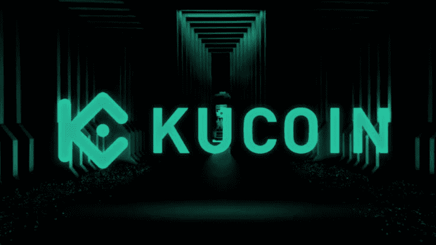
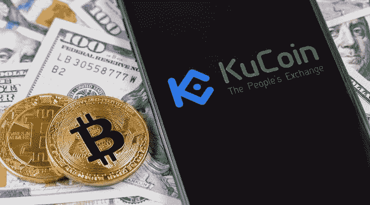
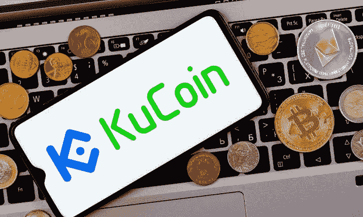

# 库币交易所评论——库币交易所安全吗？

> 原文：<https://medium.com/coinmonks/kucoin-exchange-review-is-kucoin-exchange-safe-61888429b4e9?source=collection_archive---------47----------------------->

kucoin exchange 是一个已经发展到拥有 1000 万注册用户的广阔地区的交易所，并且仍在增加，与其他交易所相比，许多人喜欢这个交易所，因为它具有交易费用低、导航方便、初学者友好以及为在其平台上注册的新用户提供大量奖金等特点。

50%的用户注册了这个平台；注册是因为该系统的好处，如使用他们的工具令牌 KCS 可以享受 20%的交易费，用户还可以通过 Kcs 奖金赚取 50%的 kucoins 每日交易费；通过在库币交易所持有至少 6 Kcs

然而，这篇文章需要详细的库币交易所审查，如什么是库币交易所，他们的附属计划，赌注，如果库币交易所对用户是安全的。

# 什么是库币交易所

[KuCoin Exchange](https://www.kucoin.com/r/rf/rJ81KN4) 是一个针对众多数字资产和加密货币的全球加密货币交易所。KuCoin 于 2017 年 9 月推出，现已成为最受欢迎的加密交易所之一，在全球 207 个国家和地区拥有 1000 万注册用户。

库币交易所强调项目的质量，这些项目基于一个研究部门，该部门在区块链行业中搜寻优质项目。KuCoin 为用户提供交换服务，安全高效地进行数字资产交易。随着时间的推移，KuCoin 的目标是为超过 207 个国家的 1000 多万注册用户提供持久的增值服务。2018 年 11 月，“人民交易所”正式与 IDG 资本和 Matrix Partners 合作。

Johnny Lyu 是全球领先的加密货币交易所 KuCoin 的联合创始人兼首席执行官。KuCoin 迅速走红，成为最大的国际密码交易所之一。Lyu 的总部在亚洲，而 KuCoin 在美国没有获得许可，很少美国人使用这种交换。

如果你想在 [kucoin 上注册，只要点击这个文本！！！](https://www.kucoin.com/r/rf/rJ81KN4)

# 库币交易所安全吗？

2020 年 9 月 25 日，KuCoin 的交易所遭受了网络攻击；黑客窃取了价值 2.75 亿至 2.85 亿美元的用户数字资产。有人怀疑朝鲜黑客应对此次黑客攻击负责。

然而，总部位于塞舌尔的交易所对黑客攻击做出了快速有效的反应——ku coin 与区块链数据公司 Chainalysis、其他加密交易所和执法机构进行了联络——使其能够收回大部分资金，并使用其保险基金退还其余用户。

与此同时，对于每一个投资者来说，这也是一个终极负担，不管他们是持有资金还是出借资金。该平台有一个全面的风险控制系统，可以保护用户的资产。

您可以放心地在 KuCoin 上交易，因为您知道您的数字资产在交易所是安全的。KuCoin 利用了众多安全层，包括小额取款钱包、行业级多层加密和动态多因素认证；这意味着 Kucoin 对于所有打算利用该平台的密码交易商/投资者来说都是安全的。

**亦读；** [KCS 钱币价格预测:KCS 钱币是好投资吗？](https://bulliscoming.com/kcs-coin-price-prediction/)

# kucoin 附属计划

在 Kucoin 上，用户可以利用联盟计划，通过邀请用户加入平台赚取高达 40%的佣金，这可以通过向他们的朋友和家人介绍/推荐 kucoin 来完成。

KuCoin Affiliate 旨在奖励那些与 KuCoin 拥有相同价值观和使命，并愿意推广交流平台的会员。

用户可以创建唯一的推荐链接并与其他人共享。任何完成注册的人都将自动成为被邀请人。作为奖励，用户将根据裁判在所有平台上完成的交易(如现货、期货和保证金交易)获得佣金。

# KuCoin 加盟计划的优势

作为 KuCoin 附属用户，您有权享受以下奖励:

# 交易费用的 45%佣金

一旦被邀请者通过独家链接在 KuCoin 上进行交易，KuCoin 附属公司的用户将享受被邀请者交易费 40%的佣金回报。如果会员等级达到 2 级，他们的佣金奖励将增加到 45%。

注意:佣金每周结算一次，最长佣金期可以是永久性的。

# 独特的二级佣金方案

KuCoin 联盟计划推出了独特的二级佣金计划。

一旦您的被邀请人也成为 KuCoin 附属机构(他们将使用术语“次级附属机构”)，您将收到次级附属机构提供的 5%的额外交易费佣金。

例如，A 是 KuCoin 的附属公司。如果 A 邀请 B 成为关联公司，B 邀请 C 成为交易客户，那么 A 是主关联公司，B 是次级关联公司。a 可以从 C 的交易中获得 5%的佣金，而 B 可以从 C 的交易中获得 40%或 45%的佣金，这取决于 B 的会员级别。

# 如何加入 KuCoin 联盟计划？

只要你对加密空间感兴趣，KuCoin 附属计划欢迎所有内容创作者加入他们，无论你是 YouTube 视频博客作者、加密货币社区领袖、KOL 还是其他内容创作者。

只要你愿意推广 KuCoin，就可以填写[表格](https://www.kucoin.com/affiliate)申请成为加盟商。

# Kucoin 打桩

Kucoin 用户可以参与赌注，用户将获得赌注奖励和 POL 积分。它支持多种数字资产。同时，在押货期间，用户可以在流动性交易市场上交易其押货资产以获得流动性。

用户可以选择赎回一个赎回期(根据不同的币种设置相应的赎回期)，在赎回期内，没有本币收入和 POL 矿业收入。

参考年产量由赌注奖励和将 POL 转换成赌注硬币后的年产量组成。年化收益率是根据历史市场收益估算的，是一个参考。实际奖励将根据您帐户中收到的实际金额计算。

比如 21.75%的年利率，指的是 ORN 的预期年化收益为 20%(ORN 的年收益率)+1.75%(POL 转换成 ORN 后的年收益率)。

**亦读；** [利物浦 NFTs——你需要知道的一切](https://bulliscoming.com/liverpool-nfts/)

# 结论

Kucoin 支持现货交易，期货交易，保证金交易，也杠杆交易与低费用相比，一些密码交易所，并与他们的公用事业令牌；用户可以通过 Kcs 奖金奖励每天至少获得 6 Kcs。

他们的官方原生令牌被顶级密码交易商交易，许多投资者正大量买进，因为它有可能带来良好的投资回报。

> 加入 Coinmonks [电报频道](https://t.me/coincodecap)和 [Youtube 频道](https://www.youtube.com/c/coinmonks/videos)了解加密交易和投资

# 另外，阅读

*   [Bookmap 评论](https://coincodecap.com/bookmap-review-2021-best-trading-software) | [美国 5 大最佳加密交易所](https://coincodecap.com/crypto-exchange-usa)
*   [如何在 FTX 交易所交易期货](https://coincodecap.com/ftx-futures-trading) | [OKEx vs 币安](https://coincodecap.com/okex-vs-binance)
*   [CoinLoan 评论](https://coincodecap.com/coinloan-review) | [YouHodler 评论](/coinmonks/youhodler-4-easy-ways-to-make-money-98969b9689f2) | [Kucoin 评论](https://coincodecap.com/kucoin-review)
*   XT.COM 评论 | [币安评论](https://coincodecap.com/xt-com-review)
*   [SmithBot 评论](https://coincodecap.com/smithbot-review) | [4 款最佳免费开源交易机器人](https://coincodecap.com/free-open-source-trading-bots)