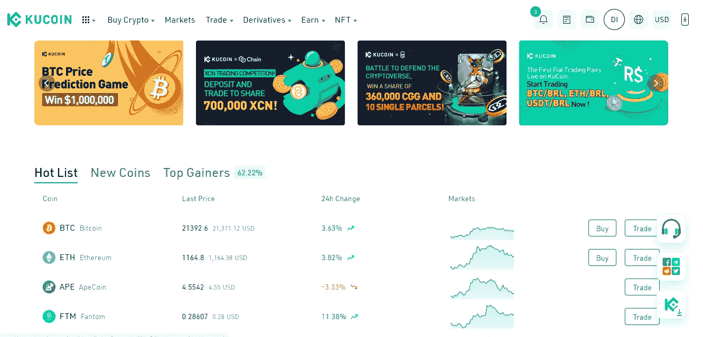
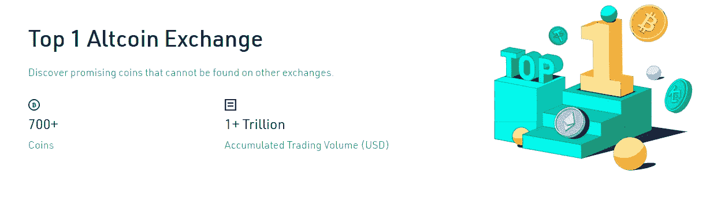
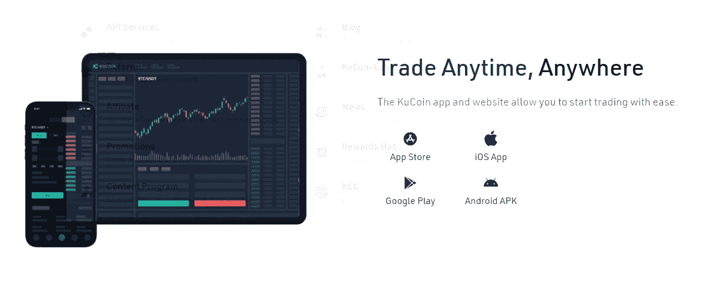
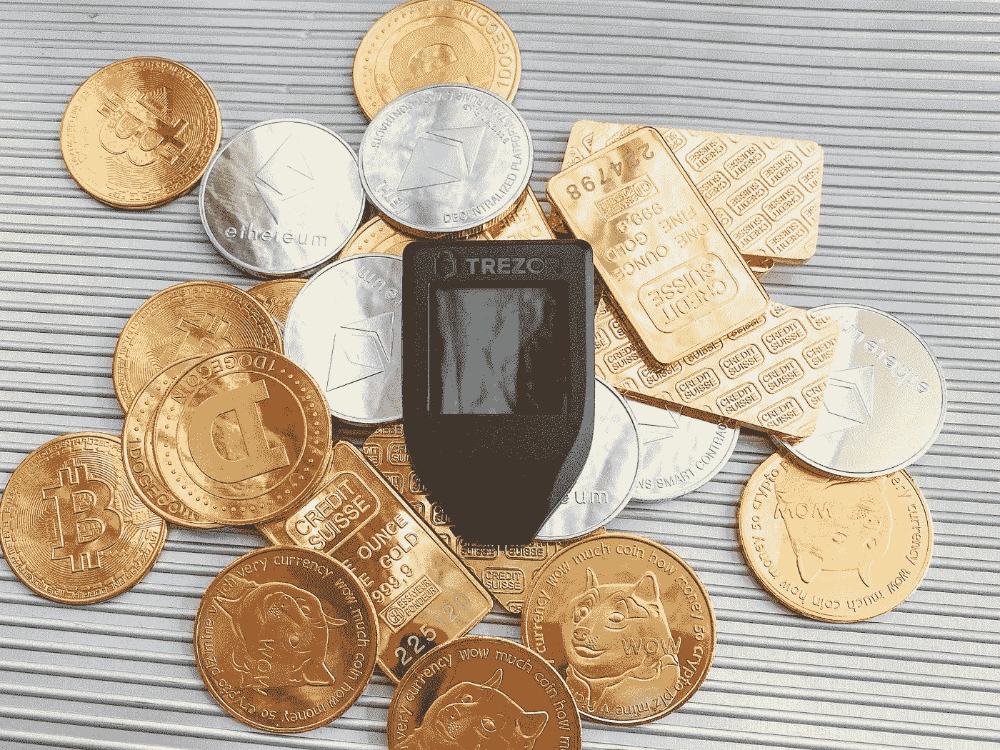

# 库币评论— 2022 年

> 原文：<https://medium.com/coinmonks/kucoin-review-2022-e704cc8fbb02?source=collection_archive---------66----------------------->

发现在其他交易所找不到的有前途的硬币。

KUCOIN

# 简介:

KuCoin 是一个主要的加密货币交易所，允许用户购买、出售和交易加密货币。除了传统的交易选择之外，该平台还提供保证金、期货和点对点(P2P)交易。用户还可以通过押注或出借他们的加密货币来获得激励。与其他竞争对手相比，KuCoin 的交易费用较低，这使其成为一个有吸引力的选择。

# 公司概况:

[KuCoin](https://www.kucoin.com/ucenter/signup?rcode=rPA1V32) 是一家位于塞舌尔的加密货币交易所，成立于 2017 年。自成立以来，它已发展成为交易量最大的全球交易所之一，拥有 1000 多万会员，业务遍及 200 多个国家。

虽然美国消费者可以开设一个 [KuCoin](https://www.kucoin.com/ucenter/signup?rcode=rPA1V32) 账户，但他们对功能的访问是有限的，因为 [KuCoin](https://www.kucoin.com/ucenter/signup?rcode=rPA1V32) 没有获得在美国运营的许可。鉴于此，开户可能会带来一定的风险。例如，如果美国监管机构决定打击 [KuCoin](https://www.kucoin.com/ucenter/signup?rcode=rPA1V32) ，你可能无法提取你的资金。

# KuCoin 安全吗？

[KuCoin](https://www.kucoin.com/ucenter/signup?rcode=rPA1V32) 拥有全球最先进的安全技术和维护团队之一，他们也在不断升级自己的安全系统，确保用户资金和账户的保护。

# 我能用 1 美元开始交易吗？

KuCoin 用户只需花 1 美元就可以购买精选的贸易和金融商品，从而增强他们的实际体验。

# 费用:

KuCoin 有一个分级的做市商/收市商费用结构，交易费用根据你的级别从 0.0125%到 0.1%不等。与竞争对手相比，它的收费很低，竞争对手每笔交易的收费最高可达 0.50%。用户还可以根据他们的 [KuCoin](https://www.kucoin.com/ucenter/signup?rcode=rPA1V32) Token (KCS)余额节省交易费用。

除交易费外，KuCoin 还收取取款费，该费用因资产而异，并根据市场表现进行调整。在这个交易所存款是免费的，但值得注意的是 [KuCoin](https://www.kucoin.com/ucenter/signup?rcode=rPA1V32) 目前对法定存款的选择有限。

# 用户界面:

KuCoin 的用户可以通过互联网门户或 Android 和 iOS 的移动应用程序访问他们的账户。它的桌面网站和移动应用都有过多的功能和工具。

[KuCoin](https://www.kucoin.com/ucenter/signup?rcode=rPA1V32) 用户可以在桌面或手机上登录后查看市场、获取加密、交易、出借加密等。该平台接受四种类型的订单:市价单、限价单、限价止损单和市价止损单。保证金、期货和点对点交易也可以使用，这可能对一些客户有吸引力。

> KuCoin 支持赌注，最近增加了一个交易机器人功能，以帮助简化交易过程；它实际上充当了你的比特币投资组合的机器人顾问。

# KUCOIN 有什么优势？

加密货币赚取利息: [KuCoin](https://www.kucoin.com/ucenter/signup?rcode=rPA1V32) 用户可以通过将加密货币下注或借给他人并收取利息来赚取利息。赚取加密货币的奖励可以帮助您建立更大的投资组合。

KuCoin 有超过 600 种加密货币可供交易，而某些交易所只有几十种。

交易费用低:与其他主要交易所相比，KuCoin 的交易费用相对较低。用户预计每笔交易将支付 0.0125%至 0.10%的费用。

# KUCOIN 有哪些缺点？

[KuCoin](https://www.kucoin.com/ucenter/signup?rcode=rPA1V32) 没有在美国获得许可，因此该国的消费者应该寻找替代的交易所。

没有法定交易对。没有银行存款。对于新人来说，这可能显得困难。

# KuCoin 与其他加密货币公司有何不同？

[KuCoin](https://www.kucoin.com/ucenter/signup?rcode=rPA1V32) 与其他加密货币交易所相比，拥有大量的加密货币和最低的成本。它还支持赌注和杠杆、期货和点对点交易，这可能会吸引更多经验丰富的用户。

## KuCoin 的主要特点

1.  在世界各地以便宜的费用购买和交易 200 个硬币。
2.  杰出的客户服务
3.  银行级资产保护
4.  保证金交易和库币期货
5.  用加密货币赚钱:加密贷款、赌注、软赌注和库币股份(KCS)
6.  简单易用的平台
7.  没有托管人的交易。如果你想增加你的加密安全性，KuCoin 允许直接从你的私人钱包进行非托管交易，这是由阿尔温支持的。

# KuCoin 的帐户验证

[KuCoin](https://www.kucoin.com/ucenter/signup?rcode=rPA1V32) 提供三个验证层:

1.  帐户未经验证。它需要电子邮件验证，并允许您每天最多提取 2 BTC。
2.  个人账户已验证。您必须提交您的身份数据，如身份证或护照，以及您的居住国，并且您的提款限额增加到每 24 小时 100 BTC。
3.  机构账户已核实。将您的每日取款限额提高到 500 BTC。

KuCoin 强烈建议用户完成验证，以避免将来出现问题。此外，一旦在网站上启用了“法定到加密”交易，经过确认的个人将能够参与其中。

# 库币股份(KCS)到底是什么？

库币股份(KCS)被用来资助交易所的发展。总共有 200，000，000 KCS 发行给创始人、私人投资者和普通投资者。第一和第二阶段授予的资金分别有四年和两年的锁定期(第一阶段为 2021 年 9 月 2 日)(第二阶段为 2019 年 9 月 2 日)。

下注 KCS 为 KuCoin 客户赚取部分每日外汇收入。例如，如果你拥有 10，000 KCS，交易所向你收取 20 BTC 的交易费(每日交易量的 0.1%)，你每天将获得 0.001 BTC(20 * 50% *(10000/100000000))。

你也可以通过推荐朋友来获得 KCS。当朋友下订单时，您可以获得高达 20%的推荐奖励。您可以通过输入我们的库币推荐代码: **rPA1V32** 加入交易所。

Photo by [olieman.eth](https://unsplash.com/@moneyphotos?utm_source=medium&utm_medium=referral) on [Unsplash](https://unsplash.com?utm_source=medium&utm_medium=referral)

# KuCoin 的存款和取款

KuCoin 是一个加密到加密的交易所，这意味着你不能存放任何法定货币，除非你通过第三方集成(如 SImplex 或 Banxa)直接获得它。它不接受法定交易对或存款，但它支持越来越多的集成的法定支付方式。

KuCoin 不收取存款费用，取款收取可变的固定费用。交易处理持续时间因资产的区块链而异，但通常在一小时内完成，因此提款在 2-3 小时内到达用户钱包。

Photo by [Alexander Schimmeck](https://unsplash.com/@alschim?utm_source=medium&utm_medium=referral) on [Unsplash](https://unsplash.com?utm_source=medium&utm_medium=referral)

# 库科恩审查的结论

KuCoin 是一个具有前瞻性和创新性的加密货币玩家。自 2017 年成立以来，该交易所取得了显著增长，目前在安全性、可靠性、服务质量和功能性方面都位居行业前列。因此，该交易所对于寻求接触流行和不太知名的小型加密货币和资产的新手和有经验的交易者来说都是理想的。

[注册:KUCOIN](https://www.kucoin.com/ucenter/signup?rcode=rPA1V32)

> 加入 Coinmonks [电报频道](https://t.me/coincodecap)和 [Youtube 频道](https://www.youtube.com/c/coinmonks/videos)了解加密交易和投资

# 另外，阅读

*   [加密复制交易平台](/coinmonks/top-10-crypto-copy-trading-platforms-for-beginners-d0c37c7d698c) | [Coinmama 审核](/coinmonks/coinmama-review-ace5641bde6e)
*   [印度的加密交易所](/coinmonks/bitcoin-exchange-in-india-7f1fe79715c9) | [比特币储蓄账户](/coinmonks/bitcoin-savings-account-e65b13f92451)
*   [OKEx vs KuCoin](https://coincodecap.com/okex-kucoin) | [摄氏替代品](https://coincodecap.com/celsius-alternatives) | [如何购买 VeChain](https://coincodecap.com/buy-vechain)
*   [币安期货交易](https://coincodecap.com/binance-futures-trading)|[3 comas vs Mudrex vs eToro](https://coincodecap.com/mudrex-3commas-etoro)
*   [如何购买 Monero](https://coincodecap.com/buy-monero) | [IDEX 评论](https://coincodecap.com/idex-review) | [BitKan 交易机器人](https://coincodecap.com/bitkan-trading-bot)
*   [CoinDCX 评论](/coinmonks/coindcx-review-8444db3621a2) | [加密保证金交易交易所](https://coincodecap.com/crypto-margin-trading-exchanges)