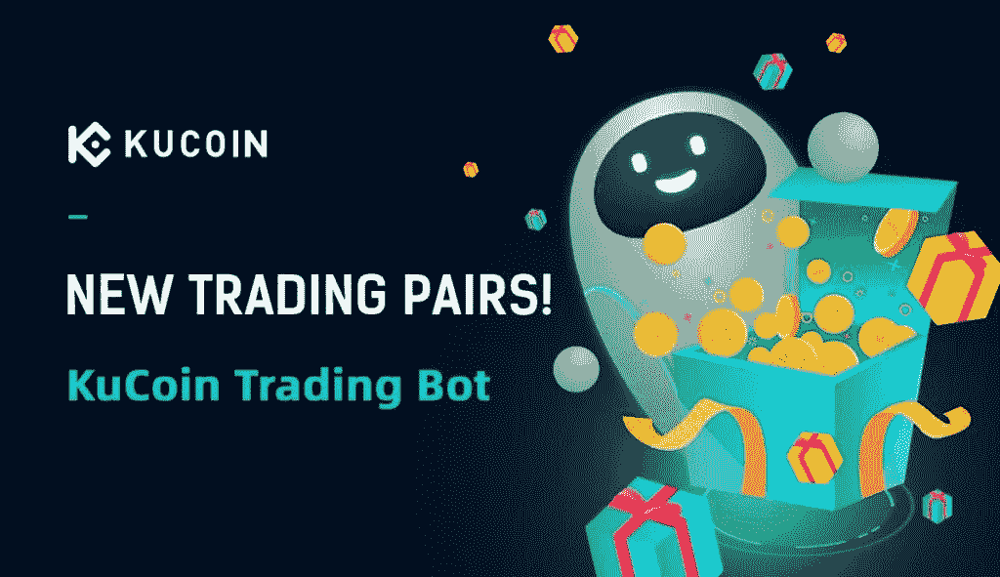
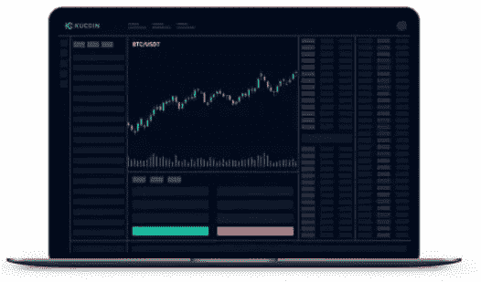
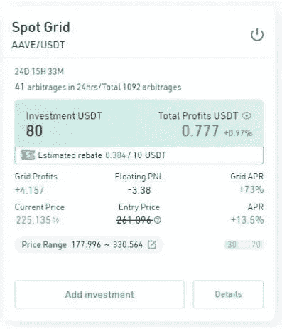
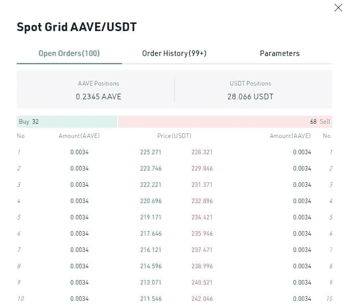
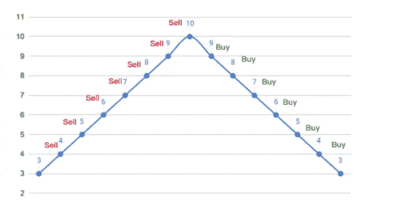
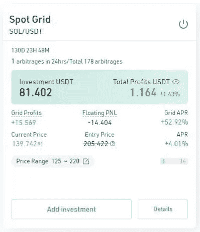
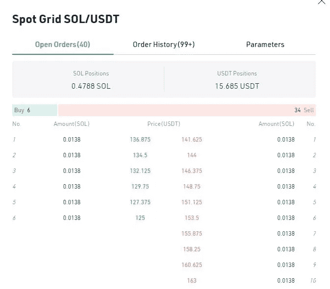
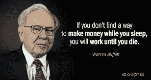
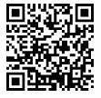

# 库币交易机器人:终极波动黑仔？

> 原文：<https://medium.com/coinmonks/kucoin-trading-bot-the-ultimate-volatility-killer-cb7e90c13e19?source=collection_archive---------0----------------------->

让交易在自动化的基础上进行的想法确实非常吸引人；毕竟，谁不喜欢被动的现金流呢？交易机器人可以通过编程实现这一目的，本质上就是在价格低的时候买入资产，在价格上涨的时候卖出。有理由说，加密交易机器人比人类交易者表现得更好，但有一个关键的缺陷:它仍然必须由人类“设置”，并且必须继承精通编码和加密交易的专家的交易逻辑。

[KuCoin](https://www.kucoin.com/ucenter/signup?rcode=rJH29LZ) 是当今最受欢迎的加密货币交易所之一，该公司声称每 4 名加密交易者中就有 1 人通过他们的服务交易过硬币。 [Kucoin](https://www.kucoin.com/ucenter/signup?rcode=rJH29LZ) bot 于 2021 年初首次亮相，此后经历了各种升级，目前提供以下 6 种策略，其中经典的网格策略仍然是我的最爱，经受住了时间和价格波动的考验。

*   动态再平衡
*   无限网格
*   边距网格
*   美元平均成本
*   期货网格
*   经典网格

# **术语解释**

我们将看看在交易机器人中经常遇到的术语，以下面的经典网格为例。

***套利*** 指正在执行的交易数量。以 AAVE 硬币为例，现货网格机器人在网格中创建了一定数量的买卖订单，这些订单将在达到该价格时执行。在过去的 24 小时内，它已经执行了 41 笔交易，自大约 24 天前启动 bot 以来，总共执行了 1092 笔交易。

***电网利润*** 是指 bot 低买高卖获得的利润，本质上是执行上述电网指令。

***浮动 PNL*** (损益)是资产的平均购买价格与该资产的当前市场价值之间的差价。

在上面的加密货币 X 的例子中，当 X 的价格从 3 USDT 涨到 10 USDT 时，机器人将分别在 4 USDT、5 USDT、6 USDT、7 USDT、8 USDT、9 USDT 和 10 美元完成卖单以获利。在价格下降到 4 USDT 之后，机器人将立即在 9 USDT、8 USDT、7 USDT、6 USDT、5 USDT 和 4 USDT 执行购买指令。因此，X 的平均购买价格现在是(10+3)/2 = 6.5 美元。

***总利润*** 只是反映了浮动 PNL 和电网利润的相加——这是如果 bot 在该时刻关闭将实现的实际利润额。

***网格 APR*** 显示网格生成的年化收益率；虽然 APR(低于电网 APR)只是 bot 的总体 APR，考虑了电网和浮动 PNL 产生的利润——这通常随着市场条件而改善。

***当前和进场价格*** 都是自我说明的；然而，在上面显示的 AAVE 交易机器人的例子中，进入价格被大幅削减，因为在最初创建机器人之后进行了额外的投资，从而使最初的进入价格无效。这是一个可以在市场下跌时使用的策略，以增加低价买入的利润。

# **黑仔出现波动**

波动性是加密货币固有的一部分；当价格朝着不利的方向波动时，它带来的兴奋和焦虑一样多。通过 Kucoin 交易机器人，机器人产生的利润可以对冲波动性，为资产价格贬值带来的损失提供一定程度的缓冲。

以下面这个使用 SOL 的交易机器人为例，这是我目前为止在 kucoin 上使用时间最长的交易机器人。我在 4 个月前开始交易，当时 SOL 的价格相对较高，为 205 美元。

我目前的持仓量为 0.478 索尔和 15.68 美元。

尽管交易机器人在价格下跌时不知疲倦地执行购买订单，但毫无疑问，随着价格从 205 美元下跌到现在的 139 美元，我购买的索尔价值已经贬值。这通过-14USDT 的浮动 PNL 反映出来；事实上，这是当时以 205 美元购买 0.4788 索尔与现在以 139 美元购买相对便宜的 0.4788 索尔的价格差异，因此反映了损失。然而，由于 bot 在此期间通过低买高卖产生的电网利润，资产价值的减少在某种程度上得到了缓冲——总体而言，考虑到 SOL 当前较低的价格，bot 实际上产生了 1.16 美元的利润。不言而喻，当 SOL 的价格在不久的将来回升时， bot 利润(APR 和电网 APR)将迅速上升，因为浮动 PNL 现在将是正的，除了电网利润之外，还有助于总收益。

**利用 Kucoin 的交易机器人**获得被动收入

使你的收入来源多样化是走向财务独立的第一站。如果你设法从各种渠道获得被动收入，你的财务弹性会更大，市场危机和波动也不会带来太多麻烦。Kucoin 的机器人是一个完美的被动收入来源。一旦你设置好了，机器人就会为你工作。从那以后，一切都取决于市场的行为。

# **一些常见问题**

涉及哪些费用？

Kucoin 对机器人的创建或维护不收取任何费用；仅交易费用，金额为 0.08%。

**我可以同时运行多少个机器人？**

10

**库币交易机器人靠谱吗？**

总的来说，Kucoin 的交易机器人可谓靠谱。就像任何其他交易机器人一样，它会做它被告知的事情。因此，它的表现主要取决于所选择的环境和所选时期的市场走势。然而，该机器人不支持更复杂的机器人常见的某些复杂设置，如鞅策略。

**最低投资额是多少？**

这因币而异，取决于受欢迎程度、需求和市值。较小的大写硬币往往有较低的最低投资，可低至 40 美元。

**用交易机器人能亏钱吗？**

当然可以，如果市场下跌的话。然而，这通常是暂时的，因为下跌为 bot 提供了一个买入机会，当然，除非是大规模的市场崩溃，在这种情况下，损失可能超过收益。

**我可以在所有市场条件下使用加密交易机器人吗？**

不幸的是，没有——如果价格快速上升或下降，机器人的使用变得无效，在某些情况下无利可图。如果在摇摆不定或中立的市场中使用，机器人是最有效的——它可以购买和出售，并重复这一过程。

**如果价格高于或低于 bot 的范围会发生什么？**
以 BTC / USDT 为例，如果价格突破了你的 bot 的上界，那么所有的 BTC 都会被卖掉，你只剩下变现的 USDT。如果价格越过了下限，那么 BTC 的所有买单都将被执行。机器人将卖单留在指定的范围内，等待价格回升。在这两种情况下，机器人变得空闲，并将在价格回到可接受的范围时恢复其活动。或者，bot 运作的价格范围可以调整，以适应动态的市场条件。

**网格数如何影响利润？**
你价格范围内的格子数会直接影响每个格子的收益百分比。确定最佳金额取决于你的交易风格和预算。如果你喜欢用小利润完成频繁交易，并保证完成订单的概率，那么增加网格的数量。如果你的预算有限，或者你想以降低订单完成几率为代价获得更多的利润%,那么就减少网格的数量。每个电网的理想平衡利润在 0.5%到 2%之间。

观看我在 youtube 上的视频，了解如何在 Kucoin 上创建交易机器人的迷你教程。

[**今天就注册 Kucoin 的**](https://www.kucoin.com/ucenter/signup?rcode=rJH29LZ) **，开始享受被动收入，自动驾驶！**

*一如既往，这不是财务建议！而只是我投资过的，觉得值得分享的投资平台。在投资前做好自己的研究，不要存你输不起的钱。下面有什么问题可以随时问我。*

*如果你喜欢这篇文章，* [*关注&订阅*](/@cybery) *！*

*查看以下值得信赖的平台！*

*🎁*[*honey gain*](https://r.honeygain.me/CYBER577DD)*一款被动收入应用，从你未使用的互联网带宽中赚钱。* [*免费获得 5 美元*](https://r.honeygain.me/CYBER577DD) *，无需投资。*

*🎁* [*蛋糕 Defi*](https://cakedefi.com/?ref=677920) *一站式投资平台，以高达 200%的年利率烘焙被动现金流！* [*拿 30 美元*](https://cakedefi.com/?ref=677920) *在 DFI 存 50 美元。*

*🎁*[*Nexo*](https://nexo.io/ref/hce5cfdt5o?src=web-link)*全球最先进、受监管的数字资产机构，在 200 多个司法管辖区提供 40 多种法定货币的即时加密贷款、每日资产收益、交换和服务。* [*用 100 美元存款获得 25 美元*](https://nexo.io/ref/hce5cfdt5o?src=web-link) *。*

*🎁* [*摄氏度*](https://celsiusnetwork.app.link/174094633e) *一个金融科技平台，提供带息储蓄账户、借贷，以及用数字和法定资产进行支付。* [*在 BTC 拿 50 美元*](https://celsiusnetwork.app.link/174094633e) *拿 400 美元存款。*

*🎁* [*Hodlnaut*](https://www.hodlnaut.com/join/RTbHxuJMX) *一个稳健的新加坡加密借贷平台，成立于 2019 年，从你闲置的加密货币中产生被动现金流。* [*在 USDC 用 1000 美元存款获得 30 美元*](https://www.hodlnaut.com/join/RTbHxuJMX) *。*

*🎁*[*BlockFi*](https://blockfi.com/?ref=a16e37fd)*一种加密货币交易所和钱包。* [*用 100 美元存款得到 10 美元*](https://blockfi.com/?ref=a16e37fd) *。*

*🎁* [*库币*](https://www.kucoin.com/land/register/r/rJH29LZ) *最大的加密货币交易所之一。*

*🎁***最大的加密货币交易所。**

**🎁*[*MEXC*](https://m.mexc.com/auth/signup?inviteCode=1NAJC)*最大的加密货币交易所之一。**

**🎁*[*Crypto.com*](https://read.cash/@TraderFX/10-tips-to-maximize-earnings-on-honeygain-an-effortless-free-passive-income-app-68535728#bad-link)*一款基于新加坡的加密货币兑换 app。* [*得到 25 美元*](https://crypto.com/app/fcbsjmf5pb) *在 CRO 赌赢一张红宝石牌。**

**针对马来西亚投资者**

**🎁* [*斯塔沙威*](https://www.stashaway.my/referrals/kenleel9jx) *获得 6 个月免费投资！**

**🎁Wahed code 'KENLIE1' RM10 注册奖金**

**🎁Capbay P2P 代码' 8879c6' RM100 注册奖金**

**接我* [*中*](https://cybery.medium.com/)*|*[*read . cash*](https://read.cash/r/TraderFX)*|*[*Youtube*](https://www.youtube.com/c/SmartInvestingChannel)*|*[*电报*](https://t.me/kkkk289) *|* [*推特*](https://twitter.com/cybertraderfx)*|*[*Linktree*](https://linktr.ee/trader.fx)*

> *加入 Coinmonks [电报频道](https://t.me/coincodecap)和 [Youtube 频道](https://www.youtube.com/c/coinmonks/videos)了解加密交易和投资*

# *另外，阅读*

*   *[新加坡十大最佳加密交易所](https://coincodecap.com/crypto-exchange-in-singapore) | [购买 AXS](https://coincodecap.com/buy-axs-token)*
*   *[投资印度的最佳加密软件](https://coincodecap.com/best-crypto-to-invest-in-india-in-2021) | [WazirX P2P](https://coincodecap.com/wazirx-p2p)*
*   *[7 个最佳零费用密码交易平台](https://coincodecap.com/zero-fee-crypto-exchanges)*
*   *[最佳网上赌场](https://coincodecap.com/best-online-casinos) | [期货交易机器人](/coinmonks/futures-trading-bots-5a282ccee3f5)*
*   *[分散交易所](https://coincodecap.com/what-are-decentralized-exchanges) | [比特 FIP](https://coincodecap.com/bitbns-fip) | [宾邦评论](https://coincodecap.com/bingbon-review)*
*   *[用信用卡购买密码的 10 个最佳地点](https://coincodecap.com/buy-crypto-with-credit-card)*