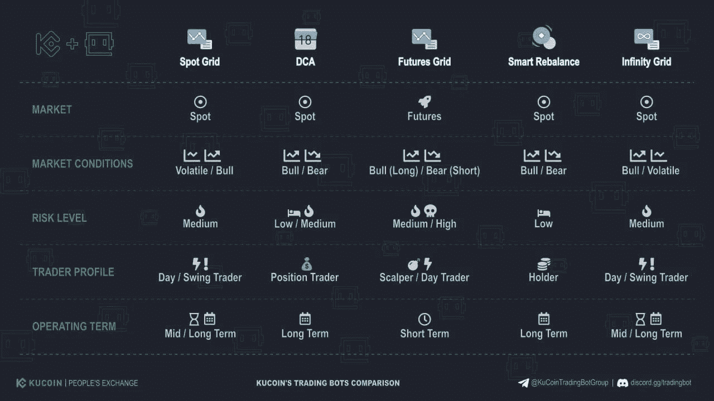
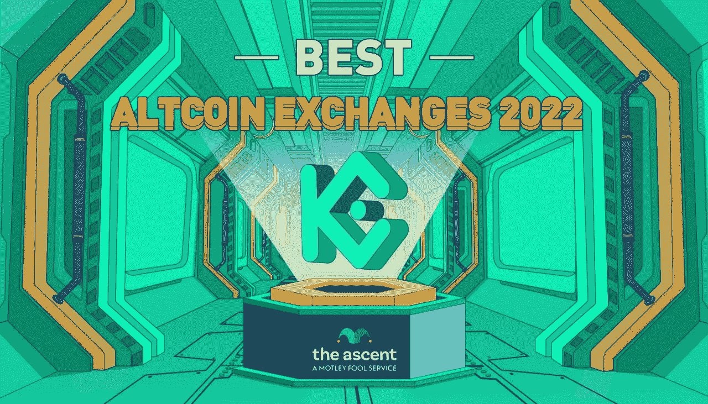
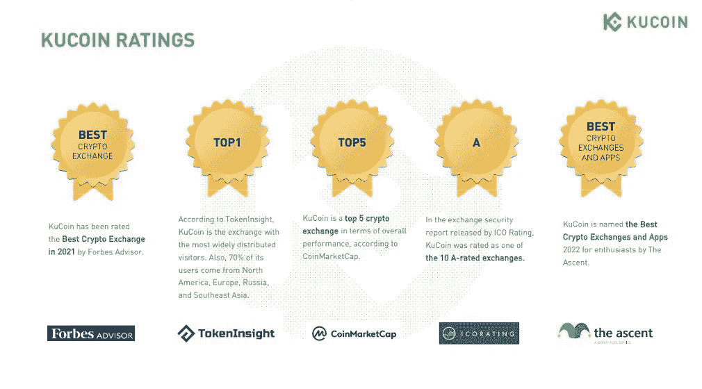
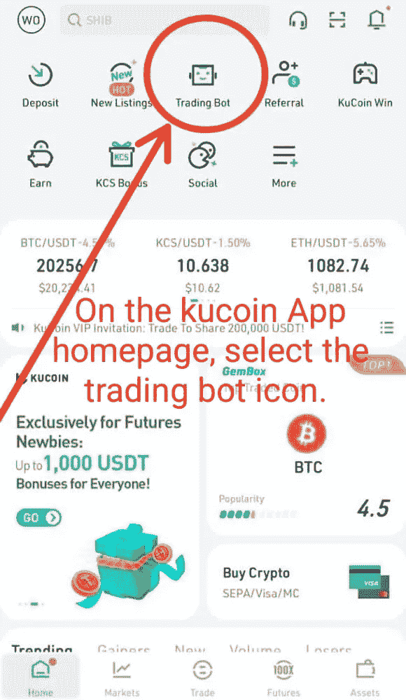
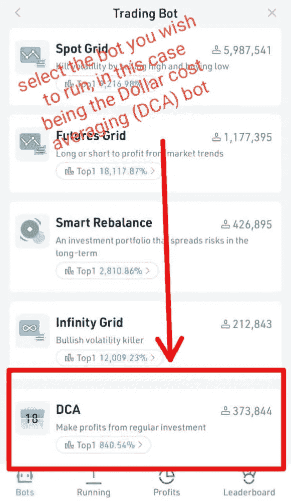
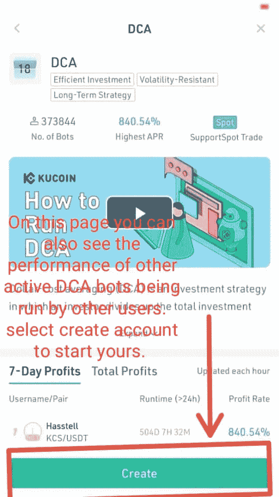
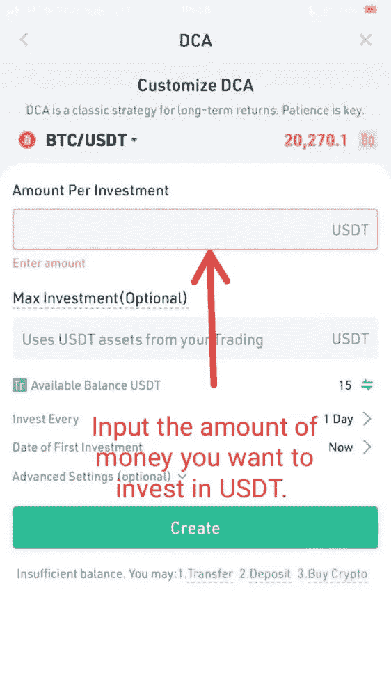
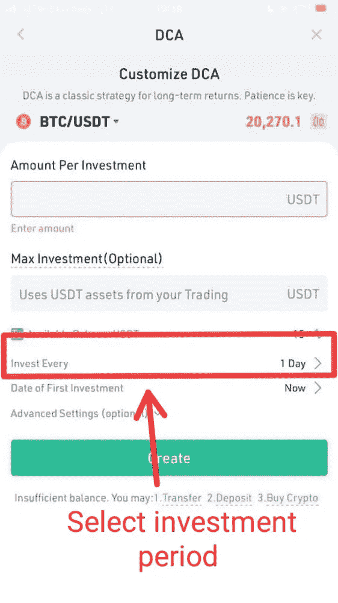

# 熊市的精英美元成本平均策略。

> 原文：<https://medium.com/coinmonks/kucoins-elite-dollar-cost-averaging-strategy-for-the-bear-market-f4b7e6bbf06b?source=collection_archive---------40----------------------->

你是否曾经“全押”买入，试图抓住底部，但随后却跌得更深？失败的尝试中充满了痛苦。如果你刚刚买入，你唯一的选择是观察和等待，但是如果你利用你的头寸，我希望你有精神力量度过交易所清算文本带来的痛苦。有许多方法可以克服上述任何一种情况，但最突出和最有效的是:平均成本！
什么是美元成本平均法(DCA)
美元成本平均法是一种著名的投资策略，它要求您将希望投资的总额分成不同的定期购买，以减少波动性和价格波动对您最终持股的影响。

众所周知，全仓买入有很多缺点，因为不管你打算持有投资多长时间，你都有以不利价格买入的风险。
DCA 策略基于这样一种理念，即你将投资的购买分散在不同的时间进行。
投资加密货币时，时机对于成功实施 DCA 策略至关重要。这需要深思熟虑的想法和对密码市场的最新知识，这可能一开始听起来很乏味，但如果你能继续处理日常事务，而一个高效的机器人为你完成工作，那会怎么样呢？！这是可能的。今天我将告诉你关于 Kucoin DCA 交易机器人和使用它的众多优点。在 kucoin 上，你可以运行一个 DCA 机器人，它将按照你指定的频率购买你的密码，从每小时到 2 周不等，而不管购买时的资产价格。首先，您需要一个 Kucoin 帐户。KUCOIN 是世界上最大的密码交易所之一，拥有
💰平台总交易量 7000 亿，
🌎来自 207 个不同国家的 1000 多万注册用户。

Kucoin 被福布斯顾问评为最佳加密交易所
📌根据 Coinmarketcap
的数据，kucoin 在整体表现方面排名前三🚀ascent 评选的 2022 年最佳比特币交易所。

在 Kucoin 上，您可以访问:保证金交易，现货交易，交易机器人，加密赌注借贷，采矿池，最重要的是一个免费的 DCA 战略机器人，供新用户试用。

如果你还没有账户，你应该马上[注册](https://www.kucoin.com/r/rf/r395ZQJ)，获得 20%的交易费终身返利，并有机会通过猜测比特币的收盘价赢得 500 美元或 3000 美元。

现在，什么是 Kucoin DCA 策略 bot，它是如何工作的？Kucoin DCA strategy bot 让您能够在不同的时间框架和范围内分散对单一资产的投资金额。这也降低了价格波动对您购买密码的总体影响。
鉴于我们正处于熊市，可以从历史高点折价购买比特币和其他加密货币，美元成本平均化是最有效的策略，kucoins 顶级网格交易机器人旨在提高您的投资能力。
当加密市场上涨时，众所周知，熊市期间的投资会带来更多利润。熊市期间的无风险投资是 DCA 交易机器人在 KUCOIN 上为您提供的主要优势。
您可以从比特币和 600 多种其他加密货币中选择您想要购买的货币，并在 kucoin 上设置 DCA bot 来完成其余工作。
以下是如何通过 5 个简单的步骤在 kucoin 上设置你的 DCA 交易机器人。

1.  [创建一个 kucoin](https://www.kucoin.com/r/rf/r395ZQJ) 帐户并完成验证过程，或者如果您已经有帐户，则登录并通过任何可用的存款方式购买加密或存款资金。

[参见关于进行法定存款或加密存款的指南](https://www.kucoin.com/support/900007079063-How-to-Deposit-Crypto-to-KuCoin)

[参见如何在 kucoin 上购买密码的指南](https://www.kucoin.com/support/categories/360001934634-Buy-Crypto)

2.在 kucoin 应用程序的主页上，您可以找到并选择交易机器人选项。在桌面上你可以在这里找到它

trading bot landing page on kucoin app

3.在交易机器人主页上，选择您喜欢的机器人。在这种情况下，我们希望使用 DCA 交易机器人。

DCA bot home page

4.选择“创建机器人”选项，

set your desired investment amount

pick your preferred range and time to start investing

5.填写所需的参数，以适应您的投资策略，并继续创建 bot。您可以使用高级选项为 DCA bot 指定利润目标。一旦机器人达到这个目标，机器人自动关闭所有仓位并停止运行。类似于止盈功能。

就是这么简单。现在，在下一轮牛市来临之际，你已经走上了完全自由和财务自由的轨道。

我希望你能够开始使用 kucoin DCA 策略机器人进行交易并做出明智的投资决策。如果你仍然不清楚，我欢迎提问和评论。有关 kucoin DCA 机器人和所有其他交易机器人的更多信息，请参考以下文章。

[关于库币交易机器人你需要知道的一切](/coinmonks/everything-you-need-to-know-about-kucoin-trading-bot-cbdf0218e69f)

[ku coin 交易机器人是赚钱机器吗？](https://youtu.be/hGbNo1633fk)

> 加入 Coinmonks [电报频道](https://t.me/coincodecap)和 [Youtube 频道](https://www.youtube.com/c/coinmonks/videos)了解加密交易和投资

# 另外，阅读

*   [如何在 Uniswap 上交换加密？](https://coincodecap.com/swap-crypto-on-uniswap) | [A-Ads 评论](https://coincodecap.com/a-ads-review)
*   [WazirX vs coin dcx vs bit bns](/coinmonks/wazirx-vs-coindcx-vs-bitbns-149f4f19a2f1)|[block fi vs coin loan vs Nexo](/coinmonks/blockfi-vs-coinloan-vs-nexo-cb624635230d)
*   [本地比特币审核](/coinmonks/localbitcoins-review-6cc001c6ed56) | [加密货币储蓄账户](https://coincodecap.com/cryptocurrency-savings-accounts)
*   [什么是保证金交易](https://coincodecap.com/margin-trading) | [美元成本平均法](https://coincodecap.com/dca)
*   [支持卡审核](https://coincodecap.com/uphold-card-review) | [信任钱包 vs 元掩码](https://coincodecap.com/trust-wallet-vs-metamask)