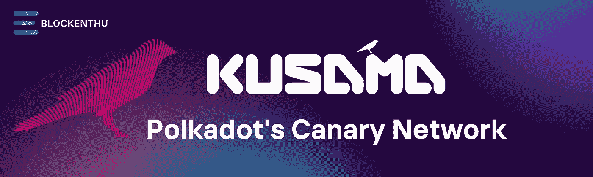
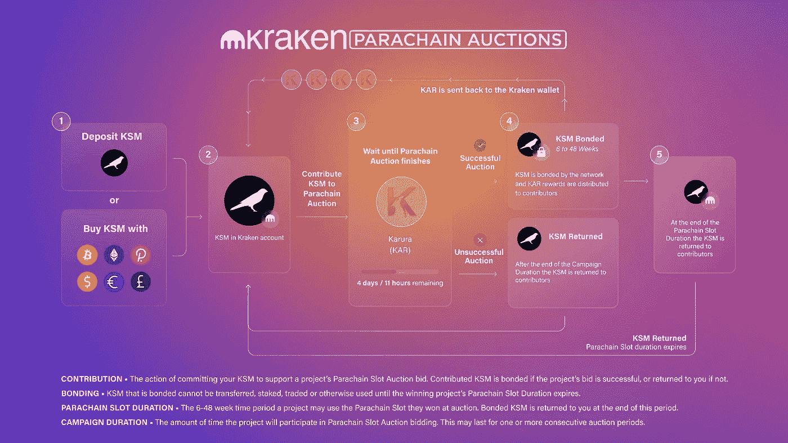
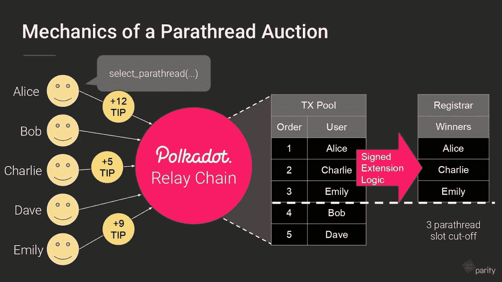
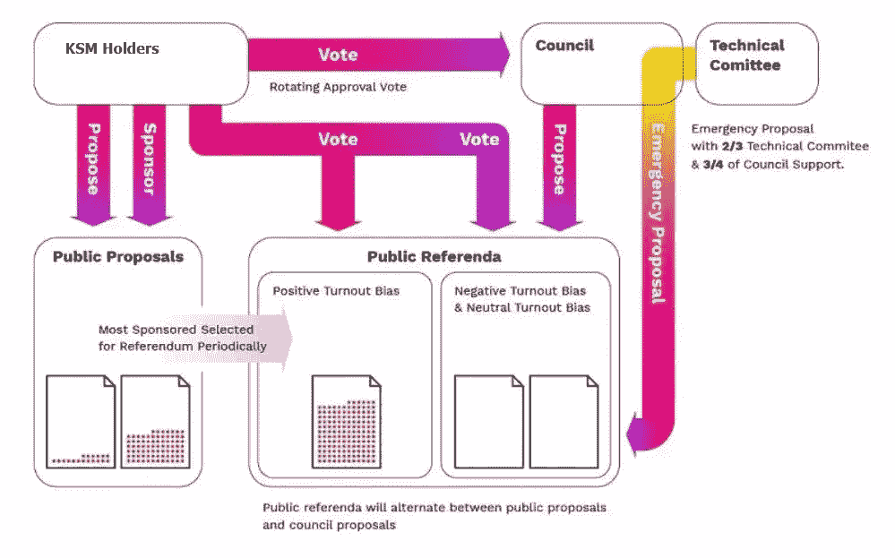
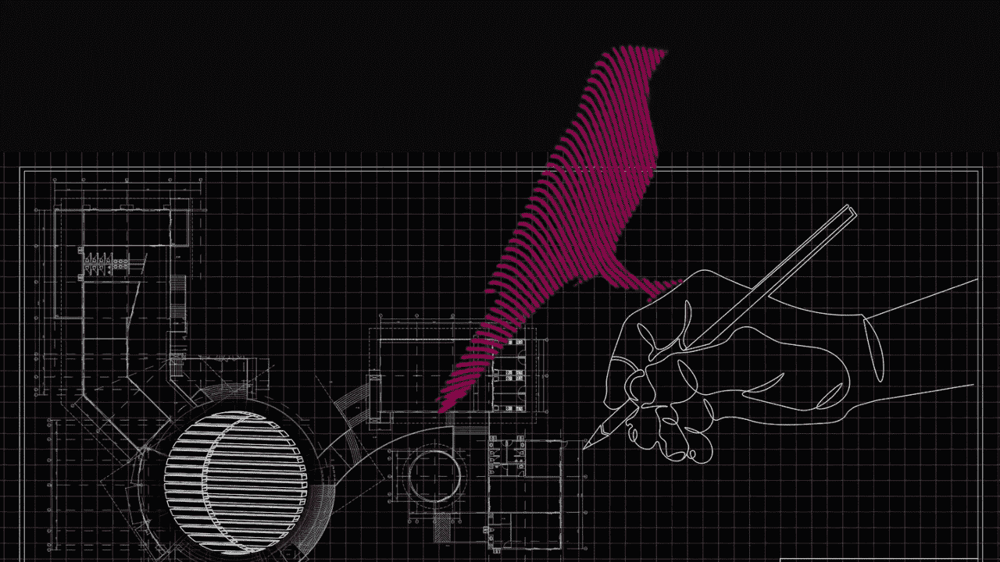

# 草间弥生

> 原文：<https://medium.com/coinmonks/kusama-ksm-4117fd7e0791?source=collection_archive---------20----------------------->

> 副链和波尔卡多特生态系统的先进测试网络。

Polkadot 显然已经成为 T2 最著名的加密货币计划之一。草间弥生是其生态系统中最具开拓性的方面之一。

草间弥生在区块链平台中是独一无二的，因为它主要是为希望以快速开发速度启动大型、雄心勃勃的项目的开发人员设计的。

# **简介**

草间弥生是波尔卡多特的**金丝雀**网络，

短语“金丝雀网络”这个名字来源于短语“**煤矿里的金丝雀**”金丝雀曾经被矿工带到矿井里，因为这些鸟会在笼子里唱歌，如果有害气体泄漏，它们就会停止唱歌，然后死去。

它们充当了矿工的预警系统，提醒他们注意危险。好消息是草间弥生在不伤害任何鸟类的情况下充当了一个“金丝雀网络”。草间弥生与波尔卡多特的虚拟复制品具有相同的用途，为区块链的项目提供最真实的测试环境。**金丝雀** **网络**是最先可用且具有真正经济价值的代码的早期发布。Kusama 是运行时升级、链上治理和开发者副链的测试区。在 Kusama 上启动的快节奏应用程序可以访问高度可扩展、可互操作的分片网络，这些网络具有 Polkadot 上尚未提供的功能。

# **草间弥生是如何工作的？**

草间弥生基于**基板**，这是由**奇偶技术公司开发的区块链开发套件。** Polkadot 是最成功的互操作区块链之一，它使用与草间弥生几乎相同的代码库。

草间弥生对部署副链的准入门槛很低，对验证者的保证金要求也很低。它最常用于早期创业和实验。

草间弥生网络支持两种类型的区块链的发展。

**中继链** —草间弥生区块链的主要网络，交易在这里完成。中继链将添加新事务的操作与验证这些事务的行为隔离开来，以获得更高的速度。

草间弥生中继链采用了一个名为**提名利益证明**的利益证明(PoS)共识版本，以保持其网络与系统状态 **(NPoS)一致。**

这种方法允许任何通过锁定特定合同中的加密货币来入股 KSM 的人扮演以下一个或多个角色:

**验证器** —检查副链块中数据的有效性。他们还参与网络共识并对提议的网络变更进行投票。

**提名者** —通过选择可靠的验证者来保护中继链。提名者将他们的 KSM 标记委托给验证者，然后验证者为他们投票。下注 KSM 并扮演这些角色的用户也有资格获得 KSM 奖品。

**副链** —副链是定制的区块链，利用中继链的计算能力来确保交易的准确性。

# **治理**

三种类型的草间弥生用户有能力影响软件的发展。

**公投室** —任何购买 KSM 代币的人都有能力提议网络变更，并批准或拒绝他人提出的实质性变更。

**董事会** —理事会成员由 KSM 持有人选举产生，负责提出变更建议，并决定在计划中实施 KSM 持有人提交的哪些变更。草间弥生委员会最初有 7 个席位，但随着社区兴趣的增加，预计会增加。

**技术委员会** —该小组由积极创造草间弥生的团队组成，可以在紧急情况下提供非凡的建议。技术委员会成员由理事会选举产生。

# **KSM 和 DOT 的区别**

这两个网络的第一个显著区别是治理系统的运行速度。在草间弥生，进行公民投票需要 7 天时间，投票结果出来后需要 8 天时间实施改革，而波尔卡多特则需要 1 个月时间。

第二，在草间弥生上成为验证者比在波尔卡多特上容易得多，因为最低赌注要求更低。

# 草间弥生的起源

波尔卡多特发明者**加文·伍德**(以太坊联合创始人)**彼得·查班**、**罗伯特·哈伯迈尔**于 2016 年成立草间弥生。

伍德的职业生涯值得关注，因为他创造了以太坊开发者用来创建去中心化应用(dapps)的编程语言 **Solidity** 。他也是以太坊基金会的第一任首席技术官，之前在微软担任研究科学家。

2015 年，Wood 推出了 Parity Technologies，该公司维护着 Substrate，这是一个软件开发框架，草间弥生的开发人员利用它来创建仿链。

伍德也是 Web3 基金会的负责人，这是一个监督 Polkadot 代币销售的非营利组织，从投资者那里筹集了大约 2 亿美元。

# **KSM 令牌及其经济学**

截至 2022 年 5 月 6 日，KSM 目前是排名第 70 位的加密货币，目前交易价格为**126.82 美元**(9740 印度卢比)。市场规模超过 10 亿美元。草间弥生的流通代币供应量为 847 万枚，截至 2022 年 5 月的总供应量为 960 万枚。与某些其他区块链不同，最大供应量是不固定的。相反，它以百分之十的年通货膨胀率上升**。**

KSM 赌注的分数影响如何分配新创建的 KSM 令牌(因为通货膨胀)。如果恰好一半的 KSM 被下注，草间弥生验证者将获得 100%的新发行代币，但是如果它大于或小于 50%，一些通胀激励将进入草间弥生国库。

# **关闭思路**

草间弥生并非没有幽默感，他们非常了解这个平台在波尔卡多特生态系统中的作用。

草间弥生的口号是“**期待混乱**”，这是一个很好的提醒，这毕竟是一个试验网。事实上，它是市场上最真实的测试网之一，因此实际上是 Polkadot 的克隆，这增加了混乱的可能性。然而，这一切都是为了一个非常好的理由:让波尔卡多特生态系统和它所拥有的每一条副链成为最受考验和最持久的区块链项目。

# 加入我们，轻松进入 WEB 3.0

> *我们的社区*

# WHATSAPP

 [## BLOCKENTHU

### WhatsApp 群邀请

chat.whatsapp.com](https://chat.whatsapp.com/FTKme4XzkOU73ZDv99Oatj) 

# INSTAGRAM

[https://www.instagram.com/blockenthu/](https://www.instagram.com/blockenthu/)

# 电报

 [## ⚡·布洛克登胡·⚡

### 可以马上查看并加入@blockenthu。

t.me](https://t.me/blockenthu) 

# 商务化人际关系网

 [## Blockenthu | LinkedIn

### LinkedIn 上有 461 名粉丝。“面向大众的 Web 3.0 福利”加密和区块链| BlockEnthu 是社区…

www.linkedin.com](https://www.linkedin.com/company/blockenthu/?viewAsMember=true) 

使用印度最安全的外汇货币

 [## CoinDCX -加密交易所|购买、出售和交易比特币和顶级替代币

### CoinDCX 是印度最大、最安全的加密货币交易所，在这里你可以买卖比特币和其他…

coindcx.com](https://coindcx.com/) 

# blockenthu # ETH # BTC # coincxpathbreaker #比特币#以太坊#索拉纳#草间弥生# parachains #波尔卡多

> 加入 Coinmonks [电报频道](https://t.me/coincodecap)和 [Youtube 频道](https://www.youtube.com/c/coinmonks/videos)了解加密交易和投资

# 另外，阅读

*   [BigONE 交易所评论](/coinmonks/bigone-exchange-review-64705d85a1d4) | [电网交易 Bot](https://coincodecap.com/grid-trading)
*   [氹欞侊贸易评论](https://coincodecap.com/anny-trade-review) | [CoinSpot 评论](https://coincodecap.com/coinspot-review)
*   [新加坡十大最佳密码交易所](https://coincodecap.com/crypto-exchange-in-singapore) | [收购 AXS](https://coincodecap.com/buy-axs-token)
*   [投资印度的最佳加密软件](https://coincodecap.com/best-crypto-to-invest-in-india-in-2021) | [WazirX P2P](https://coincodecap.com/wazirx-p2p)
*   [西班牙 5 大最佳文案交易平台](https://coincodecap.com/copy-trading-spain)
*   [Pionex 双重投资](https://coincodecap.com/pionex-dual-investment) | [AdvCash 审查](https://coincodecap.com/advcash-review) | [支持审查](https://coincodecap.com/uphold-review)