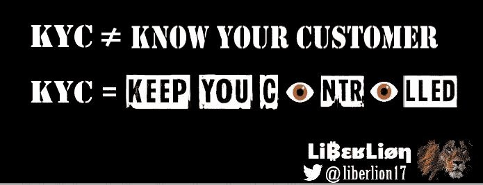

# KYC，一个大规模监控仪器

> 原文：<https://medium.com/coinmonks/kyc-a-mass-surveillance-instrument-305ffe9b3bd6?source=collection_archive---------9----------------------->

KYC 或“了解您的客户”是任何有银行或金融关系的公司都必须遵守的法规。

这些规则在世界各地强制执行，旨在确保作为交易所和/或汇款人的企业拥有关于其服务的每个客户的“充分”信息。

监管机构使用的理由是，KYC 是为了打击洗钱和恐怖融资而创建的，但我们知道，随着时间的推移，自 20 世纪 70 年代实施以来，它已被证明是无效的，银行是非法资金的第一洗钱者，不遵守他们自己的 KYC，但遵守你们的。

“进行性 KYC”是一种传播缓慢的疾病，但其黑暗的结局超出了其最初的目的。

如果你通过这些受监管的实体之一购买，他们实际上用你的个人身份来标记你的基金地址。这使得像最大的法律咨询公司 Chainalysis 这样与政府签约的区块链监控公司变得更加容易

目标:

*   跟踪你的消费习惯
*   防止您使用其他不受监管的服务
*   必要时没收你的资金
*   征收税款
*   他们通常比他们应该知道的更多

# 你需要提供什么信息？

为了在 KYC 交易所购买加密货币，用户需要提供个人信息。您需要提供的金额因人而异，对于小额金额，有些可能需要简单的名称(您可以轻松地提供别名)，而其他可能需要所有信息。大多数人会询问以下数据的任意组合:

*   姓名
*   电话号码
*   电子邮件
*   侨居国
*   驾驶执照
*   鉴定文件
*   拿着一张写有交易所名称和日期的纸的自拍照
*   与交易所进行视频通话。

# 为什么提供这些信息会有风险？

## 数据泄露

KYC 信息将您的个人身份与您购买的任何加密货币联系起来。交易所知道:

*   你是谁
*   你买了多少
*   你什么时候买的
*   您的银行信息
*   你把资金转移到哪里

因为其中一些公司的安全措施不力。如果你的名字、地址、照片，以及你的确切资金数额从交易所被盗，并被卖给暗网市场上的最高出价者，你会有什么感受？这听起来像是危言耸听，但是数据泄露发生得太频繁了！

## 审查制度

这些交流大多以某种方式直接与连锁监控公司合作(有些直接与政府机构合作！)遵从他们选择的司法管辖区。大多数区块链完全透明的性质意味着任何人只要有合适的工具就可以跟踪你的活动。如果你向监管机构不喜欢的实体提款或存款，他们可以冻结你的资金，甚至关闭你的账户。这并不完全符合区块链技术的抗审查特性。

# 你还有其他选择

幸运的是，有一些选择可以购买没有 KYC 来源的加密货币，这就是 P2P(点对点)交易所，在这里你将直接与另一个人谈判，而不是与集中的第三方谈判。

## 交易所 P2P

*   [**hodl**hodl](https://hodlhodl.com/)
*   [Bisq](https://bisq.network/)
*   
*   **[**LocalCoinSwap**](https://localcoinswap.com/)**

## **自动取款机**

**自动柜员机是另一个很好的选择，但要谨慎使用，因为有些仍然需要不同级别的身份识别，这取决于购买的金额。许多人只需要一个电话号码，所以一定要使用一个没有标记你的个人身份的号码。查看 [out Coin ATM Radar](https://coinatmradar.com/) 了解当地可用的服务。**

# **购买没有 KYC 的加密软件会有很高的溢价吗？**

**毫无疑问，你会看到有人在 P2P 交易所以高于现货价格的溢价购买加密货币**。然而，如果你有足够的耐心，你可以当场或略高于(1-4%)的价格买一些。Bisq 和 Hodl Hodl 都允许你创建一个“买入报价”，这实质上是告诉市场，你想以相对于现货价格的“X%”买入“X”数量的比特币。然后你需要做的就是等待卖家接受你的报价并完成交易。****

# **如果你已经在 KYC 购买了加密货币，该怎么办**

**一旦你从 KYC 进货，你就再也回不去 T21 了。即使是像 Coinjoin 这样创造前瞻性隐私的先进技术也不行。您有三个主要选项:**

## **在同一个交易所出售你的基金**

**在你购买的交易所出售你在 KYC 购买的硬币。根据司法管辖区的不同，这可能会为您创建一个需要处理的应税事件，但随后您将拥有一份书面记录来证明您不再拥有这些硬币。这个过程给了你一个“干净的开始”,你可以从一个非 KYC 来源开始，安全地知道你不再容易受到上述风险的伤害。**

## **分开购买**

**停止通过 KYC 渠道购买，完全隔离并标记这些基金。然后，开始通过非 KYC 来源购物，确保保持完全隔离。这种选择仍然让你容易受到上述风险的影响，但你可以选择那些较小的金额为 KYC 或那些你不想出售和处理税务事件。**

## **移动辖区**

**这更极端，但可能是一个让你免除未来义务的选择。当然，这不是 100%的保证，因为某些司法管辖区可能有信息共享协议。**

# **KYC 是对你隐私的侵犯，危险且无效，这让你处于危险之中**

**[libelion.com](http://liberlion.com/)**

> **加入 Coinmonks [电报频道](https://t.me/coincodecap)和 [Youtube 频道](https://www.youtube.com/c/coinmonks/videos)了解加密交易和投资**

# **另外，阅读**

*   **[3 商业评论](/coinmonks/3commas-review-an-excellent-crypto-trading-bot-2020-1313a58bec92) | [Pionex 评论](https://coincodecap.com/pionex-review-exchange-with-crypto-trading-bot) | [Coinrule 评论](/coinmonks/coinrule-review-2021-a-beginner-friendly-crypto-trading-bot-daf0504848ba)**
*   **[莱杰 vs n rave](/coinmonks/ledger-vs-ngrave-zero-7e40f0c1d694)|[莱杰 nano s vs x](/coinmonks/ledger-nano-s-vs-x-battery-hardware-price-storage-59a6663fe3b0) | [币安评论](/coinmonks/binance-review-ee10d3bf3b6e)**
*   **[Bybit Exchange 审查](/coinmonks/bybit-exchange-review-dbd570019b71) | [Bityard 审查](https://coincodecap.com/bityard-reivew) | [Jet-Bot 审查](https://coincodecap.com/jet-bot-review)**
*   **[3 commas vs crypto hopper](/coinmonks/3commas-vs-pionex-vs-cryptohopper-best-crypto-bot-6a98d2baa203)|[赚取秘密利息](/coinmonks/earn-crypto-interest-b10b810fdda3)**
*   **最好的比特币[硬件钱包](/coinmonks/hardware-wallets-dfa1211730c6) | [BitBox02 回顾](/coinmonks/bitbox02-review-your-swiss-bitcoin-hardware-wallet-c36c88fff29)**