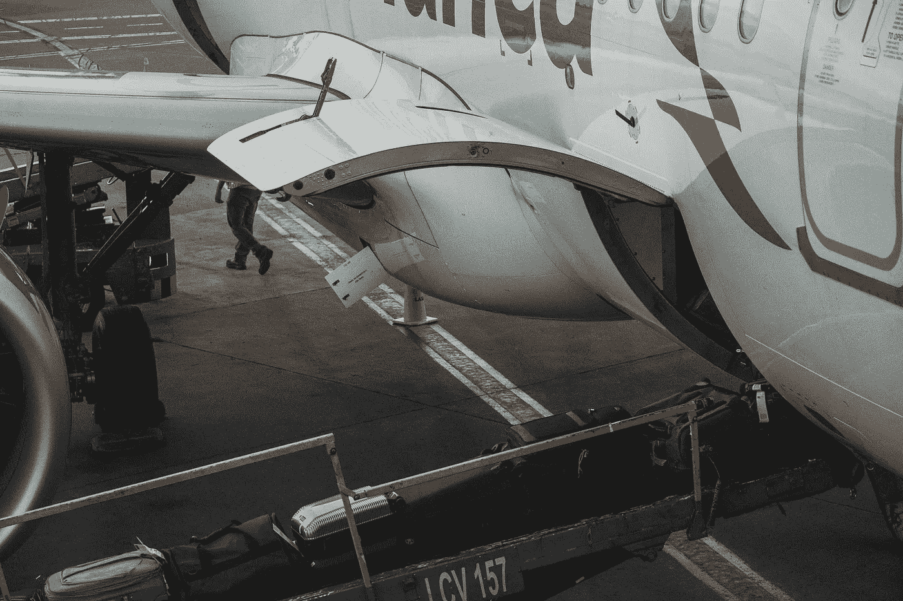

# 女士们，先生们，系好安全带，准备乘坐区块链航空公司起飞

> 原文：<https://medium.com/coinmonks/ladies-and-gentlemen-fasten-your-seatbelts-and-get-ready-for-take-off-with-blockchain-airlines-7f056548baa6?source=collection_archive---------32----------------------->

乘客们，下午好。我是你们的机长。首先，我要欢迎区块链 86A 航班上的所有人。我们目前正以每小时 400 英里的速度在 33，000 英尺的高度巡航。时间是下午 1 点 25 分。天气看起来很好，顺风向我们这边，我们预计比预定时间提前大约十五分钟到达伦敦。大约 20 分钟后，机组人员会过来为您提供小吃和饮料，现在开始登机**。**

*民用航空几乎在世界任何地方运送乘客和货物。民用航空的可用性是经济发展的一个重要推动因素。民用航空连接全球，给消费者和企业带来有形和无形的经济利益。民用航空是降低贸易壁垒的主要影响因素；飞机行业是创新和技术发展的独一无二的引擎。航空业目前占全球 GDP 的 3.5 万亿美元(4.1%)。普及航空的出现是地球历史上的一个分水岭。航空运输前所未有地将各国和各大洲联系在一起，改善了外交关系、商业、贸易和旅游。*

*从一开始，航空就处于最前沿，利用了当时最先进的技术，同时也激发了新的技术；如果没有飞机工业、航空安全和舒适，许多发明今天都不会存在。例如，由于不断寻求更好、更轻、更强的飞机解决方案，发动机制造取得了巨大的进步。对每一次空难的彻底调查导致了新的安全措施和建筑材料的发展，以及许多我们现在认为理所当然的技术。*

*商业航空业务是一个高度复杂的领域，其中许多实体参与了旅行产品和服务的交付，从客户的角度来看，这些产品和服务可能偶尔表现为单一产品。这些参与者经常合作，共同交付价值，满足客户的期望。从旅行者在网上浏览机票到抵达目的地，该航空公司只是航空链中大约 26 个合作伙伴之一。*

***旅游价值链每个阶段的智能合同***

*航空公司和其他价值链参与者交易产品和服务，并在合同签订、合同执行、合同监控、对账、发票开具和结算方面花费大量精力。使用智能合同的概念，所有这些工作都可以消除或减少。智能合约可以被创建为独立运行，由中立的数据源和预定义的标准激活。*

***货物、行李和备件***

**

*随着旅客行李、货物和飞机替换零件等重要资产的保管发生变化，区块链能够非常可靠且永久地跟踪它们的状态和下落。随着这些类型的东西沿着价值链向上移动，这提供了一个提高可见性和开放性的机会。这些新功能可以开拓新产品开发领域，提高流程效率，并使供应商能够处理中断。*

***常旅客积分***

*通过标记这些资产，使它们数字化和无处不在，区块链有可能大大加快常旅客积分的赚取、支出、核算和对账。虽然客座率的不断上升令人鼓舞，但这使得航空公司更难将积分兑换成机票。除了资产负债表债务问题，赚取、兑换和交换积分的过程已经成熟，可以进行创新，特别是在联盟之间。*

***乘客和乘务人员身份管理***

**

*区块链可能会简化乘客身份管理，改善体验，保护隐私，并使航空公司和更大的价值链能够在数字环境中开展业务。*

***支付和分配***

*区块链使航空公司、旅行社和分销行业的其他人能够更有效地互动，同时共同提供旅游产品和服务。预计的调整可能会扩大各方的分销范围，并提高旅行项目和服务的汇总效率。它还有可能使支付更加透明、实时和低成本。*

*虽然区块链的好处在某些用例中是具体的，但该战略应该从一个具体的问题开始，并在整个过程中保持解决方案驱动，以避免区块链成为寻求解决问题的解决方案。当确定区块链的使用案例时，应彻底考虑所有设计方案(例如，公共与私有、许可与无许可)，以获得最佳解决方案。*

**

**所以，女士们先生们，在我们到达目的地之前，我会在区块链的另一篇博客中再次与你们交谈。在那之前，请坐好，放松，享受剩下的旅程。**

> *加入 Coinmonks [电报频道](https://t.me/coincodecap)和 [Youtube 频道](https://www.youtube.com/c/coinmonks/videos)了解加密交易和投资*

# *另外，阅读*

*   *[德国最佳加密交易所](https://coincodecap.com/crypto-exchanges-in-germany) | [Arbitrum:第二层解决方案](https://coincodecap.com/arbitrum)*
*   *[币安交易机器人](/coinmonks/binance-trading-bots-d0d57bb62c4c) | [OKEx 评论](/coinmonks/okex-review-6b369304110f) | [Atani 评论](https://coincodecap.com/atani-review)*
*   *[最佳加密交易信号电报](/coinmonks/best-crypto-signals-telegram-5785cdbc4b2b) | [MoonXBT 评论](/coinmonks/moonxbt-review-6e4ab26d037)*
*   *[如何在 Bitbns 上购买柴犬(SHIB)币？](https://coincodecap.com/buy-shiba-bitbns) | [购买弗洛基](https://coincodecap.com/buy-floki-inu-token)*
*   *[CoinFLEX 评论](https://coincodecap.com/coinflex-review) | [AEX 交易所评论](https://coincodecap.com/aex-exchange-review) | [UPbit 评论](https://coincodecap.com/upbit-review)*
*   *[十大最佳加密货币博客](https://coincodecap.com/best-cryptocurrency-blogs) | [YouHodler 评论](https://coincodecap.com/youhodler-review)*