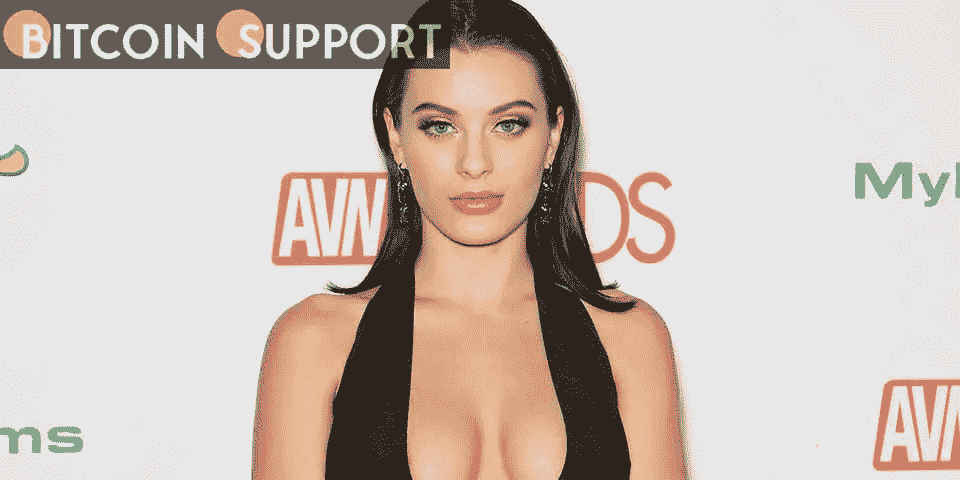

# 拉娜·罗迪斯在批评 NFT 项目后删除了推特账户

> 原文：<https://medium.com/coinmonks/lana-rhoades-deletes-twitter-account-after-criticized-nft-project-a13403ab41c1?source=collection_archive---------14----------------------->

**Visit our website:-** [**https://bitcoinsupports.com/**](https://bitcoinsupports.com/)

在铸币厂的 150 万美元以太坊被从该项目的钱包中取出后，成人电影明星拉娜·罗迪斯(Lana Rhoades)因其不可替代的令牌(NFT)项目“密码病”而受到严厉批评在 Rhoades 向她的粉丝保证 NFTs 将是“对持有者有利可图的投资”之后，这位色情明星取消了她的官方 Twitter 账户，以回应反弹。拉娜·罗迪斯在被指控诋毁她的 NFT 项目

后，删除了她的推特账户。加密部门的人批评拉娜·罗迪斯在 NFT 加密项目中的角色，该项目包括 6069 个这位成人电影明星的 NFT 卡通形象。根据 Coffeezilla 发布的视频，Rhoades 被指控从该项目中移除了大量以太坊(ETH)。

根据指控，罗迪斯将她的 NFT 系列作为一项“有利可图的投资”进行营销，但在退出和该项目的 Discord channel 的一系列声明之后，人们对 NFT 的 Cryptosis 项目的信任已经下降。Coffeezilla 和其他人将这一举动称为“拉地毯”(rug pull)，这是一个在加密业务中使用的术语，用于描述积累了大量资金的项目，但随后创始人放弃了该项目，并保留了筹集的资金。Youtuber Coffeezilla 的另一个视频的视频描述说:“Rhoades 对 crypto 来说并不陌生，她过去已经完成了多个 tokens，Lana 甚至还帮助过其他 NFT 项目 rug pulls，如 Stickdix、Titscoin 和 Pawgcoin。罗迪斯似乎对这些指控感到愤怒，从她在视频发布后对 Youtuber 的评论中可以看出这一点。这位成人电影明星说:“Youtubers 是他妈的神经病，网络疾病，会为了观看而说或做任何事情。”罗迪斯接着说:

**我有一个一个月大的婴儿要照看，我当时只想骗骗大家，带着这些废话离开这里。仅仅因为一个项目没有按计划进行并不意味着它是恶意的。人们厌倦了为了获得观点而引发争议。**

截至发稿时，该色情明星的官方推特账号已被停用。然而，archive.org 在推特上存档了罗迪斯社交媒体账户的一大部分。

人们还在购买 Cryptosis NFTs，罗迪斯在 Opensea 上的 NFT 系列底价为 0.018 以太，合 50.23 美元。有一个列表出价 310 万美元出售隐孢子虫 NFT #5795。

许多其他人都在寻找几十万美元来换取罗迪斯的 NFT。另一方面，这些有希望的隐孢子虫 NFT 卖家似乎根本不卖。自 2 月 22 日以来，当平均销售价格为 0.1624 乙醚或 453.20 美元每隐球菌 NFT，销售活动已经下降。

**访问我们的网站:-**[**https://bitcoinsupports.com/**](https://bitcoinsupports.com/)

**免责声明:以上为作者观点，不应视为投资建议。读者应该自己做研究。**

> 加入 Coinmonks [电报频道](https://t.me/coincodecap)和 [Youtube 频道](https://www.youtube.com/c/coinmonks/videos)了解加密交易和投资

# 另外，阅读

*   [印度加密交易所](/coinmonks/bitcoin-exchange-in-india-7f1fe79715c9) | [比特币储蓄账户](/coinmonks/bitcoin-savings-account-e65b13f92451)
*   [OKEx vs KuCoin](https://coincodecap.com/okex-kucoin) | [摄氏替代品](https://coincodecap.com/celsius-alternatives) | [如何购买 VeChain](https://coincodecap.com/buy-vechain)
*   [币安期货交易](https://coincodecap.com/binance-futures-trading)|[3 comas vs Mudrex vs eToro](https://coincodecap.com/mudrex-3commas-etoro)
*   [如何购买 Monero](https://coincodecap.com/buy-monero) | [IDEX 评论](https://coincodecap.com/idex-review) | [BitKan 交易机器人](https://coincodecap.com/bitkan-trading-bot)
*   [CoinDCX 评论](/coinmonks/coindcx-review-8444db3621a2) | [加密保证金交易交易所](https://coincodecap.com/crypto-margin-trading-exchanges)
*   [红狗赌场评论](https://coincodecap.com/red-dog-casino-review) | [Swyftx 评论](https://coincodecap.com/swyftx-review) | [CoinGate 评论](https://coincodecap.com/coingate-review)
*   [Bookmap 评论](https://coincodecap.com/bookmap-review-2021-best-trading-software) | [美国 5 大最佳加密交易所](https://coincodecap.com/crypto-exchange-usa)