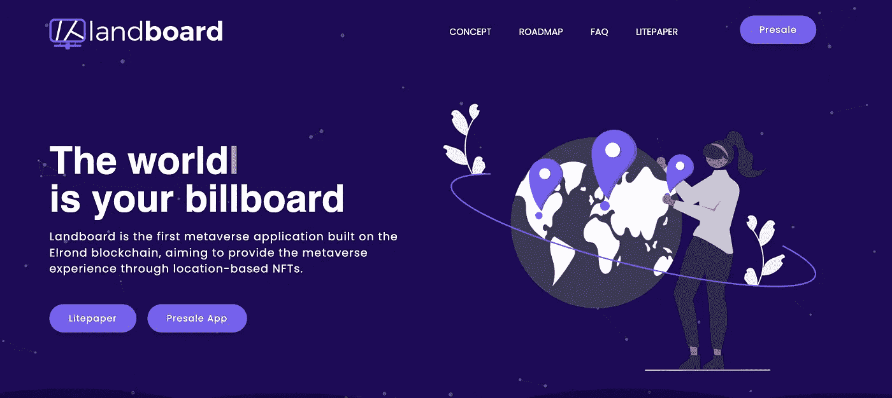

# land board——埃尔隆德生态系统的第一个元宇宙项目

> 原文：<https://medium.com/coinmonks/landboard-first-metaverse-project-on-elrond-ecosystem-3f34d34d59b9?source=collection_archive---------12----------------------->

Landboard 是埃尔隆德生态系统中第一个元宇宙去中心化的应用程序，旨在成为数字创作者、投资者和元宇宙与区块链爱好者的强大工具。它允许人们购买、交易和使用罗马尼亚的虚拟土地。

在继续之前，我们想强调的是，我们不建议你买或不买，我们不是财务顾问，你必须在投资前做自己的研究。

Landboard 的使命是在购买虚拟土地时为用户提供独特的体验。通过独特的功能获得独特的体验，例如:通过出租土地获得被动收入，利用土地宣传你的信仰和许多其他事情。

在 Landboard 生态系统中，人们将能够出于广告原因使用他们的土地。拥有多个图块将使您能够创建更大的图像，获得更多的可见性。你可以用这个来推广你的产品，NFT，业务或任何你选择的东西。

在 Landboard 生态系统中，你可以简单快速地获得被动收入:将你的土地出租给其他感兴趣的用户。你从其他人那里收到使用你土地的提议，你可以选择是否接受这个提议。整个陆地生态系统将不仅由 EGLD 驱动，而且通过它自己的令牌:土地。

令牌将尽快在 Maiar Exchange 上推出，以让用户有机会高效地使用令牌并扩大社区。土地令牌将用于:DAO 参与，早期访问应用程序，让持有者有可能在普通用户之前抢到他们最喜欢的土地，降低版税，特别赠品和空投。

土地令牌旨在使土地委员会生态系统内的交易更容易、更快、更有回报。持有土地将允许早期访问土地应用程序，以及治理，奖励，赌注和降低费用。

如果你想购买预售，你可以从他们的网站，按下预售按钮，连接你的钱包。第一轮预售几乎售罄，第二轮预售将宣布。这个团队由两个年轻人组成，他们是公众成员。通过他们的项目，他们似乎雄心勃勃，我们希望这个项目将会成功。

在我们看来，该项目是一个好项目，它也有一些团队必须努力的事情，例如创建一个更详细的白皮书，扩大团队，让人们全职为项目工作，并形成一个社区来支持项目。毕竟，在加密领域，社区给了你翅膀。

> *加入 Coinmonks* [*电报频道*](https://t.me/coincodecap) *和* [*Youtube 频道*](https://www.youtube.com/c/coinmonks/videos) *了解加密交易和投资*

# 另外，阅读

*   [3 商业评论](/coinmonks/3commas-review-an-excellent-crypto-trading-bot-2020-1313a58bec92) | [Pionex 评论](https://coincodecap.com/pionex-review-exchange-with-crypto-trading-bot) | [Coinrule 评论](/coinmonks/coinrule-review-2021-a-beginner-friendly-crypto-trading-bot-daf0504848ba)
*   [莱杰 vs n 格拉夫](/coinmonks/ledger-vs-ngrave-zero-7e40f0c1d694) | [莱杰纳诺 s vs x](/coinmonks/ledger-nano-s-vs-x-battery-hardware-price-storage-59a6663fe3b0) | [币安评论](/coinmonks/binance-review-ee10d3bf3b6e)
*   [Bybit Exchange 审查](/coinmonks/bybit-exchange-review-dbd570019b71) | [Bityard 审查](https://coincodecap.com/bityard-reivew) | [Jet-Bot 审查](https://coincodecap.com/jet-bot-review)
*   [3 commas vs crypto hopper](/coinmonks/3commas-vs-pionex-vs-cryptohopper-best-crypto-bot-6a98d2baa203)|[赚取加密利息](/coinmonks/earn-crypto-interest-b10b810fdda3)
*   最好的比特币[硬件钱包](/coinmonks/hardware-wallets-dfa1211730c6) | [BitBox02 回顾](/coinmonks/bitbox02-review-your-swiss-bitcoin-hardware-wallet-c36c88fff29)
*   [BlockFi vs Celsius](/coinmonks/blockfi-vs-celsius-vs-hodlnaut-8a1cc8c26630)|[Hodlnaut 点评](/coinmonks/hodlnaut-review-best-way-to-hodl-is-to-earn-interest-on-your-bitcoin-6658a8c19edf) | [KuCoin 点评](https://coincodecap.com/kucoin-review)
*   [Bitsgap 审查](/coinmonks/bitsgap-review-a-crypto-trading-bot-that-makes-easy-money-a5d88a336df2) | [Quadency 审查](/coinmonks/quadency-review-a-crypto-trading-automation-platform-3068eaa374e1) | [Bitbns 审查](/coinmonks/bitbns-review-38256a07e161)