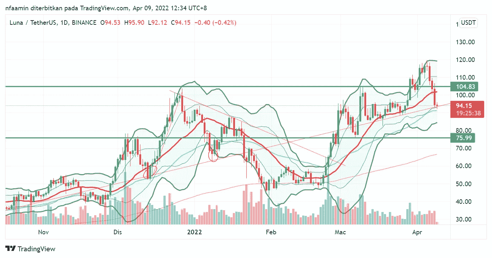
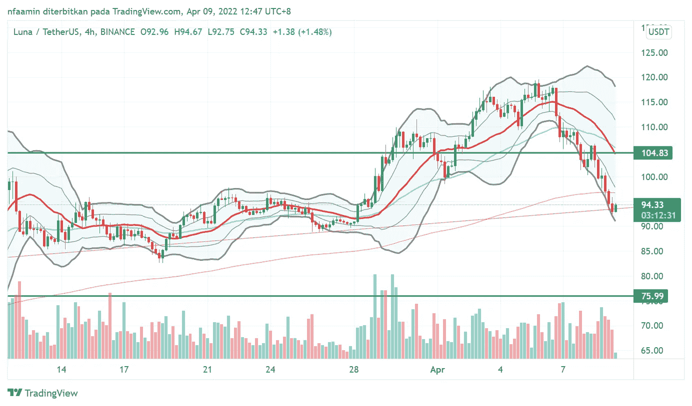
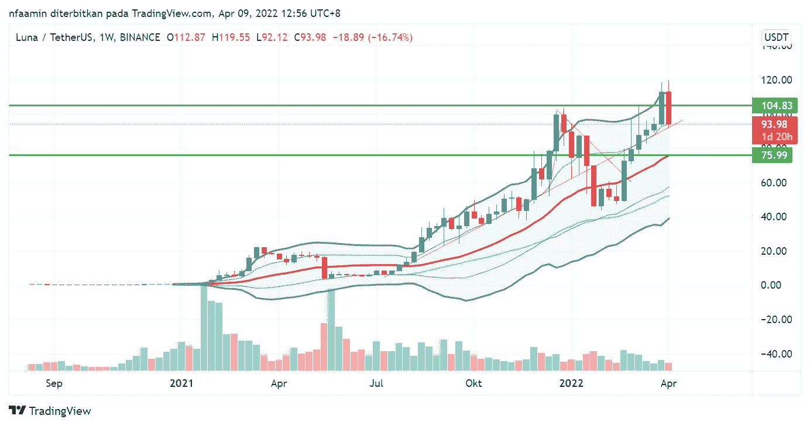
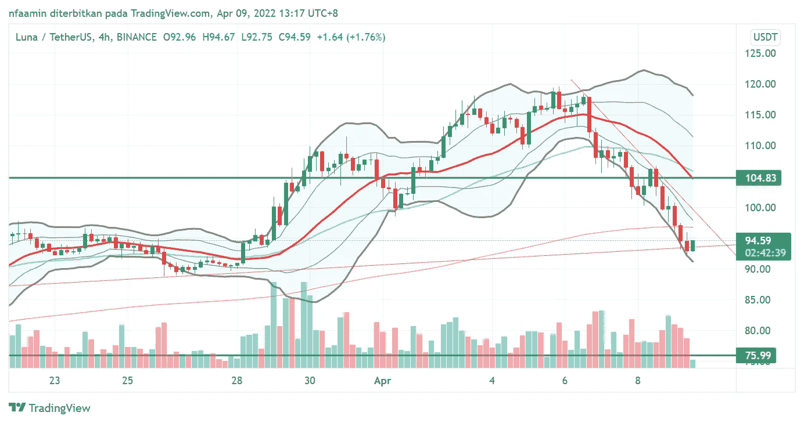

# 抓住$100 以下的$LUNA 的最后机会

> 原文：<https://medium.com/coinmonks/last-chance-to-grab-luna-below-100-1c020cd77903?source=collection_archive---------29----------------------->

# 这不是财务建议，只是教育。

请看看我之前在[‘如何交易$ LUNA’](/coinmonks/luna-price-update-363f7c4c2afb)上的帖子，以了解这种说法从何而来。在我以前的文章中，我已经分享了如何使用趋势线交易$LUNA。到目前为止，趋势线仍然保持它的支撑，并且几乎总是在它上面反弹。

## 每日图表

$LUNA is trading below $100

4 月 5 日，Luna 创下了 119.55 美元的历史新高。**在动荡的市场中创出历史新高的能力表明，美元将强劲上涨。**这一理论适用于所有市场。

在创下历史新高后，LUNA 正准备进行修正。**我们目前看到的调整是健康的。**希望$LUNA 能把握住趋势线。注意，Luna 目前也在测试 EMA50(绿线)作为支持。

注意**我们在这个价格范围有两个支持:**

1.  **趋势线**
2.  **EMA50**

如果$LUNA 突破这个支撑范围，$LUNA 会继续转储到下一个支撑。如果发生这种情况，这意味着$LUNA 未能生成更高的低点。要继续向上移动，$LUNA 必须生成更高的高点和更高的低点。

根据价格经验， **$LUNA 一次又一次地证明，不跟随$BTC 的价格波动，独自行动是强有力的。**

$LUNA 4 hour chart

如果$LUNA 从这个趋势线反弹，我预计$LUNA 将测试 104 美元，110 美元和 119 美元的阻力。

> 如果失败，$LUNA 可以转储到$75 范围。

**还有一种可能性是，$LUNA 将进一步下跌，以取出弱手牌，为升至更高价位做准备**。

关于这一点，提醒自己是交易者还是投资者是很重要的。交易者不希望陷入抛售的境地，因为没有人知道价格何时会再次上涨。同时，投资者不需要太担心每日的价格变动。你是在做一场长期的游戏。

## 每周图表

The candle for weekly chart does not look that good

我们来看$LUNA 周线图。现在的蜡烛在我眼里并不好看。**最后两根蜡烛是镊子顶端形成的**。下周蜡烛对交易者来说至关重要。交易者在这里需要小心。去年年末的下降趋势有可能重演。因此，$LUNA 保持其当前的支持是很重要的。

**如果失败，$LUNA 可以转储到$75 范围。**

在交易中，最好同时看大的和小的时间框架。这样可以避免过早进入或者在顶部进入。

我个人会等待进一步确认进入。这意味着我将等待蜡烛发出反转信号。鉴于当前趋势线失去支撑，准备好画一条新的下降趋势线。

## **4 小时图**

反转信号将首先出现在较小的时间范围内。

**画一条短期趋势线是检查反转信号的最好方法之一**。如上图，我在 4 小时图上画了一条短期下跌趋势线。观察价格在触及趋势线后是如何反弹的。这意味着这条短期下跌趋势线是$LUNA 需要突破的阻力，以阻止价格下跌。一旦它设法打破这种下降趋势线，有机会为$卢纳反弹。

**永远记住在交易中首先要管理风险。**

说实话，我看好$LUNA。作为交易者，我只想以折扣价入场；)

如果觉得这篇文章有帮助就鼓掌分享吧！非常感谢:)

我必须提醒你，这不是财务建议。这里分享的一切只为教育。在投资任何硬币/代币之前，一定要做好自己的研究。根据你的个人情况，这对 DYOR 很重要。我不会对你的任何投资负责。

> 加入 Coinmonks [电报频道](https://t.me/coincodecap)和 [Youtube 频道](https://www.youtube.com/c/coinmonks/videos)了解加密交易和投资

# 另外，阅读

*   [密码本交易平台](/coinmonks/top-10-crypto-copy-trading-platforms-for-beginners-d0c37c7d698c) | [Coinmama 审核](/coinmonks/coinmama-review-ace5641bde6e)
*   [印度的加密交易所](/coinmonks/bitcoin-exchange-in-india-7f1fe79715c9) | [比特币储蓄账户](/coinmonks/bitcoin-savings-account-e65b13f92451)
*   [OKEx vs KuCoin](https://coincodecap.com/okex-kucoin) | [摄氏替代品](https://coincodecap.com/celsius-alternatives) | [如何购买 VeChain](https://coincodecap.com/buy-vechain)
*   [币安期货交易](https://coincodecap.com/binance-futures-trading)|[3 commas vs Mudrex vs eToro](https://coincodecap.com/mudrex-3commas-etoro)
*   [如何购买 Monero](https://coincodecap.com/buy-monero) | [IDEX 评论](https://coincodecap.com/idex-review) | [BitKan 交易机器人](https://coincodecap.com/bitkan-trading-bot)
*   [CoinDCX 评论](/coinmonks/coindcx-review-8444db3621a2) | [加密保证金交易交易所](https://coincodecap.com/crypto-margin-trading-exchanges)