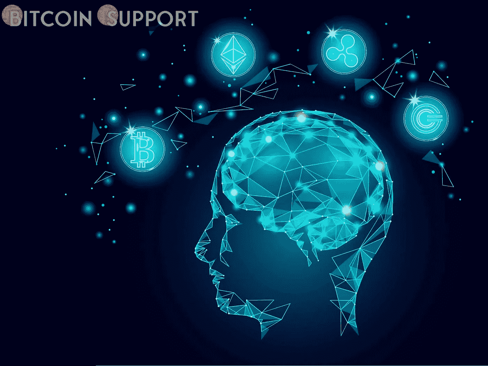
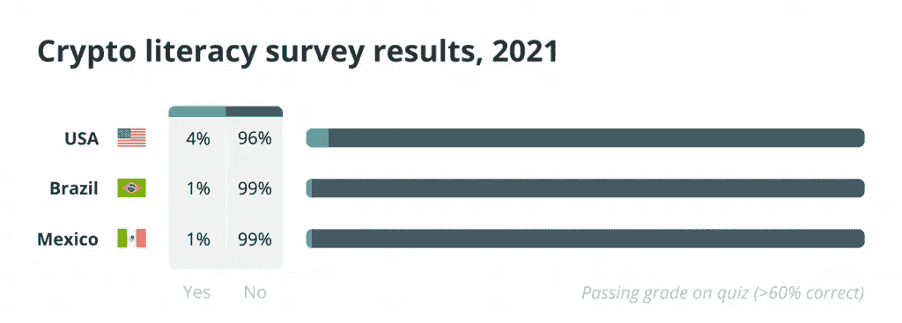
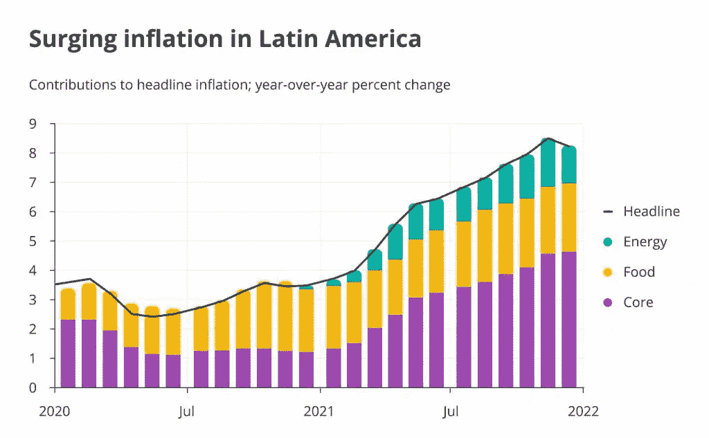
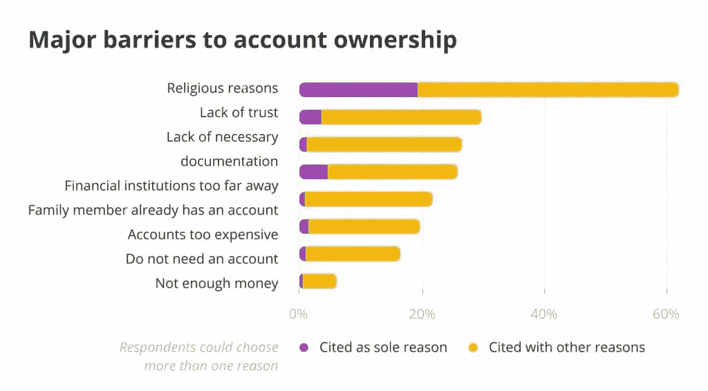

# 拉丁美洲人可以通过获得财务独立从加密货币教育中受益

> 原文：<https://medium.com/coinmonks/latin-americans-can-benefit-from-cryptocurrency-education-by-gaining-financial-independence-e2f39a3ae507?source=collection_archive---------63----------------------->

**Visit our website:-** [**https://bitcoinsupports.com/**](https://bitcoinsupports.com/)

如果我们做得好，加密教育可能是促进金融赋权和提高拉丁美洲广泛接受度的关键。据估计，2021 年 10 月，全球约 15%的比特币(BTC)在拉丁美洲流通。然而，根据 Crypto Literacy 最近发布的一项调查，99%的巴西和墨西哥受访者未能通过基本的加密素养评估。加密技术在该地区的采用正在进行中，甚至还在上升，但许多人仍然缺乏对其背后的技术及其应用的基础知识。

**Visit our website:-** [**https://bitcoinsupports.com/**](https://bitcoinsupports.com/)

当在拉丁美洲经济增长的背景下评估这种基本加密素养的缺乏时，区块链技术在现实世界中有应用，这就成为一个严重的担忧。

拉丁美洲不通晓密码的人可能会错过稳定的货币，这可以保护他们免受该地区快速上升的通货膨胀的影响。以及分散化应用程序(DApps ),让没有银行账户的人可以通过智能手机获得金融服务。在汇款是经济重要组成部分的国家，加密货币为跨境转移资金提供了一种更快、更便宜的方式。

**Visit our website:-** [**https://bitcoinsupports.com/**](https://bitcoinsupports.com/)

那么，我们如何才能让这项改变生活的技术更容易被拉丁美洲最受忽视的人群所利用呢？教育。

**利用教育打开主流采用的大门**

金融知识、信任和安全是主流加密采用的三个基本障碍，教育有能力解决这些障碍。

**金融敏锐度**

金融素养，或者说缺乏金融素养，不仅是接受加密的障碍；这也是银行常规采用的一个障碍。截至 2021 年 8 月，拉丁美洲和加勒比地区约一半的人口没有银行账户，这意味着他们无法获得银行账户或其他金融服务。除了居住在远离金融机构的地方，许多人说他们没有银行账户是因为他们对金融机构缺乏信任。缺乏信任的地方通常缺乏理解。

**信任**

从个人经历来看，在墨西哥经常听到父母建议他们的(成年)子女将他们的储蓄兑换成美元并存入保险箱，而不是将他们的利润委托给银行机构的故事。通过围绕广泛的金融理念和更集中的区块链相关主题提高金融知识，我们可以激发对金融机构的更多信任，将其作为促进主流采用的关键支柱。

**Visit our website:-** [**https://bitcoinsupports.com/**](https://bitcoinsupports.com/)

安全

教育激发信任的方式不仅仅是金融机构。这也是关于相信自己:不熟悉他们所接触的机构和技术的人更容易做出危险的财务决策。他们很清楚这一点。教育可以起到安全网的作用，让人们了解有哪些保护他们的法规，以及金融服务如何适应这些框架。

**教它最算数的地方**

加密货币具有革命性改变世界的能力，掌握它的人将拥有显著的优势。鉴于教育的重要性，为了延续现有的差异，加密世界故意瞄准受众是至关重要的。偏远和服务不足的地区，以及那些无法获得传统教育的地区，应该成为区块链教育的主要受益者。

我们必须为遥远的村庄提供移动友好的教育可能性，以便人们可以通过手机访问学习材料，而不必驱车数百公里前往最近的城市。

对于受教育程度较低的个人，应考虑使用多媒体教育工具，这种工具无需假定基础知识水平较高即可避免阅读要求。

女性对加密货币的兴趣越来越大，然而教育差距依然存在

我们应该为全球受众提供当地语言的资源，例如拉丁美洲的西班牙语和葡萄牙语，以确保我们接触到最广泛的潜在受众。我们必须避免为每个人的教育设置财政障碍，相信通过免费开放教育扩大用户群的长期好处。

区块链技术和加密货币的产生是为了颠覆既定的金融权力结构。他们有能力显著提高拉丁美洲的金融包容性和自由度。因此，毫不奇怪，加密货币的接受度已经在上升。然而，当新技术被更广泛地采用时，我们面临着将最脆弱的人群抛在身后的风险。这是教育可以帮助解决的事情。教育可以帮助人们通过灌输知识来获得对这一快速发展的技术的信心，使他们能够正确地与这些新工具互动。金融排斥是可以通过教育打破的。

**访问我们的网站:-**[**https://bitcoinsupports.com/**](https://bitcoinsupports.com/)

**免责声明:以上为作者观点，不应视为投资建议。读者应该自己做研究。**