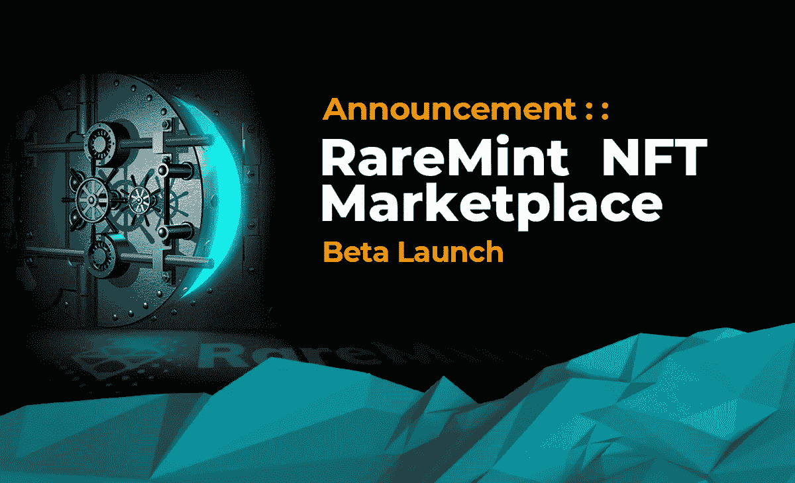

# 公告::稀有薄荷 NFT 市场发布

> 原文：<https://medium.com/coinmonks/launch-announcement-raremint-nft-marketplace-beta-f031a49ed01?source=collection_archive---------30----------------------->

## 体育收藏品的未来

稀有薄荷团队自豪地宣布，NFT 市场将于 2022 年 3 月 15 日星期二发布私人测试版。在这 48 小时内，列入白名单的社区成员将能够直接在平台上购物。

从 3 月 17 日星期四开始，市场公开测试将从新的 1/1 超稀有 NFT(资产支持)和限量版 NFT 开始，并公开发售。

从 3 月 22 日开始，每周二和周四都会有新的下降趋势，包括标志性的传奇、备受瞩目的明星、激动人心的新人和著名的体育赛事。通过令人回味的故事和身临其境的内容，稀有薄荷提供了一个开创性的数字经验，以纪念著名运动员和重大时刻的体育运动。

NFT 市场在 RareMint.com 上线

## 关于稀有薄荷

稀有薄荷正在扰乱体育收藏品市场，扩大标志性纪念品在全球粉丝群中的影响力。通过专有的数字化过程，稀有金属从真实的现实世界体育收藏品中创造出 3D 照片逼真的 NFT。这些 1/1 超稀有 NFT 以其实物资产为后盾，由 NFT 持有者持有。凭借即将在元宇宙推出的产品实用程序、交互式运动员体验和对现场事件的访问，稀有金属正在打造体育收藏品的未来。

## 保持联系，✨

在[推特](https://twitter.com/RareMint_nft)和[不和](http://discord.gg/raremint)上关注我们最新的稀有薄荷更新。

一定要在[稀有](http://raremint.com/)查看我们最新的市场列表！

> 加入 Coinmonks [电报频道](https://t.me/coincodecap)和 [Youtube 频道](https://www.youtube.com/c/coinmonks/videos)了解密码交易和投资

# 此外，请阅读

*   [如何购买 Monero](https://coincodecap.com/buy-monero) | [IDEX 点评](https://coincodecap.com/idex-review) | [比拼交易机器人](https://coincodecap.com/bitkan-trading-bot)
*   [CoinDCX Review](/coinmonks/coindcx-review-8444db3621a2) | [加密融资融券交易所](https://coincodecap.com/crypto-margin-trading-exchanges)
*   [红狗赌场评论](https://coincodecap.com/red-dog-casino-review) | [Swyftx 评论](https://coincodecap.com/swyftx-review) | [造币厂评论](https://coincodecap.com/coingate-review)
*   [Bookmap 评论](https://coincodecap.com/bookmap-review-2021-best-trading-software) | [美国 5 大最佳加密交易所](https://coincodecap.com/crypto-exchange-usa)
*   [如何在 FTX 交易所交易期货](https://coincodecap.com/ftx-futures-trading) | [OKEx vs 币安](https://coincodecap.com/okex-vs-binance)
*   [CoinLoan 审查](https://coincodecap.com/coinloan-review) | [YouHodler 审查](/coinmonks/youhodler-4-easy-ways-to-make-money-98969b9689f2) | [BlockFi 审查](https://coincodecap.com/blockfi-review)
*   [XT.COM 评论](https://coincodecap.com/profittradingapp-for-binance)币安评论 |
*   [SmithBot 评论](https://coincodecap.com/smithbot-review) | [4 款最佳免费开源交易机器人](https://coincodecap.com/free-open-source-trading-bots)
*   [比特币基地僵尸程序](/coinmonks/coinbase-bots-ac6359e897f3) | [AscendEX 审查](/coinmonks/ascendex-review-53e829cf75fa) | [OKEx 交易僵尸程序](/coinmonks/okex-trading-bots-234920f61e60)
*   [如何在印度购买比特币？](/coinmonks/buy-bitcoin-in-india-feb50ddfef94) | [瓦济克斯审查](/coinmonks/wazirx-review-5c811b074f5b)