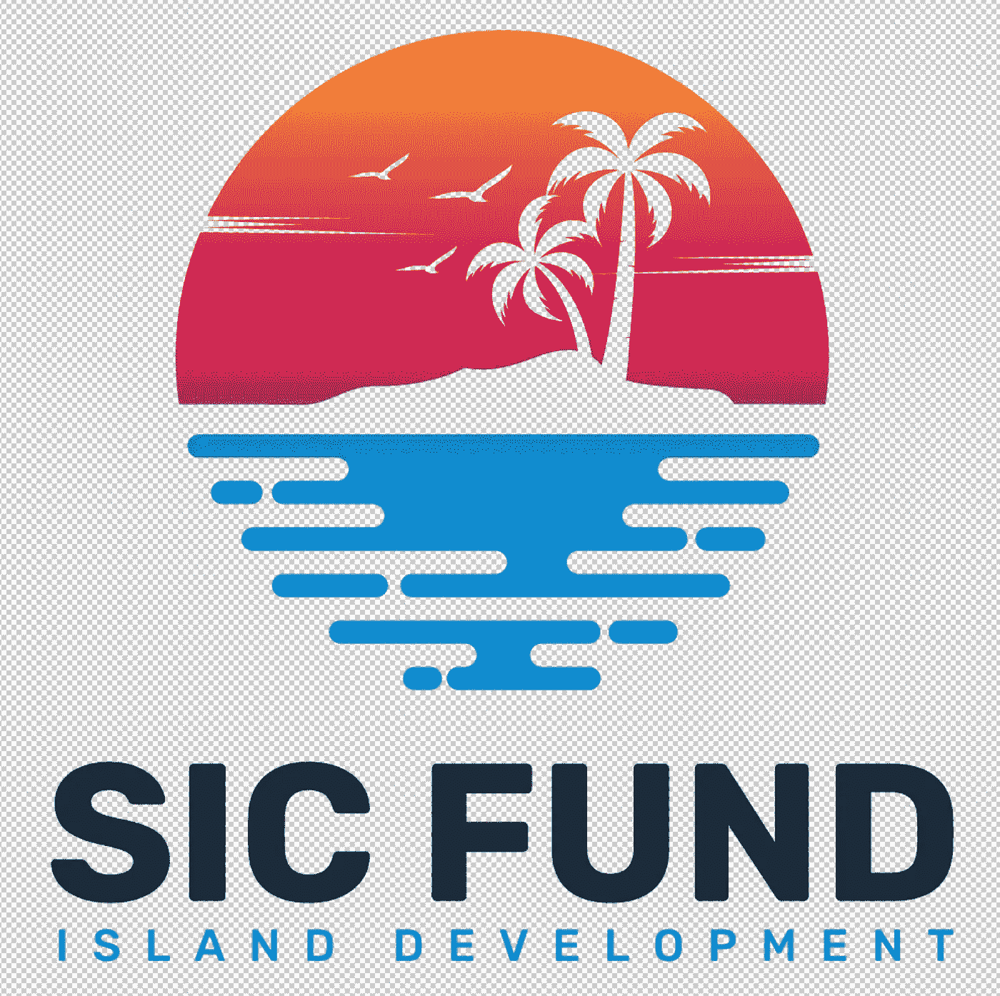
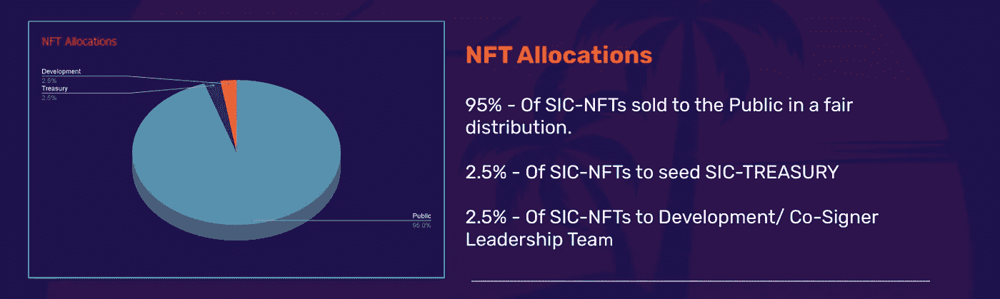
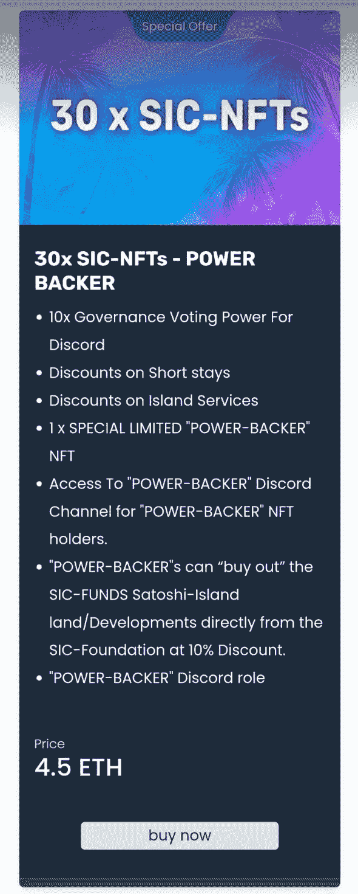
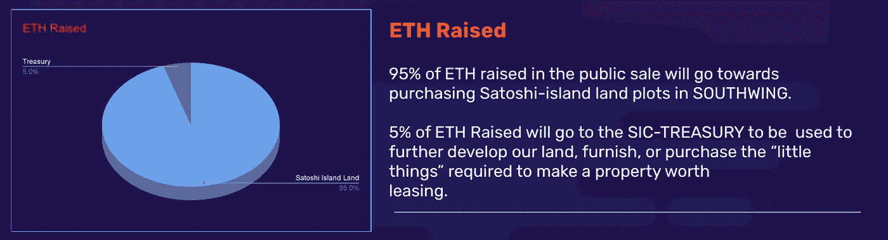
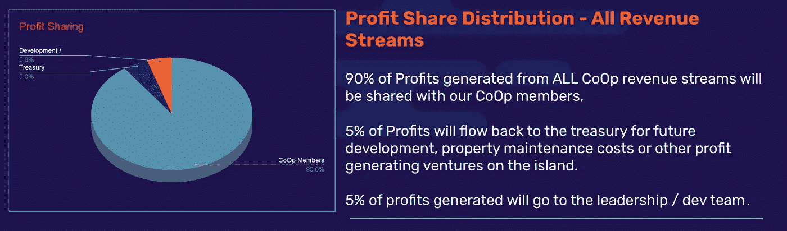
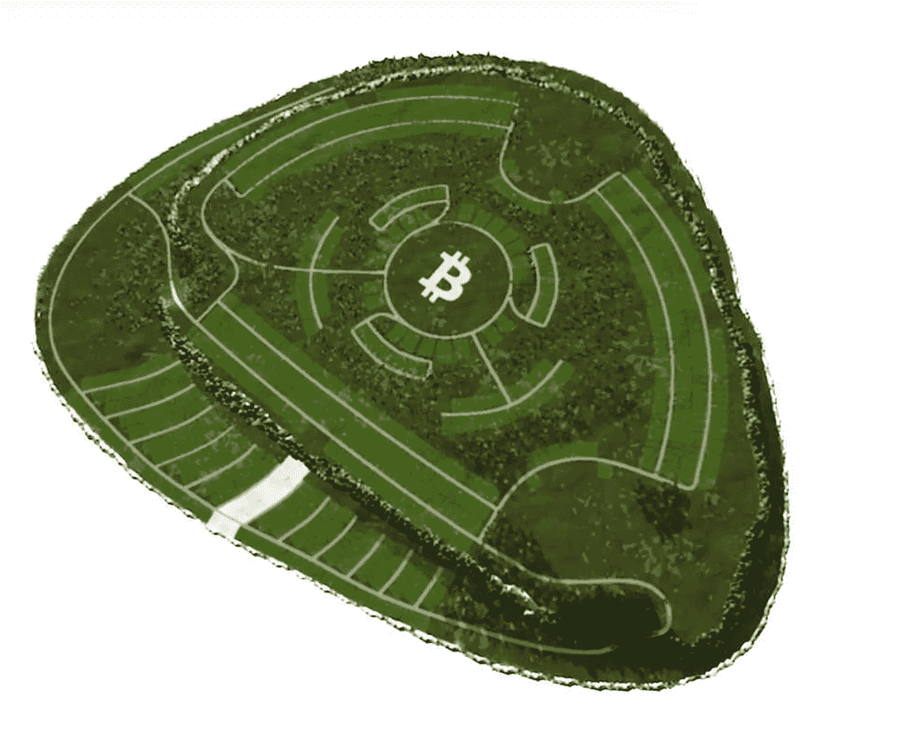

# 发起社会主义合作基金

> 原文：<https://medium.com/coinmonks/launch-of-the-si-cooperative-fund-d21c538126a2?source=collection_archive---------19----------------------->

## 这几个月的研究和计划很有趣，但是我们已经到了，日期已经定了！

https://buy.sicfund.io

# 4 月 23 日星期六上午 10 点整(AEST-悉尼-0:00 UTC ), SICFund 首次公开募股开始。

利用社区和辛迪加的力量，SIC-Foundation 正在发起一个以社区为中心的“合作”来汇集人才和资源。

## 这将使我们能够建造比单干更宏伟的东西…

我们的合作岛屿发展基金的 2000/2100 股将于 23 日星期六向公众发售。

https://buy.sicfund.io

## 只有 300 人的上限。

这将是先来先服务，并根据你想从合作社得到什么提供会员等级。

30 股或以上的购买者将获得一个有限的“权力支持者”NFT，以表示他们对事业的奉献。随着时间的推移，持有权力支持者 NFT 和你的 30 股股份将会带来一些相当可观的好处。

随着我们业务的扩展，我们的权力支持者将站在最前沿。

https://buy.sicfund.io

## 该团队长期享受公平加薪和公共设施。

这是给伙伴们的笼子，伙伴们不会互相抢钱。

将社区放在第一位是我们所做一切的核心。
作为一个旨在降低进入门槛并提供蓝筹资产池敞口的细分资产基金，我们是一个社区优先的倡议，每一个 Hodler 对我们都很重要。

我们“社区第一”的精神体现在我们的令牌组学中。

“我们都会成功”应该不仅仅是一句口号，我们认为我们的象征经济学讲述了这个故事。

## 筹集的 95%的 ETH(285 ETH)将用于购买 Satoshi 岛土地释放(南翼)第一阶段的岛屿地块。

## 筹集的剩余 5%的 ETH(15 ETH)将用于启动 SIC 国库。

SIC 国库将用于支付任何额外费用，或我们开发完全开发的可供租赁的物业所需的小东西。

财政部也可用于在未来的发行中帮助购买额外的岛屿资产。
SIC 资金的管理将由 SIC 基金会主持。

SIC-Foundation 是一个经验丰富的秘密本地 3 人领导团队，全部位于澳大利亚新南威尔士州。

## 领导团队组成了 Gnosis multi-sig safe 的 3 个共同签署人。

## 贾斯汀:
https://www.linkedin.com/in/justin-davies-64a70a119/

## 乔诺:
[https://www.linkedin.com/in/crypto-jono/](https://www.linkedin.com/in/crypto-jono/)

## 特里斯坦:
https://www.linkedin.com/in/tristan-hazelwood-0845221ba/

## Gnosis 多信号安全:
0xa 2c 27865 e 59274 a 54394 a8d 26540 a4b d 8472 e8dc

# 基金会将根据我们社区的共识协调合作社的资产。

# 分享战利品…

## 所有利润流产生的所有利润的 90%将与合作社分享。

这包括销售特许权使用费、来自产生额外利润的岛屿企业的收入、来自任何资产销售的利润以及来自租赁收入的利润。一切都将与我们的合作伙伴共享。

我们相信，这些象征性的经济措施是建立一个将社区放在首位的公共事业的一个很好的平衡，同时确保联署人领导团队受到长期激励，以帮助推进和扩大运营。

## 团队不是来从你身上赚钱的，作为一个公共事业单位，我们是来建设一些东西并一起创造它的！

团队只有在社区赚钱的情况下才会赚钱，这是应该的。

我们看到太多的现金攫取，创始人从他们的社区迅速致富，我们需要做得比这些现金攫取更好。我们会做得更好！

# 这只是我们岛屿开发行动的第一阶段，从南翼开始。

随着该岛更多地区的开发，将会有更多的机会。
届时，我们将与我们的 Citadel 开发人员社区一起准备购买土地、开发和租赁。

## 第一阶段:获得岛屿土地(285 ETH worth - 10 整块土地或 3650 平方米的岛屿土地)。

## 第二阶段:作为一个社区，确定在哪些地块上建造什么，并制定预算。

## 阶段 3:决定如何支付模块的开发和购买费用。

我们这里有几个选项，因为土地将在出售中随机分配(使用 VRF 链)，我们可以选择，

1)出售我们的 5 个最差位置的土地，以资助 5 个最佳位置的开发。

2)我们可以进行第二轮融资(以非摊薄的方式)，筹集资金开发我们的地块。

3)或者我们可以将以上两者结合起来，创建提案，我们将决定如何作为一个群体向前发展。

# 在我们完成南翼的开发后，未来几年将会有更多的岛屿开放。

[https://www.satoshi-island.com/](https://www.satoshi-island.com/)

# 发展的机会将是无限的，我们期待着与我们的社区一起提出和构建想法！

## 网址:【https://sicfund.io/】

## 电报社区聊天:
[https://t.me/sicfoundation](https://t.me/sicfoundation)

## 不和谐:
https://discord.gg/WAWZ8C92

## 推特:
[https://twitter.com/SICFoundati0n](https://twitter.com/SICFoundati0n)

> 加入 Coinmonks [电报频道](https://t.me/coincodecap)和 [Youtube 频道](https://www.youtube.com/c/coinmonks/videos)了解加密交易和投资

# 另外，阅读

*   [如何购买 Monero](https://coincodecap.com/buy-monero) | [IDEX 评论](https://coincodecap.com/idex-review) | [BitKan 交易机器人](https://coincodecap.com/bitkan-trading-bot)
*   [CoinDCX 评论](/coinmonks/coindcx-review-8444db3621a2) | [加密保证金交易交易所](https://coincodecap.com/crypto-margin-trading-exchanges)
*   [红狗赌场评论](https://coincodecap.com/red-dog-casino-review) | [Swyftx 评论](https://coincodecap.com/swyftx-review) | [CoinGate 评论](https://coincodecap.com/coingate-review)
*   [Bookmap 点评](https://coincodecap.com/bookmap-review-2021-best-trading-software) | [美国 5 大最佳加密交易所](https://coincodecap.com/crypto-exchange-usa)
*   [如何在 FTX 交易所交易期货](https://coincodecap.com/ftx-futures-trading) | [OKEx vs 币安](https://coincodecap.com/okex-vs-binance)
*   [CoinLoan 审查](https://coincodecap.com/coinloan-review) | [YouHodler 审查](/coinmonks/youhodler-4-easy-ways-to-make-money-98969b9689f2) | [BlockFi 审查](https://coincodecap.com/blockfi-review)