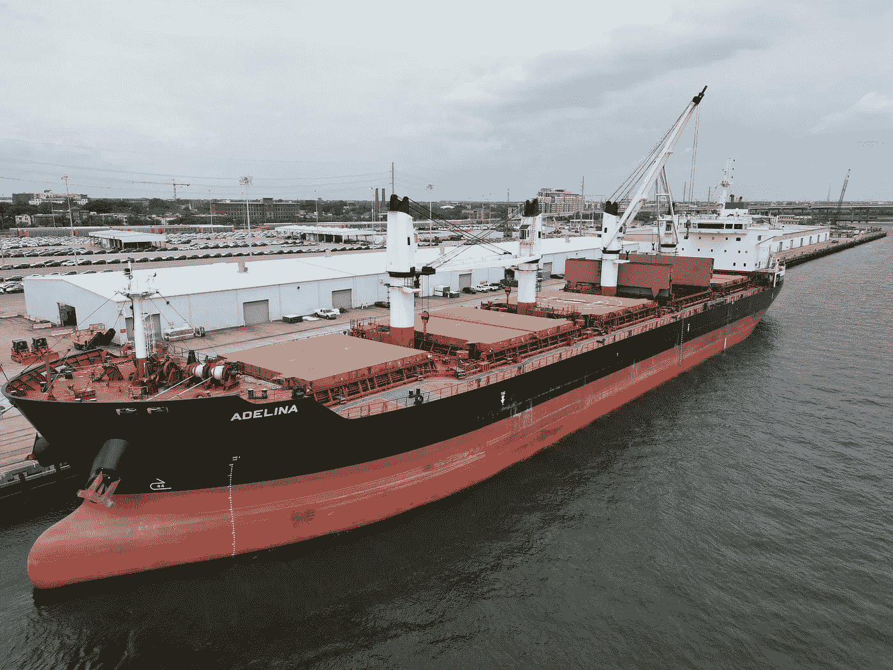

# 成立前沿商品集团，我们的商品交易部门

> 原文：<https://medium.com/coinmonks/launching-frontier-commodities-group-our-commodity-trading-division-9d33007df4?source=collection_archive---------44----------------------->

Photo by [Jaxon Matthew Willis](https://www.pexels.com/photo/drone-cargo-ship-12485413/)

我们很高兴地宣布**前沿商品集团(简称“FCG”)**的成立。

经过 5 年的贸易融资运作，我们已经建立了重要的市场数据集，并确定了重要商品的供应缺口。

我们的实物商品交易部门将成为我们为这些关键市场供货的支柱。

> 交易新手？试试[密码交易机器人](/coinmonks/crypto-trading-bot-c2ffce8acb2a)或者[复制交易](/coinmonks/top-10-crypto-copy-trading-platforms-for-beginners-d0c37c7d698c)

# 强调前沿市场和农产品

对商品的需求不仅仅是外生的。随着购买力的提高，前沿市场的人口正在快速增长。

今天，我们与肯尼亚和赞比亚等国家的农民合作，为国家和地区消费提供农作物。

世界在变化，维持现代生活所需的许多商品可以在前沿市场买到，但往往由于缺乏资金而生产不足。

我们作为贸易商的角色将不仅限于从当地生产商处采购，我们还将投资于当地生产设施，以便更有效地管理产量。

就目前而言，我们的行动仍将保密。我们专注于加强与现有承购商和融资者的关系。

这种方法旨在帮助我们管理与现阶段资本密集型项目投资相关的风险，并在这些投资投入运营后提供有效的创收手段。

# 石油和天然气贸易

我们的石油和天然气贸易业务是资本密集型的，我们知道这对许多企业来说是一个障碍。

但我们正在利用我们的信贷渠道，为需要的石油生产提供预融资，并从生产国购买精炼石油产品，以便将其运输到需要它们的国家。

我们最初的重点将是 Jet A1、TS-1、Mazut & Diesel，所有这些产品的需求量都很大，尤其是在 Mainland China、东南亚和非洲。随着我们业务的增长，我们期望供应更广泛的商品。

**如果你是一个有能力的买家，请通过下面的** [**燃油采购订单，随时向我们预订供应。**](https://tally.so/r/w81eLA)

我们将在现场交付燃料，并在交付时向您开具发票。

如果您对我们的商品交易服务有任何疑问，请在此[安排与我们的咨询](https://calendly.com/financelygroup/commodity-procurement-consultation?back=1&month=2022-06)。