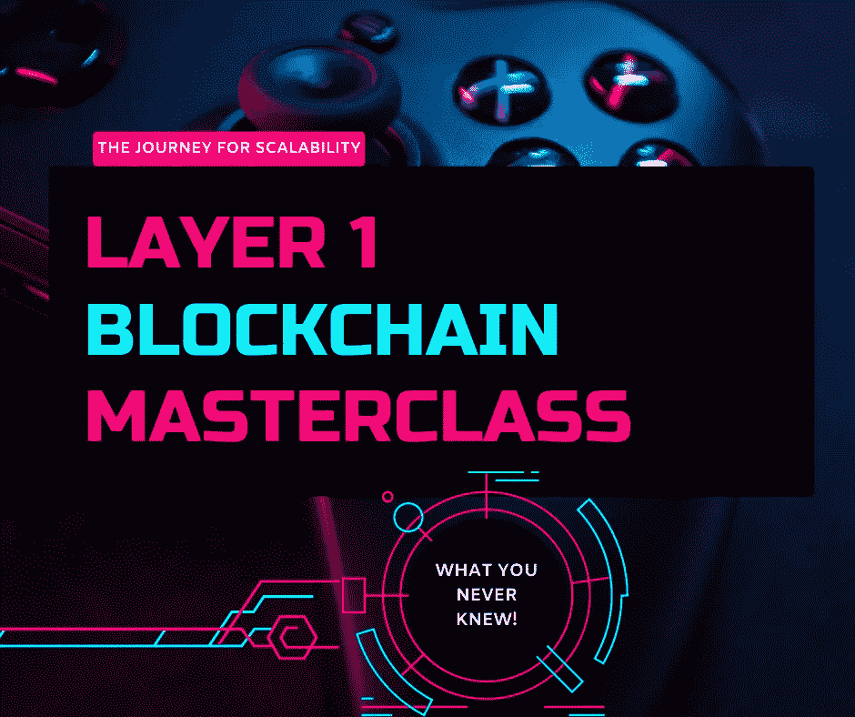
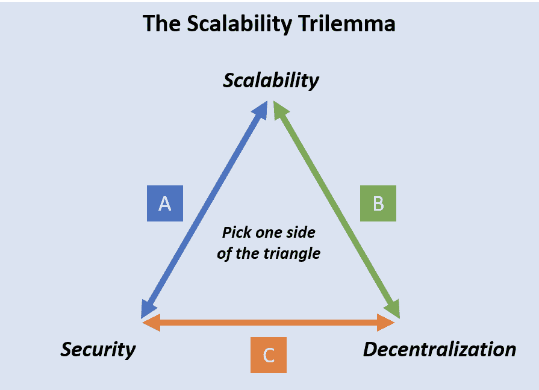
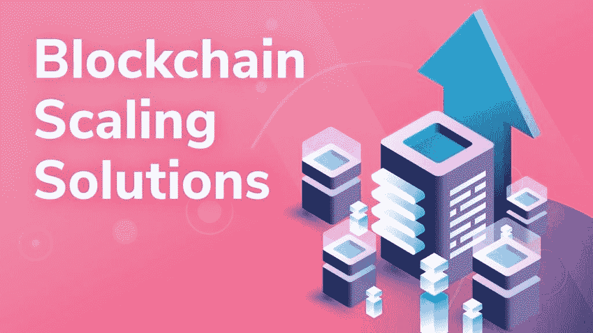

# 第 1 层区块链大师班——可扩展性之旅

> 原文：<https://medium.com/coinmonks/layer-1-blockchain-masterclass-the-journey-for-scalability-14e94d34da9a?source=collection_archive---------24----------------------->

# 介绍

由于区块链空间的沉浸式深度和 it 变革性技术，其有效使用和性能仍然存在限制，这一直是人们担忧的原因，也是全球采用的主要障碍。

区块链技术的主要组成部分是:去中心化、安全性和可伸缩性。然而，在 2016 年，以太坊创始人 Vitalik Buterin 规定，区块链只能是上述三个中的两个，这一直是区块链的议事日程，要么去中心化-安全或安全-可扩展性，要么去中心化到可扩展性等，大多数区块链项目利用去中心化和安全性，因为没有人希望投资于不安全的环境，无论利润如何，都容易受到黑客的攻击。因此，随着区块链应用的增加，可伸缩性成为一个主要挑战。

在区块链技术中，可伸缩性只是指网络在规定的时间内(通常为 1 秒)处理事务的能力(事务吞吐量)、它可以支持的人数(网络负载)、它处理这些事务的速度(延迟)以及验证的成本(成本)。

并非所有的区块链都具有足够的可扩展功能，因此，为了解决可扩展性问题，我们采用了某些措施，其中包括:

1.  第 1 层解决方案
2.  第 2 层解决方案

然而，出于本文的目的，我们将只关注第 1 层解决方案，作为解决可伸缩性问题的一种手段。那么，什么是第 1 层解决方案呢？

# 第 1 层解决方案

第 1 层区块链是链上解决方案，集中于改进区块链的内部元素，从而使整个系统具有很大的可扩展性。第 1 层区块链网络的几个例子包括:比特币、以太坊、币安智能链、雪崩、莱特币等。

# 第 1 层区块链解决方案的类型

第 1 层区块链提供的基本解决方案包括绝对的分散性、安全性和一流的可扩展性。作为实现这种有保证的可扩展性的手段，网络利用这两种主要方法，因此:

*   共识机制和
*   分片

## 共识协议方法

共识协议的低效率是这些区块链中可伸缩性问题的主要原因，为了解决这个问题，需要采用不同的共识方法。最常用的共识协议包括

*   **工作证明(POW):** 这是为比特币提议的共识，已被其他区块链广泛采用。它利用矿工解决一个密集的数学难题(哈希)，以获得添加下一个区块的机会，并获得比特币形式的奖励。然而，该协议利用高计算能力，因此速度慢。
*   **股权证明(POS):** 。在该协议中，矿工被认为拥有一种货币的所有权，并且具有最高数量的货币(赌注)的矿工将有机会向链中添加/验证下一个块。

虽然股权证明在交易速度上超过了工作证明，但仍然失去了安全级别。以太坊 2.0 中可以看到这种共识开关的一个非常好的例子，这是一种升级，使以太坊区块链更具可扩展性和可靠性。

## 分片

分片被认为是解决可伸缩性问题的有效方法之一。其技术要求将一个节点分成几个称为“碎片”的块，并以并行顺序处理事务的一小部分。这种交易的并行处理提高了整个区块链网络的吞吐量，并从本质上使区块链更易于管理。

# 您需要考虑的 5 个第 1 层令牌

根据 www.coinmarketcap.com 和 www.coingecko.com 的[的说法，关于投资和交易选项，我们将只考虑 5 个一级项目和我们可以轻松访问它们的交易所](http://www.coinmarketcap.com)

1.  以太坊(ETH)拥有超过 700 个市场交易所，包括币安、gate.io、ftx、coinbase 等
2.  Build N Build (BNB)可以在币安、gate.io、hitbit 和 570 markets 买到
3.  Polkadot (DOT)包括币安、gate.io、pancakeswap、kucoin 和 249 个其他市场交易所
4.  卡尔达诺(ADA)，可以在币安，库科恩，okx 和 329 市场买到
5.  阿尔格兰德(ALGO)，也可以在比特币基地、库科恩、币安和 161 市场买到。

***注*** *:榜单排名不分先后，市场交易依据 coinmarketcap。*

# 如何购买第 1 层令牌

购买第 1 层令牌与购买任何其他令牌是一样的。唯一的区别是你在哪里买的，要么(集中交换要么分散交换)，交换差价等等。然而，要购买第 1 层令牌，您只需遵循以下步骤:

1.  识别您想要购买的令牌
2.  做你的研究代币和交换，你可以很容易地得到他们。一些交换可以是集中的或分散的交换。如果你要在一个分散的交易所购买，你需要做的就是使用正确的网络连接你的钱包。另一方面，如果是在一个集中的交易所，你需要做的就是在首选的交易所注册并开始交易。
3.  如果你还没有在像[币安](https://www.binance.me/en/activity/referral/offers/claim?ref=CPA_00TAEVOPL3)和 [gate.io](https://www.gate.io/signup/7465448) 这样的交易所注册，请点击交易所名称开始，在你完成第一次 gate 上的加密交易后，还可以获得 100 美元的免费加密奖金和 5500 美元的 USDT 测试。

# 结论

随着高采用率和技术进步，很明显区块链技术是金融业的未来，因此，需要提高区块链的可扩展性，并为其更广泛的使用做好准备。

> **今日问题:你今天投资了什么第一层项目？**

# 关于作者

Igwe Ihuoma Patience 是一名自学成才的创意和行业特定内容作家，加密货币爱好者，拥有 2 年多的经验和不断发展的区块链空间的知识。

我擅长内容创作、文案写作、字幕管理、视频编辑和手机图形设计，我教其他人如何在加密货币和区块链领域起步，我的目标是让区块链的学习和更新易于任何人理解。

> 加入 Coinmonks [电报频道](https://t.me/coincodecap)和 [Youtube 频道](https://www.youtube.com/c/coinmonks/videos)了解加密交易和投资

# 另外，阅读

*   [n 平均零点评审](/coinmonks/ngrave-zero-review-c465cf8307fc) | [Phemex 评审](/coinmonks/phemex-review-4cfba0b49e28) | [PrimeXBT 评审](/coinmonks/primexbt-review-88e0815be858)
*   最佳[区块链分析](https://bitquery.io/blog/best-blockchain-analysis-tools-and-software)工具| [赚比特币](/coinmonks/earn-bitcoin-6e8bd3c592d9)
*   [Cloudbet 赌场评论](https://coincodecap.com/cloudbet-casino-review) | [点火赌场评论](https://coincodecap.com/ignition-casino-review)
*   [加密套利](/coinmonks/crypto-arbitrage-guide-how-to-make-money-as-a-beginner-62bfe5c868f6)指南| [如何做空比特币](/coinmonks/how-to-short-bitcoin-568a2d0b4ae5)
*   [如何在加拿大购买加密货币？](https://coincodecap.com/how-to-buy-cryptocurrency-in-canada)
*   [无聊猿游艇俱乐部(BAYC)回顾](https://coincodecap.com/bored-ape-yacht-club-bayc-review) | [拜比特 vs 比特币基地](https://coincodecap.com/bybit-vs-coinbase)
*   [5 款最佳加密交易终端](https://coincodecap.com/crypto-trading-terminals) | [最佳 DeFi 应用](https://coincodecap.com/best-defi-apps)