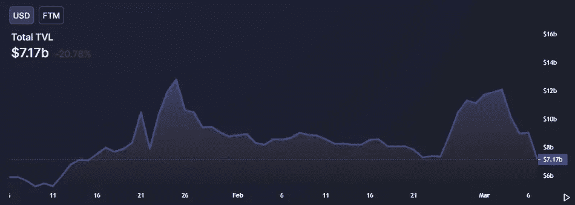

# 随着市场损失 760 亿美元，第一层加密货币正在节节败退

> 原文：<https://medium.com/coinmonks/layer-1-cryptocurrencies-are-losing-ground-as-the-market-loses-76-billion-b28de2978146?source=collection_archive---------75----------------------->

**Visit our website:-** [**https://bitcoinsupports.com/**](https://bitcoinsupports.com/)

流行的第 1 层协议的底层令牌(包括 as Fantom、Solana、Near 和 Cosmos)在过去 24 小时内都失去了价值。在过去的 24 小时里，几个著名的第一层网络受到了打击，Solana、Terra、Cosmos 和 Near 的市场领导者都下跌了大约 5%。

智能合约的首要平台以太坊下跌超过 3%，从略高于 2600 美元跌至 2500 美元左右。然而，对其他协议的损害要严重得多。

在 DeFi 最多产的开发者之一 Andre Cronje 宣布将退出业务后，Fantom Network 的股票在过去 24 小时内暴跌了 13%以上，至 1.40 美元。Cronje 和许多其他人一起，通过他最近的项目——一个名为 Solidly 的分散式交换项目，在扩大 Fantom 生态系统方面发挥了重要作用，该项目显著增加了网络上所有项目的总价值。然而，自声明发布以来，资金已从网络中蜂拥而出。

**Visit our website:-** [**https://bitcoinsupports.com/**](https://bitcoinsupports.com/)

继 Fantom 之后，Cosmos 和 Near Protocol 均下跌近 5%，而 Solana 下跌约 5.8%。Terra 是迅速崛起的第 1 层网络，为 LUNA token 和 UST stablecoin 提供支持，在经历了异常积极的一周后，其股价也下跌了约 4%。此外，根据 CoinMarketCap 的统计，Kadena 和 Harmony 等不太知名的一级网络分别下降了 4.6%和 4.3%。

**第 1 层网络是如何定义的？**

第 1 层网络可以被认为是一个加密基础，在此基础上可以构建许多项目。

这种类型的网络经常给出构建 NFT 收藏或货币市场所必需的图表和工具，用户可以在其中存放他们稳定的硬币。在该货币市场购买 NFT 或进行现金存款会产生额外的费用，这些费用通常以网络的本币计价。

比如用户可以使用以太坊而不是 Aave 的原生币在 Aave 上借款。

以太坊和比特币是加密领域最大的两个第 1 层网络，然而以太坊的适应性更强。开发者在以太坊上的构建比在比特币上要容易得多。事实上，一些更受欢迎的第 1 层网络直接与以太坊竞争，旨在提高交易速度和成本。

然而今天，这个板块在过去的 24 小时内已经大幅失守，包括以太坊。

虽然第一层加密货币首当其冲受到了这种负面影响，但其影响已经波及到了整个加密货币市场。市值最大的加密货币比特币仍在努力突破具有重要心理意义的 4 万美元里程碑。截至发稿时，这枚橙色硬币的售价略高于 38，200 美元，较去年 11 月 68，789 美元的历史高点下跌了约 45%。

**访问我们的网站:-**[**https://bitcoinsupports.com/**](https://bitcoinsupports.com/)

**免责声明:以上为作者观点，不应视为投资建议。读者应该自己做研究。**