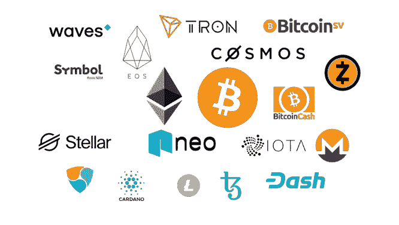
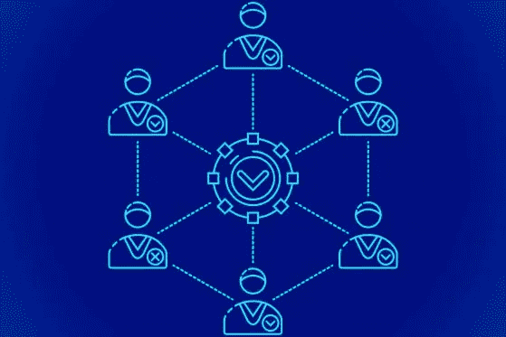
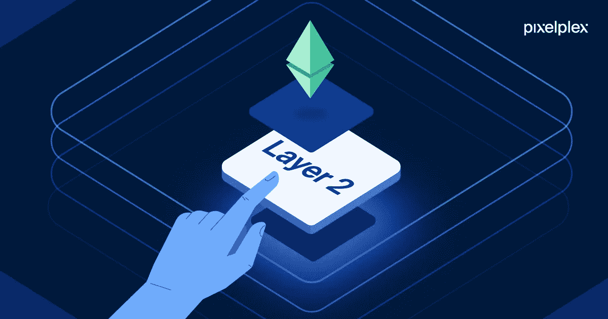
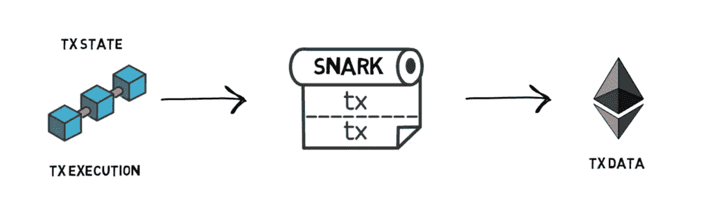
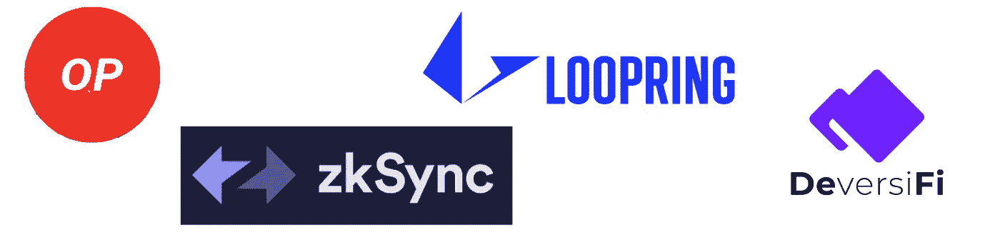
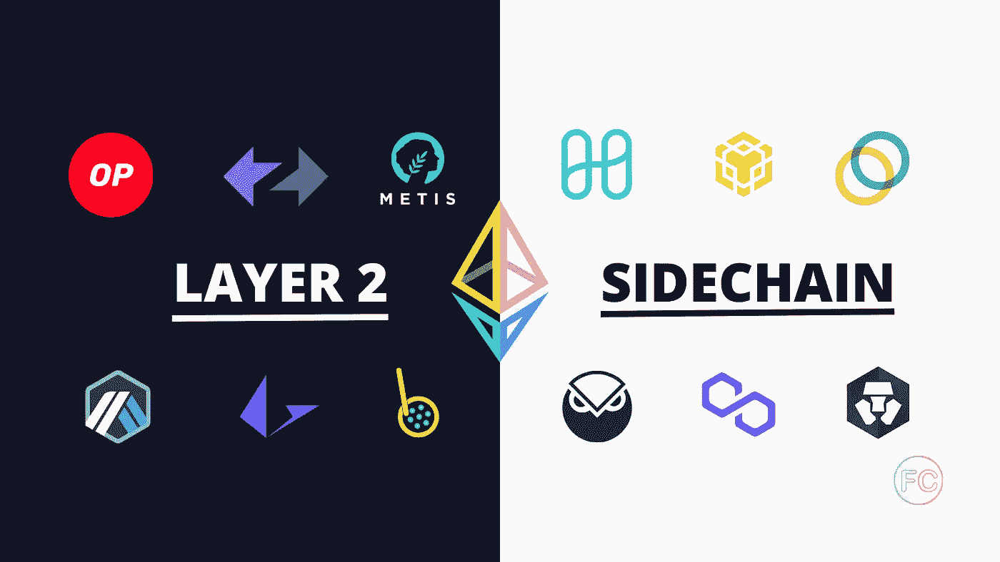

# 第二层:离区块链的大规模采用更近了一步

> 原文：<https://medium.com/coinmonks/layer-2-a-small-step-towards-the-mass-adoption-of-blockchain-cb37ad777af2?source=collection_archive---------23----------------------->

*Photo:* [Blockchain-Comparison](https://blockchain-comparison.com/)*, all right reserved.*

# **第一层:区块链的基础网络**

对于任何技术来说，区块链生态系统都在以前所未有的速度扩张。近十年前只有几十种加密货币，但现在有大量的加密货币和区块链网络。然而，区块链网络的**可扩展性**对其**增长**和**利用率**至关重要。这就是需要第 1 层(L1)区块链解决方案的地方。那么，L1·区块链解决方案到底需要什么呢？在本帖中，我们将介绍区块链领域中 L1 的基本原理，展示第 2 层(L2)解决方案及其工作原理。

## ***什么是层 1？***

要理解 L1 解决方案，我们必须首先考虑区块链的可扩展性。尽管为用户提供了几个优势，如**去中心化**、**高安全级别**和**永久记录保存**，区块链技术还是有一些缺陷。随着它的使用越来越广泛，一系列的困难出现了。其中之一是可伸缩性，它与系统的事务吞吐率有关，用每秒事务数(TPS)来衡量。它用于表示系统向每个用户提供优质体验的能力，而不管在任何给定时刻有多少用户。随着加密货币的使用越来越多，对区块链图层的需求也在增加。需要这些层来确保更强的网络安全性和速度，以及更好的记录保存和 TPS。因此，L1 和 L2 的解决方案被用来解决这些问题。

L1 解决方案的目标是增强基础协议，从而实现可扩展性。虽然比特币、以太坊和莱特币是 L1 区块链，但 Lighting Network 是一个 L2 解决方案，旨在提高比特币网络的交易速度。与 L2 相反，L1 解决方案改变了区块链协议的规则，以提高交易速度和容量，允许容纳更多的用户和数据。例如，L1 缩放解决方案可用于加速块确认或增加块中的数据量。

## ***第一层解决方案的类型***

两种最常见的 L1 解决方案包括:

Photo: [Openledger](https://openledger.info/), all right reserved.

*   **共识协议改变**，因为一些共识协议比其他协议更有效，像以太坊这样的项目正在从**工作证明**过渡到**利益证明**。后者比前者确保更高的速度和更高的能效，因为它不需要未成年人解决复杂的密码算法，从而使用大量的计算能力。系统根据参与者的利益处理和验证新的数据块，而不是利益证明。

Photo: [MongoDB](https://www.mongodb.com/features/database-sharding-explained), all right reserved.

*   **分片**是最流行的 L1 可伸缩性方法之一，它是一种从分布式数据库改编而来的机制。通过分片，事务集被**分解**成更小的片段，称为*分片*，由网络并行处理。因为工作负载在对等网络中分布得更好，所以块完成得更快。以太坊 2.0、Tezos、Zilliqa 都在探索碎片的使用。

L1 解决方案改变了区块链的基本协议在数据处理方面的表现，使其变得更好。它的一个好处是不需要在现有的基础设施上增加任何东西。分割和改变区块链共识进程是这种解决办法的两个例子。然而，并非所有问题都能在 L1 得到解决。

# **第二层网络**

Photo: [Pixelplex](https://pixelplex.io/blog/what-is-layer-2/), all right reserved.

由于技术限制，区块链主要网络的某些升级难以或不可能实施。例如，以太坊正在向股权证明(PoS)迁移，但这花了数年时间。由于可伸缩性问题，一些用例无法与 L1 一起工作。一款区块链游戏因为高交易延迟而无法使用比特币网络。尽管如此，游戏可能希望维护 L1 的安全和权力下放。最佳选择是采用构建在基础网络之上的 L2 解决方案。L2 应用依靠 L1 来执行交易，并建立在它之上。以比特币和闪电网络为例。L1 网络是比特币，而 L2 网络是闪电网络。当比特币网络上有大量需求时，交易可能需要几个小时才能完成。用户可以迅速将比特币支付转移出主链，随后将全部余额送回主链。这实质上是将所有交易整合到一个记录中，节省了时间和资源。

## ***什么是第二层？***

首先，我们必须解释 L2 扩展解决方案试图解决的问题。基本上，这些主要的区块链每秒只能处理 7 笔交易或 15 笔交易，与每秒可以处理 10 万笔交易的 Visa 相比，这是非常小和缓慢的。为了与这些集中式方法竞争，我们需要找到一种每秒处理更多事务的方法。有两种扩展方式，我们可以扩展**基础层** (L1)或者将一些工作外包给**新层**。这就是为什么我们不能扩展基础层，即**区块链三难困境**，当谈到区块链时，有 3 个重要方面:**去中心化**、**安全性**和**可扩展性**。如果不深入研究，开发人员还没有找到一种方法来最大化这三者，如果他们试图改进其中一个，其他两个就开始失去它们的好处。正因为如此，开发人员必须富有创造性地找出如何扩展区块链。另一种被称为第 2 层解决方案仍然是可能的。

L2 是建立在现有区块链网络(L1)顶部的**次级** **协议**。它专注于解决主链可能遇到的紧迫问题，如低事务吞吐量和差的可伸缩性。L2 可以通过向各种处理通道传送数据来减轻主链的一些负荷。然后，它将处理后的数据发送回区块链协议的核心，以完成操作。因此，底层的区块链远没有拥挤的 T21 和可伸缩的，允许更快的计算和交付。除此之外，绝大多数现有的 L2 平台都是以主链协议不受影响的方式设计的。区块链本地催化剂，也称为 L2 平台，能够保持 L1 的分散利益。

## ***第二层解决方案的优势***

L2 解决方案的最大好处之一是底层区块链不必改变其结构(代码)，因为它只是充当一个额外的层。另一个值得强调的方面是，L2 平台有助于更好地保护 T2 的数据隐私。通常，现有的 L1 方案(以太坊、索拉纳、雪崩等。)是完全公开的，这意味着在这些链上进行的所有交易都是透明的。了解网络上正在发生的事情是有益的，但是一些公司希望对他们的关键客户信息保密。在这种情况下，L2 可能是一个真正的救星，因为它是一个**非连锁**、**默认私有**的解决方案。

## ***第二层解决方案的类型***

一个很好的类比是将 L1 和 L2 的解决方案比作高速公路(L1)和摩托车、汽车和卡车(L2 解决方案)，这些 L2 的扩展解决方案中的每一个都在扩展区块链中占有一席之地。与其说哪一个是最好的，不如说哪一个最适合你正在处理的情况。让我们来看看一些 L2 缩放解决方案。

## ***上卷***

Photo: [Finematics](https://finematics.com/), all right reserved.

汇总通过**捆绑**或将侧链交易汇总为单个交易并生成加密证明(也称为 *SNARK* )(简洁的非交互式知识论证)来提供缩放，只有该证明被提交给基础层。有了 rollups，所有的事务状态和执行都在主链之外**处理。主链只存储交易数据。有两种类型的汇总:ZK 汇总和乐观汇总。一方面，尽管 ZK 汇总比乐观汇总更快、更有效，但它没有为现有智能合同迁移到 L2 提供简单的方法。另一方面，乐观汇总运行一个兼容 *EVM-* 的虚拟机，名为 *OVM* (乐观虚拟机)，它允许执行与以太坊上相同的智能合约，但它们速度较慢，效率较低。这一点很重要，因为它使现有的智能合约更容易保持其可组合性，这在 DeFi 中非常重要，因为所有主要的智能合约都已经过实战测试。致力于乐观向上的主要项目之一是乐观主义。谈到 ZK 交易所，Loopring 和 DeversiFi 是建立在 L2 的分散化交易所的好例子。最重要的是，我们有 zkSync 支持可扩展的加密支付。**

## ***侧链***

Photo: [FranceCrypto](https://francecrypto.fr/guide-cryptomonnaies/quelle-est-la-difference-entre-une-sidechain-et-un-layer-2/), all right reserved.

侧链是次级区块链，与主链并行运行，并使用它们所拥有的资源来卸载工作。他们可以从主区块链窃取或借用信息，然后使用他们的虚拟机执行智能合同或验证交易，之后，出于安全原因，他们会将自己拥有的数据发送回主区块链。没有父链，侧链无法运行，但父链不需要侧链。在以太坊的例子中，多边形网络是一个侧链。

## 频道

渠道是一种锁定你的资金，然后在一个更快的网络上交易你的资金的虚拟 T2 版本的方法。例如，每当我们刷信用卡或借记卡时，当我们使用 Visa 时，我们不是将真正的美元钞票从我们这里发送给供应商，而是发送一个虚拟数字表示我们欠供应商多少美元。因为每个人都同意虚拟美元等同于真实美元，所以不存在任何问题。在渠道系统中，我们简单地使用代码来确保您只能发送您锁定的内容。闪电网络是使用比特币区块链通道的 L2 扩展解决方案的一个例子。本质上，你可以把你的一些比特币和其他人锁在一起，然后你可以来回发送你的虚拟比特币，直到你决定结算并把一笔交易推送到区块链，而不是你本来会做的一大堆交易。同样，闪电的工作方式是，你可以通过网络向与你锁定初始硬币的人有联系的任何人付款。通道的一个缺点是，它们只能用于交易，而不是智能合约或虚拟机代码，它们是**专用的**。

## ***血浆***

血浆可能是最令人困惑的 L2 解决方案。简而言之，plasma 使用**子链**有时也称为 plasma 链，它们有自己的子链，然后可以通过主链广播重要的操作。想象一下，美国是如何划分为联邦系统和地方系统的，可能会有超级重要的联邦新闻，比如总统签署行政命令时，或者可能会有地方新闻，比如你的堂兄赢得告别演说时，这两个都是应该记录的重要信息。然而，其中一张照片可能需要 10，000 美元的拍摄费用和 50 篇关于它的新文章。在等离子体的想法中考虑这样的子链可能是理解 L2 缩放解决方案如何工作的最佳方式。

## ***探究第 2 层解决方案的局限性***

尽管 L2 解决方案有很多优点，但也有一些缺点。首先，L2 可能会阻碍潜在链条的流动性。流动性的重要性怎么强调都不为过，因为它有助于发展一个可行和繁荣的市场。例如，为了给所有商品和代币提供足够的支持，以太坊需要一个流动性市场。然而，一旦引入另一层，区块链的流动性可能会减少。除此之外，网站用户可能会面临**不必要的入职问题**。每当增加一层时，L1 连锁店和它的 dApps 都需要创建新的账户。结果，如果钱被交付给许多 L2 协议，用户可能很难跟踪它们。如你所见，L2 的好处是有代价的。尽管如此，如果主要目的是缓解主要区块链的交易吞吐量压力，L2 尤其有用。

## **结论**

目前，L2 解决方案为区块链取代旧的中央系统提供了最佳可能性。区块链技术可能会因更高的处理能力、更少的交易费用和更丰富的用户体验而获得快速接受。L2 解决方案显示了巨大的潜力，并对区块链生态系统产生了积极影响。虽然随着以太坊 2.0 升级的推出，L2 可能会失去动力，但他们将继续留在以太坊扩展议程上，以帮助区块链成为领导者。本质上，以太坊开发者社区一直在努力建立以太坊 2.0，使其与 L2 解决方案并行运行，而不是取代它们。因此，可以有把握地说，L2 将继续在解决可伸缩性和交易吞吐量问题方面发挥关键作用，而无需对主链进行更改。

## **参考文献**

⁃ ***知道第一层的一切区块链***—2022 年 3 月 23 日—佐治亚威斯顿—([https://101blockchains.com/layer-1-blockchain/](https://101blockchains.com/layer-1-blockchain/))

⁃ ***区块链的 1 层是什么？***—2022 年 2 月 22 日—币安学院—([https://Academy . binance . com/en/articles/what-is-layer-1-in-区块链](https://academy.binance.com/en/articles/what-is-layer-1-in-blockchain))

⁃ ***第一层五、第二层***—hedera—([https://hedera . com/learning/distributed-ledger-technologies/layer-1-vs-layer-2](https://hedera.com/learning/distributed-ledger-technologies/layer-1-vs-layer-2))

⁃ ***什么是第 2 层区块链扩展解决方案，它们有什么好处？*T3——2022 年 1 月 11 日——基拉·别洛娃——(【https://pixelplex.io/blog/what-is-layer-2/】T4)**

⁃ ***什么是‘第二层区块链’，它意味着什么？***—2021 年 12 月 29 日—Luu Hoang—([https://bestar ion . com/what-is-a-layer-2-区块链-and-what-it-mean/](https://bestarion.com/what-is-a-layer-2-blockchain-and-what-does-it-mean/))

⁃ ***区块链一层 vs 二层:你需要知道的***—2022 年 4 月 14 日— LCX 团队—([https://www . lcx . com/区块链-layer-1-vs-layer-2-what-you-need-to-know/](https://www.lcx.com/blockchain-layer-1-vs-layer-2-what-you-need-to-know/))

⁃ ***第一层区块链*** — CoinMarketCap 词汇表-([https://coinmarketcap . com/Alexandria/glossary/layer-1-区块链](https://coinmarketcap.com/alexandria/glossary/layer-1-blockchain))

⁃ ***第一层和第二层区块链扩展解决方案***—2022 年 3 月 29 日— CryptoPedia 工作人员—([https://www . Gemini . com/cryptopedia/区块链-层-2-网络-层-1-网络](https://www.gemini.com/cryptopedia/blockchain-layer-2-network-layer-1-network))

https://ethereum.org/en/layer-2/***以太坊第二层***——()

⁃第二层，你在哪里？—2022 年 4 月 19 日—昆廷·拉胡里特—([https://coin academy . fr/academie-区块链/layer-2-seconde-couche-quest-c-e-que-cest/](https://coinacademy.fr/academie-blockchain/layer-2-seconde-couche-quest-c-e-que-cest/))

⁃ ***什么是加密中的第二层协议？***—2022 年 4 月 7 日— RJ 富尔顿—([https://www . howtoeek . com/794948/what-is-a-layer-2-protocol-in-crypto/](https://www.howtogeek.com/794948/what-is-a-layer-2-protocol-in-crypto/))

> 加入 Coinmonks [电报频道](https://t.me/coincodecap)和 [Youtube 频道](https://www.youtube.com/c/coinmonks/videos)了解加密交易和投资

# 另外，阅读

*   [Bitsgap 评审](/coinmonks/bitsgap-review-a-crypto-trading-bot-that-makes-easy-money-a5d88a336df2) | [Quadency 评审](/coinmonks/quadency-review-a-crypto-trading-automation-platform-3068eaa374e1) | [Bitbns 评审](/coinmonks/bitbns-review-38256a07e161)
*   [加密复制交易平台](/coinmonks/top-10-crypto-copy-trading-platforms-for-beginners-d0c37c7d698c) | [Coinmama 审核](/coinmonks/coinmama-review-ace5641bde6e)
*   [印度的加密交易所](/coinmonks/bitcoin-exchange-in-india-7f1fe79715c9) | [比特币储蓄账户](/coinmonks/bitcoin-savings-account-e65b13f92451)
*   [OKEx vs KuCoin](https://coincodecap.com/okex-kucoin) | [摄氏替代品](https://coincodecap.com/celsius-alternatives) | [如何购买 VeChain](https://coincodecap.com/buy-vechain)
*   [币安期货交易](https://coincodecap.com/binance-futures-trading)|[3 comas vs Mudrex vs eToro](https://coincodecap.com/mudrex-3commas-etoro)