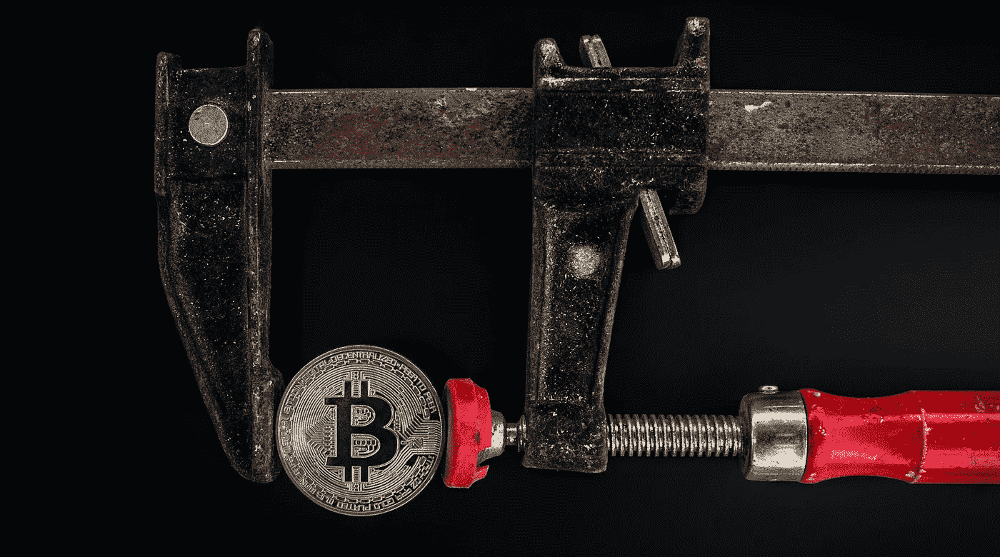
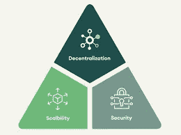

# 第 2 层扩展解决方案——区块链三元悖论

> 原文：<https://medium.com/coinmonks/layer-2-scaling-solution-the-blockchain-trilemma-448c549a50?source=collection_archive---------26----------------------->

缩放区块链指的是理解和学习如何与区块链交互，该似乎作为互联网上的单个分布式网络而存在。到目前为止，工作证明和利益证明等各种解决方案帮助开发人员理解了区块链是如何工作的。通过使用计算能力解决复杂的算法来构建区块链，可伸缩性被简单地存档了。就交易处理速度和适应新应用的能力而言，数字空间中网络的扩展依赖于工作证明和利益证明等解决方案。这些被称为区块链的第 1 层缩放解决方案。他们是在了解和学习如何与区块链互动的基础上发展起来的，并形成了对区块链基础设施的扎实知识。

当谈到第 2 层扩展解决方案时，区块链技术公司有多种选择可以采用，而且每个解决方案都有自己的位置和用途，这一点变得越来越不为人知。以太坊等主要区块链技术维持着一个生态系统，其中可扩展性表明系统促进增长和控制网络扩大的能力，因为该技术的核心是由去中心化驱动的。这使得很难扩展区块链本身，因为区块链网络中的事务必须广播到整个网络。区块链网络每秒只能处理 7-15 笔交易，与每秒可以处理多达 10 万笔交易的 visa 交易相比，这是一个很小的速度。有两种方法来缩放区块链，我们可以缩放区块链的基础层，或者将一些工作外包给新的层。这就是为什么我们不能缩放基层。

# 区块链三难困境

Source SEBA

区块链的三个三难因素是去中心化、安全性和可扩展性。在区块链体系结构中，对区块链可伸缩性的改进对安全性和/或分散性有负面影响。开发人员还没有找到一种方法来最大化这三者，如果他们试图改善其中一个，其他两个就会开始失去它们的好处。为了实现正确的权衡，开发人员必须在如何扩展区块链方面非常有创意。

实现可扩展区块链最常用的方法是第二层扩展解决方案。这个想法是建立一个框架，可以处理链外事务。

汇总-有两种形式的汇总 ZK 汇总和乐观汇总。零知识汇总是一种更快、更高效的汇总，它将在区块链上执行的事务合并为一个汇总事务。

乐观汇总有自己的虚拟机，允许它们与智能合约交互，在第 1 层上可以完成的任何事情都可以由乐观汇总完成，因为它的 EVM 和可靠性兼容。汇总的主要工作是将一堆事务汇总成单个事务，然后他们可以将其推送到真正的区块链。

侧链——它们是与主区块链并行运行的次级区块链，使用它们所拥有的资源来卸载工作。他们可以从主区块链窃取或借用信息，然后使用他们的虚拟机执行智能合约或验证交易，然后出于安全原因将他们拥有的数据发送回主区块链。没有父链，侧链无法运行，但父链不需要侧链。在以太坊的情况下，自动或多边形网络实际上是一个侧链。

等离子体-等离子体使用子链也称为等离子体链，它们有自己的子链，然后可以向主链广播重要的操作。

通道-通道是一种锁定你的资金的方式，然后在一个更快的网络上交易你的虚拟资金。在渠道系统中，我们简单地使用代码来确保我们只发送您实际锁定的内容。闪电网络是使用比特币区块链通道的第二层扩展解决方案的一个例子。本质上，你可以把比特币和其他人锁在一起，然后你可以来回发送你的虚拟比特币，直到你决定结算，然后把一笔交易推送到区块链，而不是你本来会做的一整堆交易。类似地，闪电的工作方式是，你可以付钱给任何通过网络与你锁在一起的人联系的人。通道的缺点是它们只能用于交易，而不能用于智能合约或虚拟机代码。它们是特定于应用的。闪电网络成功避免了高额的比特币交易费用，同时允许比特币扩大规模并保持安全。

# 关于卡纳波

KanaSwap 是一个在独特的区块链网络上运行的加密资产和流动性快速交换平台。与其他跨链流动性网络相比，它是为了快速、安全和提供更低的天然气费用而构建的。

[推特](https://twitter.com/kana99sol) | [不和](https://discord.com/invite/JmmVJACe5p) | [媒体](/@kanaswap-sol) | [网站](https://swap.kanaswap.com/)

> 加入 Coinmonks [电报频道](https://t.me/coincodecap)和 [Youtube 频道](https://www.youtube.com/c/coinmonks/videos)了解加密交易和投资

# 另外，阅读

*   [Bitsgap 审核](/coinmonks/bitsgap-review-a-crypto-trading-bot-that-makes-easy-money-a5d88a336df2) | [Quadency 审核](/coinmonks/quadency-review-a-crypto-trading-automation-platform-3068eaa374e1) | [Bitbns 审核](/coinmonks/bitbns-review-38256a07e161)
*   [加密复制交易平台](/coinmonks/top-10-crypto-copy-trading-platforms-for-beginners-d0c37c7d698c) | [Coinmama 审核](/coinmonks/coinmama-review-ace5641bde6e)
*   [印度的加密交易所](/coinmonks/bitcoin-exchange-in-india-7f1fe79715c9) | [比特币储蓄账户](/coinmonks/bitcoin-savings-account-e65b13f92451)
*   [OKEx vs KuCoin](https://coincodecap.com/okex-kucoin) | [摄氏替代品](https://coincodecap.com/celsius-alternatives) | [如何购买 VeChain](https://coincodecap.com/buy-vechain)
*   [币安期货交易](https://coincodecap.com/binance-futures-trading)|[3 commas vs Mudrex vs eToro](https://coincodecap.com/mudrex-3commas-etoro)
*   [如何购买 Monero](https://coincodecap.com/buy-monero) | [IDEX 评论](https://coincodecap.com/idex-review) | [BitKan 交易机器人](https://coincodecap.com/bitkan-trading-bot)