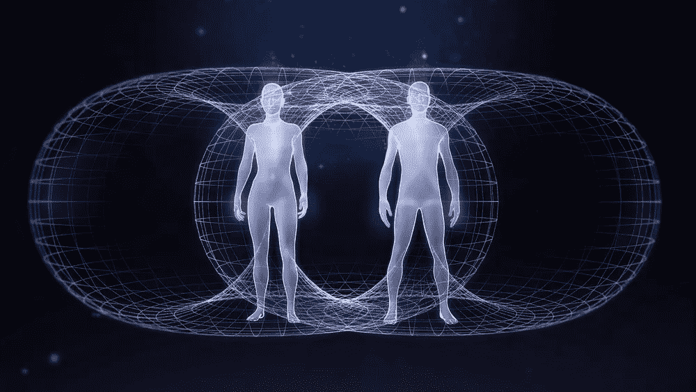

# 第二层社会

> 原文：<https://medium.com/coinmonks/layer-two-society-b6096186811a?source=collection_archive---------38----------------------->

它就在我们眼前形成..

乌克兰战争没有一丝希望。句号。

但是，如果我们能够深入沙发垫中找到一个，它将是我们全球技术网格如何扩展以满足爆炸式增长的需求。

Covid 测试了网格的极限，企业生产力大幅提升。

乌克兰击中了，技术人员又一次处理了它。

这很有趣。

只有一种方法可以对一项技术进行真正的负载测试，我们已经做到了。

它成立了。

由此带来的动力是能够在任何地方高效工作。实时交互和共享大量数据文件，如视频流。

记得就在几年前，网飞的电影还需要缓冲一分钟。不再是了。

远程和有效地一起工作表明不在同一栋大楼里也能合作。如果是这样的话，那么任何人住在哪里都没有关系。反过来，我们开始以稍微不同的方式认识界限和边界。

我有一家小型创业公司，为来自世界各地的公司和个人提供技术服务，这些公司和个人我从未见过面，但我真的很喜欢。我们有很多共同点。比我在美国甚至在我自己的城市认识的许多人都多。技术服务本地市场的概念已经过时，不太理想。

因此，一个新的市场层正在形成。

一个没有地理限制的地方。城镇、城市、县、州、国家、大洲只是这一层的抽象。就在不久前，情况正好相反。

每个人都说英语。它已经在非英语国家被教授了几十年。

那道屏障消失了。除此之外，还有在两种或多种语言之间即时自动翻译的技术。在这一点上，这是消费级技术。

那么，这一切意味着什么呢？

我的观察是，这意味着我们创造了一个第二层社会。一个将 Twitter 视为主要社交媒体渠道的社会。不和是他们去 Web3 的安全后台通道。比特币是他们的货币，Metamask 是他们的交换手段。

当这些成分混合成鸡尾酒时，会润滑这个星球上的一种新的生存方式。一个高于所有其他网格的社会网格。

有了可靠的开放通信和数据传输平台，有了安全的通信渠道，有了自己的货币，有了货币兑换，嗯，那就是一个社会。

它刚刚形成。它甚至还没有到达费城。没有宪法。规则很少，而且很大程度上依赖于常识，就像在托马斯·潘恩一样。在规则到达之前有一个礼仪形成。

这还为时过早，很难有效地描述真正发生的事情以及对未来的影响。

但是，当我说人的自然状态是自由时，我非常确定我是正确的。现在全世界都在展出，而且是同时展出。

正如前线的地面部队用他们的 iPhones 所报道的那样。

这个二级技术代表自由。

所以，最后……在乌克兰这段可怕的经历中，我们打开了通往未来的大门。当我们目睹人类最坏的意图时，我们看到了人类的潜力。

长期来看，我押注于前者。

 [## 大卫·波拉德

twitter.com](https://twitter.com/selfientdavid) 

> 加入 Coinmonks [电报频道](https://t.me/coincodecap)和 [Youtube 频道](https://www.youtube.com/c/coinmonks/videos)了解加密交易和投资

# 另外，阅读

*   Cr [ypto 交易信号为 huo bi](https://coincodecap.com/huobi-crypto-trading-signals)|[swap zone Review](/coinmonks/swapzone-review-crypto-exchange-data-aggregator-e0ad78e55ed7)
*   最佳[密码交易机器人](https://coincodecap.com/best-crypto-trading-bots) | [购买索拉纳](https://coincodecap.com/buy-solana) | [矩阵导出评论](https://coincodecap.com/matrixport-review)
*   [Coldcard 评论](https://coincodecap.com/coldcard-review) | [BOXtradEX 评论](https://coincodecap.com/boxtradex-review)|[uni swap 指南](https://coincodecap.com/uniswap)
*   [比特币基地评论](/coinmonks/coinbase-review-6ef4e0f56064) | [德里比特评论](/coinmonks/deribit-review-options-fees-apis-and-testnet-2ca16c4bbdb2) | [FTX 评论](/coinmonks/ftx-crypto-exchange-review-53664ac1198f)
*   [联合国硬币评论](https://coincodecap.com/unocoin-review) | [最佳加密赌注硬币](https://coincodecap.com/best-crypto-staking-coins)