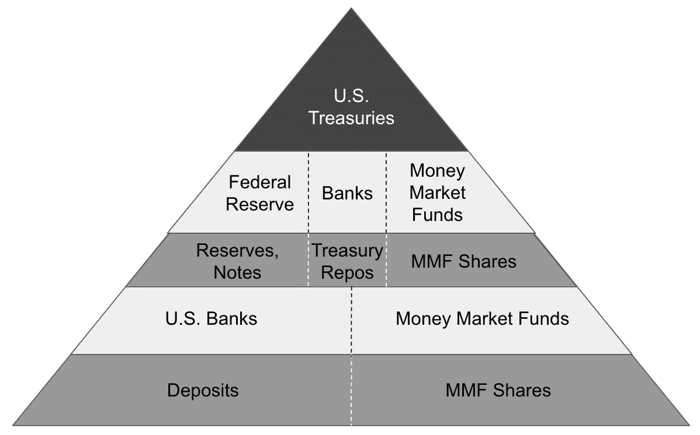
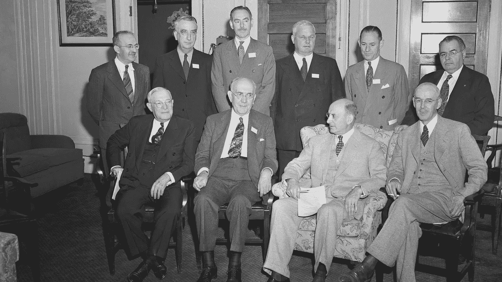

# 货币的层次:对加密、美元和通货膨胀的思考

> 原文：<https://medium.com/coinmonks/layers-of-money-thoughts-on-crypto-us-dollar-and-inflation-ca639aa9ad9f?source=collection_archive---------6----------------------->

米尔扎

## **多层钱:**

分层货币的概念并不新鲜，尼克·巴蒂亚在他的书《分层货币》中出色地总结了他的观点。从本质上来说，我们的货币体系是建立在多层货币之上的，我们的中央银行拥有储备，为政府对公众的负债提供担保。换句话说，我们的央行发行货币的前提是我们可以在需要时赎回存款，我们相信我们的央行有能力储存我们货币的价值，保持其在世界范围内的可替代性和使用，并以储备支持它(这在实践中很可能不是真的，因为货币本质上是凭空创造的)。政府创造货币的能力往往会让我们陷入困境；这就是所谓的货币贬值。当我们发行更多的货币时，每一次额外的发行都会变得越来越不值钱。印得越多，货币价值越低，价格上涨，印更多的货币来抵消，产生恶性循环。

Excerpt from Nik Bhatia’s “Layered Money”

## **美元&布雷顿森林**

成为世界储备货币也伴随着“合理的负担”。这可能是美国存在赤字的主要原因，我们的货币总是有需求，其长期稳定性使其处于任何交易、交易和储备货币地位的核心。它是如何变成这样的，为什么没有改变？

Bretton Woods Agreement 1944, for a great read around the history of our monetary policy, check out [“Lords of Finance”](https://www.amazon.com/Lords-Finance-Bankers-Broke-World/dp/0143116800)

简短的答案是第二次世界大战和随后出现的货币体系。稍长一点的解释来自于对人类历史上交易方式的考察。为了避免对过去的硬币、宝石和贝壳进行冗长的总结，虽然非常有趣，但可能会占用很多空间，我们可以在金本位制废除后再继续。二战后，出于多种原因，各国的货币都与标准重量的黄金挂钩，但有点扭曲。美元将保持每盎司 35 美元的价值，所有其他全球货币将与美元挂钩。在美国和其他国家放弃金本位制后，为时已晚。时间已经过去太久了，世界需要美元，但美联储印的美元只够国内使用。这导致了巴蒂亚所说的“离岸”美元——或者在联邦政府管辖范围之外的美元创造。这可以采取以美元发行的私人信贷额度的形式，或在紧急情况下回购贷款和其他类似工具。简而言之，美元作为储备货币的地位在很长一段时间内不会消失。全球金融体系总是需要美元。

## **回购和借贷便利**

快速的流动性迂回；当其他国家需要美元时，它们可以通过回购或其他贷款工具来满足需求。回购是指一家持有美国国债的银行将其作为抵押品提供给另一家银行，而另一家银行反过来又向第一家银行提供流动性(现金)。然后，银行返还这些钱加上名义利率(这是联邦基金利率和伦敦银行同业拆借利率相关的地方)并收回他们的抵押品。其他形式的贷款可以是无担保的(即不需要抵押品)。最后，还有一种货币市场基金(MMF ),它是一束或一组高流动性证券，每股净资产值(NAV，即资产的面值)为 1 美元。这些都存在，因为随着时间的推移，美元做了一些不可思议的事情，它保持了其储备地位。而美元通过充当流动性之王来延续这一地位。

由于大流行相关的冲击，美联储实施了所谓的 QE。在这种情况下，美联储购买美国国债向有需要的银行提供流动性，这增加了货币供应量。目前，我们正在进入“紧缩”，一旦现金返回美联储，美联储就会销毁现金，而不是用它来购买更多的美国国债。

## **通货膨胀、冲击&交易对手风险**

越来越多的人首先想到的是无处不在、持续不断的通货膨胀。我们是怎么到这里的？现代货币政策控制通货膨胀的能力似乎有限；为了真正控制它，美联储需要提高利率，实施会伤害所有人的紧缩措施。由于我们的政策制定者对选举的担忧超过了 10 年后的情况，扩大货币供应比收缩货币供应更容易。当美国国债收益率显著低于通胀率时，美元是价值储存手段吗？如果美国国债和黄金一起位于货币金字塔的顶端，保证了美国纸币的价值，那么美元贬值、通胀上升和相对于通胀的低收益率的组合几乎保证了价值的恶化，至少在理论上是这样。

QE 是美联储在动荡时期用来缓和局势的一个重要工具。在 QE，美联储从银行购买美国国债，给银行留有现金。这些现金用于资助或弥补任何紧迫的支出。因此，当人们说 QE 基本上就像印钞票时，这就是他们的意思，美联储只是向系统注入现金，在利率已经非常低的情况下，供应继续扩张。

最后，关于交易对手风险的一些想法。我们的金融体系深深交织在一起，从 clo、CDO、CBO，到基本形式的贷款和互换——这个体系纠缠在一起。这个非常简单的事实就是为什么我们的系统如此脆弱，只需要一个巨人就能摧毁整个系统。

更糟糕的是，我们似乎不允许事情自然结束；“大到不能倒”只是向私营部门表明，最坏的情况下，纳税人会出手相助！

## **输入比特币&巴蒂亚的预测**

巴蒂亚的精彩著作非常优雅地概述了金钱的等级制度；金字塔顶端的黄金和美国国债。他走得更远，认为比特币(被有意设计为黄金)可能取代黄金的角色，或者如果美国财政部位于这个金字塔的顶端，银行将能够发行比特币本身支持的新形式货币。

巴蒂亚和其他作者恰当地指出，比特币与黄金有一些共同特征。现在流通的比特币数量比任何潜在的未来“铸造或开采”都多——这意味着通货膨胀、贬值是不可能的。类似于世界大部分地区的黄金供应量高于未来的供应量。学者们将这种难以发行或创造的货币称为“硬通货”。最后，也是加密世界的核心:没有一个黄金的中央发行者。比特币也没有一个中央发行者，它是分散的，任何人都可以挖掘它。这意味着比特币可以抵御通货膨胀，将任何贬值的担忧抛在一边。

> 加入 Coinmonks [电报频道](https://t.me/coincodecap)和 [Youtube 频道](https://www.youtube.com/c/coinmonks/videos)了解加密交易和投资

## 也阅读

 [## 杠杆代币[多头代币]终极指南

### 杠杆化令牌是具有杠杆化风险敞口的 ERC20 令牌，不考虑保证金、要求、管理…

medium.com](/coinmonks/leveraged-token-3f5257808b22)  [## 最佳加密交易所| 2021 年十大加密货币交易所

### 编辑描述

blog.coincodecap.com](https://blog.coincodecap.com/crypto-exchange)  [## 2021 年最佳加密交换平台| CoinCodeCap

### 如果我们看看今天的场景，许多加密货币交换平台提供了广泛的功能和深度…

blog.coincodecap.com](https://blog.coincodecap.com/best-swap-platforms)  [## 10 大最佳网上赌场[2021] |赢取免费 BTC | CoinCodeCap

### 编辑描述

blog.coincodecap.com](https://blog.coincodecap.com/best-online-casinos)  [## 2021 年最佳加密借贷平台| 6 大比特币借贷平台

### 获得比特币和其他加密货币的最佳贷款利率

medium.com](/coinmonks/top-5-crypto-lending-platforms-in-2020-that-you-need-to-know-a1b675cec3fa)  [## 2021 年 6 大最佳硬件钱包|顶级加密硬件钱包[更新]

### 最好的加密货币硬件钱包是绝对必要的。我们将在 NGRAVE、Ledger Nano X 和…

medium.com](/coinmonks/the-best-cryptocurrency-hardware-wallets-of-2020-e28b1c124069)  [## 2021 年最佳免费加密交易机器人

### 2021 年币安、比特币基地、库币和其他密码交易所的最佳密码交易机器人。四进制，位间隙…

medium.com](/coinmonks/crypto-trading-bot-c2ffce8acb2a)