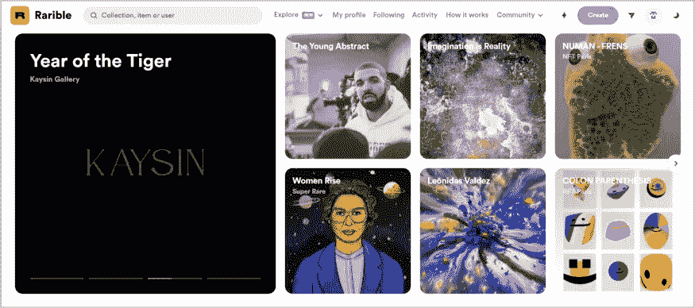
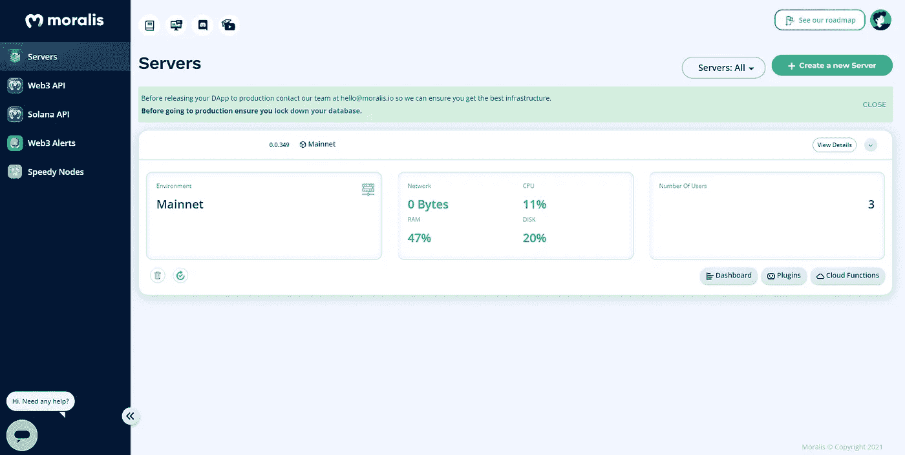
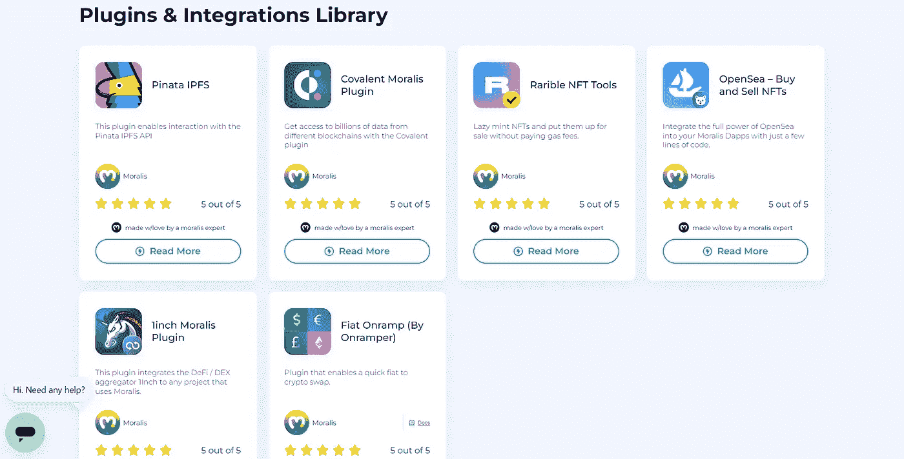
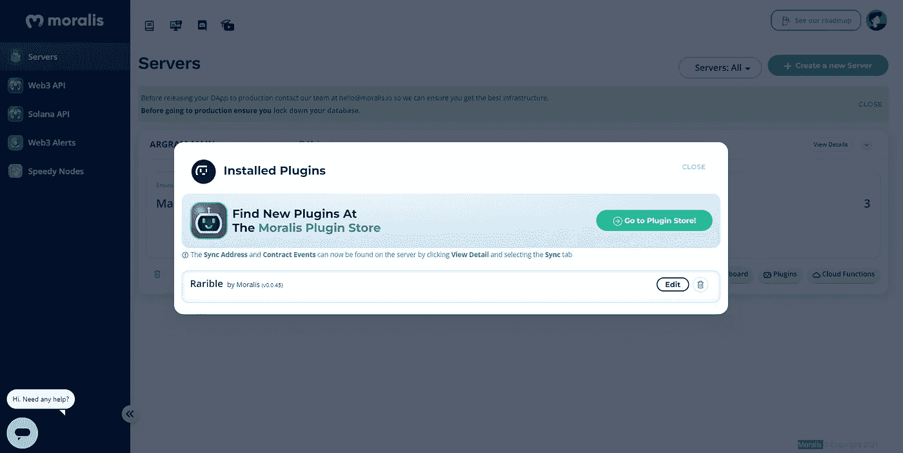
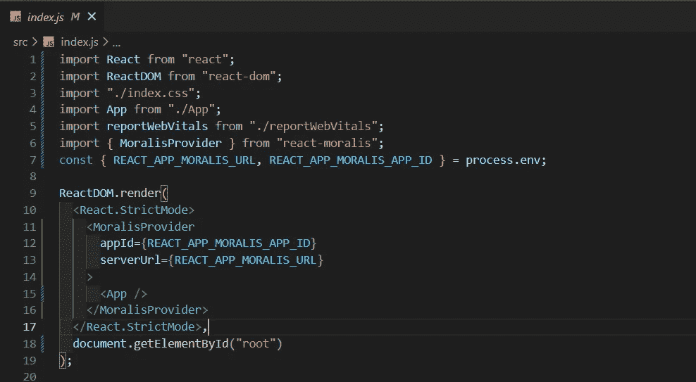
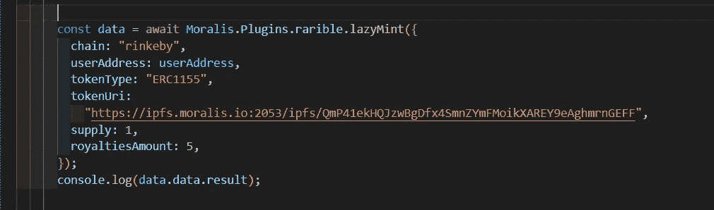

# 稀有的懒惰薄荷——使用道德稀有插件

> 原文：<https://medium.com/coinmonks/lazy-mint-on-rarible-using-moralis-rarible-plugin-45436e844695?source=collection_archive---------10----------------------->

## NFT 系列

## 关于如何在稀有市场上使用道德稀有插件偷工减料制作 NFT 的指南

作为本文的一部分，我们正试图使用道德稀有插件在稀有市场上创造一个 NFT。这里用 React.js 作为前端库。


*如果你没有道德账户，在* [*这里*](https://admin.moralis.io/servers) *设置一个。*

## 懒惰铸币

惰性铸造是一种避免汽油费的创造 NFT 的方法。懒惰制造的 NFT 仅在相应的市场合同上可用，而不是在链上。一旦非功能性交易被转让或交易，它就出现在链上。

## 稀有的

像 OpenSea 一样， [Rarible](https://rarible.com/) 是一个基于以太坊的市场，在这里我们可以买卖我们的 NFT。



Credit: Author

## 第一步:点击插件安装 Rarible 插件



Credit: Author

## 第二步:选择并安装可扩展插件



Credit: Author



Credit: Author

## 第三步:用道德供应商包装你的 React 应用



Credit: Author

## 步骤 4:道德认证

```
**const user = await Moralis.authenticate();** // Authenticate Moralis**const userAddress = user.get("ethAddress");** // Get user address
```

## 第五步:在 Rarible 上的懒惰薄荷

我们正在 Ethreum 的 Rinkeby 试验网上铸造一个 NFT。ERC-1155 将是令牌类型。需要指定令牌 URI，这是一个 IPFS URL，这里指的是要铸造的 NFT 图像。我们还可以设置可选的版税金额。



Credit: Author

```
**We will get a response as follows:****token_address**: 0x1af7a7555263f275433c6bb0b8fdcd231f89b1d7
**token_id**: 111297053292426035921452186129726256453248382378453644181514496187630838874114**You can verify the minted NFT on the below url:**[https://rinkeby.rarible.com/token/0x1af7a7555263f275433c6bb0b8fdcd231f89b1d7:111297053292426035921452186129726256453248382378453644181514496187630838874114](https://rinkeby.rarible.com/token/0x1af7a7555263f275433c6bb0b8fdcd231f89b1d7:111297053292426035921452186129726256453248382378453644181514496187630838874114?tab=owners)
```

## 懒人快乐！

> 加入 Coinmonks [电报频道](https://t.me/coincodecap)和 [Youtube 频道](https://www.youtube.com/c/coinmonks/videos)了解加密交易和投资

# 另外，阅读

*   [如何在 FTX 交易所交易期货](https://coincodecap.com/ftx-futures-trading) | [OKEx vs 币安](https://coincodecap.com/okex-vs-binance)
*   [CoinLoan 评论](https://coincodecap.com/coinloan-review) | [YouHodler 评论](/coinmonks/youhodler-4-easy-ways-to-make-money-98969b9689f2) | [BlockFi 评论](https://coincodecap.com/blockfi-review)
*   [XT.COM 评论](https://coincodecap.com/profittradingapp-for-binance)币安评论 |
*   [SmithBot 评论](https://coincodecap.com/smithbot-review) | [4 款最佳免费开源交易机器人](https://coincodecap.com/free-open-source-trading-bots)
*   [比特币基地僵尸程序](/coinmonks/coinbase-bots-ac6359e897f3) | [AscendEX 审查](/coinmonks/ascendex-review-53e829cf75fa) | [OKEx 交易僵尸程序](/coinmonks/okex-trading-bots-234920f61e60)
*   [如何在印度购买比特币？](/coinmonks/buy-bitcoin-in-india-feb50ddfef94) | [WazirX 评论](/coinmonks/wazirx-review-5c811b074f5b)