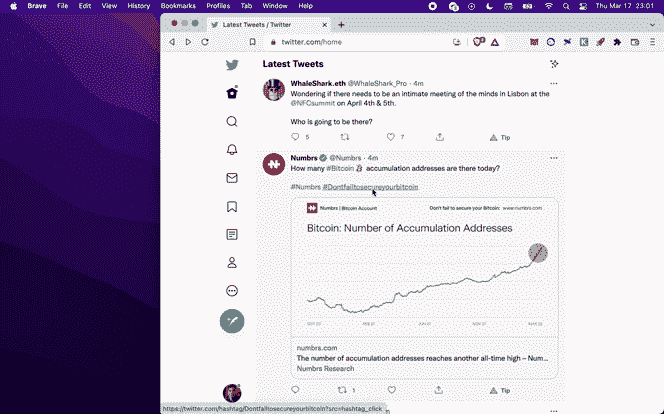

# 懒惰的贸易铬扩展-加密简化

> 原文：<https://medium.com/coinmonks/lazy-trade-chrome-extension-crypto-streamlined-babbabfc40a9?source=collection_archive---------28----------------------->

# 无摩擦加密交易和投资组合管理

如果你在使用 crypto，**你已经浪费了太多的时间**在谷歌上搜索和浏览交易所的用户界面来查看价格和下简单的订单。

## 事情通常是这样的:

*   您看到某个令牌的新闻或有趣的发展，并希望查看价格以下订单
*   加载 Coingecko 或 Coinmarketcap 并搜索令牌，找出它在哪里列出(如果您已经知道它在哪里列出，请跳过这一步)
*   打开交换(币安/FTX/比特币基地或 Uniswap/Pancakeswap)
*   2FA/登录
*   搜索股票代码
*   分析股票行情图
*   选择订单参数并选择交易金额
*   执行交易

## 这是懒惰的交易:

Entering and exiting a trade

## 分解它

当您按下热键时，惰性交易会扫描网页上的当前文本以查找标记。点击一个被识别的标记，一个预装市场和图表的弹出窗口就会打开，让你**查看图表**和**在币安、FTX、北海巨妖或分散的交易所进行即时交易**。

所有的**交易都通过持仓标签中的实时价格**进行跟踪，这样你就可以掌握你的交易。你可以**跨交易所平仓**而不必登录交易所，也不必担心你在哪个平台上执行交易。

## 超越交易

除非你小心翼翼地记录你的投资组合，否则你很难知道你拥有什么样的密码，在任何时候都在哪里，更不用说进行最优交易了。你必须单独登录每个交易所账户，计算你的持有量。我们**自动**跟踪您在**加密钱包和交易所**中的持有量，使投资组合跟踪变得容易。

Portfolio summary tab

我们还将一个**实时 Twitter feed** 集成到 Chrome 扩展中。选择特定的 Twitter 账户来关注和接收他们的推文，并标明他们提到的令牌。signals 页面可以让你对 Twitter 用户和他们的电话价格进行回溯测试。

Feed tab showing recent tweets from accounts you follow

我们目前正在运行一个**免费测试版**，希望您能尝试一下！

**在 Chrome 网上商店下载:**[https://Chrome . Google . com/Web store/detail/lazy-trade/eeobggeikihkgiggaekfbceghlcpemfm](https://chrome.google.com/webstore/detail/lazy-trade/eeobggeikihkgiggaekfbceghlcpemfm)

下面是 Chrome 扩展的**教程**:[https://www.youtube.com/watch?v=3g0g9Wyd2ag](https://www.youtube.com/watch?v=3g0g9Wyd2ag)

我们真的很高兴将更多的功能集成到扩展中，所以请继续关注，并在我们的电报组中留下任何反馈:[https://t.me/lazy_trade_feedback](https://t.me/lazy_trade_feedback)

请负责任地享用和管理您的密码！

> 加入 Coinmonks [电报频道](https://t.me/coincodecap)和 [Youtube 频道](https://www.youtube.com/c/coinmonks/videos)了解加密交易和投资

# 另外，阅读

*   [加密复制交易平台](/coinmonks/top-10-crypto-copy-trading-platforms-for-beginners-d0c37c7d698c) | [五大 BlockFi 替代方案](https://coincodecap.com/blockfi-alternatives)
*   [CoinLoan 点评](https://coincodecap.com/coinloan-review)|[Crypto.com 点评](/coinmonks/crypto-com-review-f143dca1f74c) | [火币保证金交易](/coinmonks/huobi-margin-trading-b3b06cdc1519)
*   [Bybit vs 币安](https://coincodecap.com/bybit-binance-moonxbt)|[stealth x 回顾](/coinmonks/stealthex-review-396c67309988) | [Probit 回顾](https://coincodecap.com/probit-review)
*   [顶级付费加密货币和区块链课程](https://coincodecap.com/blockchain-courses)