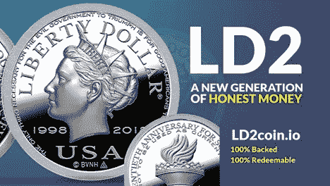
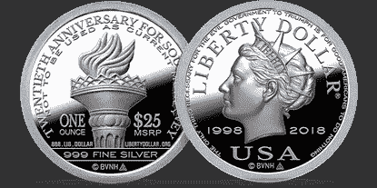

# LD2 是自由美元的白银支持加密版本，开创了资产支持非金融交易

> 原文：<https://medium.com/coinmonks/ld2-the-silver-backed-crypto-version-of-the-liberty-dollar-pioneers-asset-backed-nfts-316ab5b557b1?source=collection_archive---------42----------------------->

***美国拉斯韦加斯，2022 年 6 月 29 日*——**最初的自由美元是一种总部位于美国的替代货币，成立于 1998 年，比比特币早了十年——已经被重新设想为加密时代的 [LD2](https://ld2coin.io) ，这是一种贵金属支持的数字令牌协议和加密货币。每个 LD2 代币是一张定制的 1 金衡盎司银币或金币的收据。

LD2 最初是一种基于以太坊的 ERC-20 代币，现在正通过转移到更环保的区块链蜡(由 EOSIO 驱动)来扩大其限量版 LD2.zero 数字代币的首次发行。零代币现在可以用蜡代币购买。

“自由美元非常成功，不仅是作为一种私人的替代货币，也是加密货币运动的一种有影响力的模式。LD2 的联合创始人 Extra von NotHaus 表示:“通过 LD2 重新设计自由美元，我们将这种久经考验的替代货币模式与区块链技术相结合。“从以太坊转向蜡像对我们来说是一个自然的选择。由于零汽油费和碳中和交易，WAX 更符合 LD2 的精神。”

LD2 加入了已经在 NFT 为中心的 WAX 区块链上的其他受欢迎的内容创作者，从雅达利和 Funko 到漫威和 DC。除了可替代的 LD2.zero，LD2 现在正在构建一个基于 WAX 的首要 NFT 2.0 解决方案，这将首次为 NFTs 带来真实世界的资产支持和价格稳定性。**通过利用 LD2 的蜡基令牌，这种新的解决方案可以通过银条将真实世界的价值附加到蜡制区块链上的任何数字 NFT 资产上。**

**100%支持、可赎回和可交换**

区块链技术允许 LD2 保留使 Liberty Dollar 与众不同的精神、原则、方法和社区，同时还提供了通过新功能、流动性和实用性扩展功能的机会。

LD2 的联合创始人 Steven Brendtro 表示:“完全透明和安全，以及高交易速度和交易量，只是 WAX 区块链提供的几个好处，这些好处使我们能够将这种真实世界的价值带给世界各地的加密货币用户，现在也带给 NFT。”“将 Liberty Dollar 模式的经验和成功应用于加密货币和 NFT，这是前所未有的好时机。”

LD2 数字代币起到基于区块链的数字仓库收据的作用。简而言之，这意味着客户预先购买实物白银，而不是立即交付白银，而是以数字令牌的形式收到仓库收据。LD2 LLC 只卖白银，不卖代币——数字代币永远是收据。

由于实体银币是预先购买的，这些代币化的收据可以在任何时候兑换成实体银币。代币持有者的银币被保存在一个完全保险的金库中，定期接受严格的第三方审计，结果记录在链上。50 美元的 LD2.zero 银币价格包括发行后 10 年内的预付款和保险。

最初只发行了 10，000 枚 LD2.zero 代币，由一枚限量版的 1 金衡盎司未流通(BU) .999 优质银币支持，带有令人惊叹的 20 周年自由美元设计。LD2.zero 硬币现在更加稀缺，可供购买的剩余不到 3000 枚。除了他们的众筹销售之外，LD2.zero 目前还在 Alcor 分散式交易所上市，代币(拥有实物白银所有权)可以通过 WAX 兼容的钱包进行点对点转让，无需交易/汽油费。

**建立在令人惊叹的遗产之上**

最初的自由美元证书是由真正的金币和银币支持的。世界著名的替代货币先驱伯纳德·冯·诺豪斯于 1998 年创造了价值超过 5000 万美元的自由美元，在其第一个十年中进入流通。总的来说，Liberty Dollar 服务了超过 250，000 名用户，并被 50 个州的 5，000 多家商户接受。**自由美元最终成为美国最受欢迎的替代货币。**

**远在比特币颠覆全球对替代货币的看法之前，自由美元的大受欢迎就引起了美国政府的注意。然而，在长达十年的法律斗争之后，伯纳德只是轻描淡写地放走了一名自由公民，而联邦检察官则被迫将最初搜查中扣押的大部分自由美元资产归还给证书持有人。这代表着全球替代货币持有者和加密货币用户的重大胜利。**

自由美元的遗产及其惊人的历史预计将在 LD2 的全球影响力中得到反映，LD2 由伯纳德的儿子 Extra von NotHaus 和最初的自由美元的前地区货币官员 Steven Brendtro 共同创建。

**更多硬币& NFT 2.0:现实世界的价值来到 NFTs**

在即将出售剩余的限量版 LD2.zero 代币后，LD2 将推出开放式版本的白银和金币支持的数字代币，分别命名为 LD2.silver 和 LD2.gold。这些代币，如同 LD2 协议上发行的所有代币一样，将由优质硬币支持，但与限量版相比具有不同的设计。一种由 LD2 开发并获得专利的实时实物资产支持借记卡也正在筹备中，将于未来发布。

LD2 还直接受益于在以 NFT 为中心的蜡像区块链上的发布，这里是 Topps、Funko 和漫威等流行创作者的家园，还有游戏平台 Alien Worlds、Farmers World、Splinterlands 和 HodlGod。随着增长和创新，NFT 空间正在蓬勃发展，但众所周知，它存在固有的风险——非专利技术随时可能失去所有价值。也就是说，直到现在:

LD2 处于下一代 NFT 2.0 技术的前沿。与其他依赖于空的、法定代币的支持选项不同，LD2 将仓单直接与 NFTs 挂钩，直接将 NFT 与库存实物贵金属联系起来。与任何 LD2 协议令牌一样，附加仓单的所有权可以很容易地在人与人之间转移。NFT 2.0 解决方案现在具有现实价值，并已成为价格稳定的资产。

毫不奇怪，NFT 的所有者对给他们的 NFT 带来真实世界的价值感到兴奋，尤其是给支付奖励的游戏。LD2 可以做到这一点，不仅可以发行极具收藏价值的银支持 LD2 NFTs，还可以为其他内容创作者的现有 NFT 提供物理支持，并使自己成为 NFT 游戏平台的首选游戏内货币。

“我们的愿景是创造最终形式的加密流动性，由属于用户的真金白银支持，”Extra von NotHaus 说。“我们为 LD2.zero 感到自豪，并期待采取下一步措施，尽快推出 LD2.silver。LD2.silver 将让更多的人享受到真正的、有价值的金钱及其给社会带来的好处，随着我们在 NFT 市场的扩张，这种好处将会更多。”

零代币现在可以用蜡代币购买。

“LD2 无疑是世界上同类产品中最好的，我们有最好、最有经验的团队来实现它的成功，”Extra von NotHaus 说。

有关 LD2 代币的更多详情，请点击[此处](https://wax.ld2coin.io/crowdsale)。

要访问 XLDZ / WAX 交易对，请点击[此处](https://wax.alcor.exchange/trade/XLDZ-theld2coinio_WAX-eosio.token)。

**关于 LD2 LLC**

LD2 LLC 是一家成立于 2018 年的美国公司，其使命是将价值支持货币重新普及为银和金币支持的数字令牌协议和加密货币。实体硬币存放在一个经过保险和审计的金库中，保证以 1:1 的比例支持数字 LD2 代币。一枚限量版银币支持的 LD2.zero 硬币现已发售，剩余不到 3000 枚。继 LD2.zero 之后，银币支持的 LD2.silver 代币将在加密货币交易所作为无上限发行提供。

**LD2 官方渠道**

**网址:** [https://ld2coin.io](https://ld2coin.io)

【https://twitter.com/Ld2Coin】推特: [推特](https://twitter.com/Ld2Coin)

**不和:**https://discord.gg/MzJrJmJEcG

> 加入 Coinmonks [电报频道](https://t.me/coincodecap)和 [Youtube 频道](https://www.youtube.com/c/coinmonks/videos)了解加密交易和投资

# 另外，阅读

*   [加密货币储蓄账户](/coinmonks/cryptocurrency-savings-accounts-be3bc0feffbf) | [YoBit 审核](/coinmonks/yobit-review-175464162c62)
*   [Botsfolio vs nap bots vs Mudrex](/coinmonks/botsfolio-vs-napbots-vs-mudrex-c81344970c02)|[gate . io 交流回顾](/coinmonks/gate-io-exchange-review-61bf87b7078f)
*   [CoinFLEX 评论](https://coincodecap.com/coinflex-review) | [AEX 交易所评论](https://coincodecap.com/aex-exchange-review) | [UPbit 评论](https://coincodecap.com/upbit-review)
*   [AscendEx 保证金交易](https://coincodecap.com/ascendex-margin-trading) | [Bitfinex 赌注](https://coincodecap.com/bitfinex-staking) | [bitFlyer 审核](https://coincodecap.com/bitflyer-review)
*   [Bitget 评论](https://coincodecap.com/bitget-review)|[Gemini vs block fi](https://coincodecap.com/gemini-vs-blockfi)cmd |[OKEx 期货交易](https://coincodecap.com/okex-futures-trading)
*   [AscendEx Staking](https://coincodecap.com/ascendex-staking)|[Bot Ocean Review](https://coincodecap.com/bot-ocean-review)|[最佳比特币钱包](https://coincodecap.com/bitcoin-wallets-india)