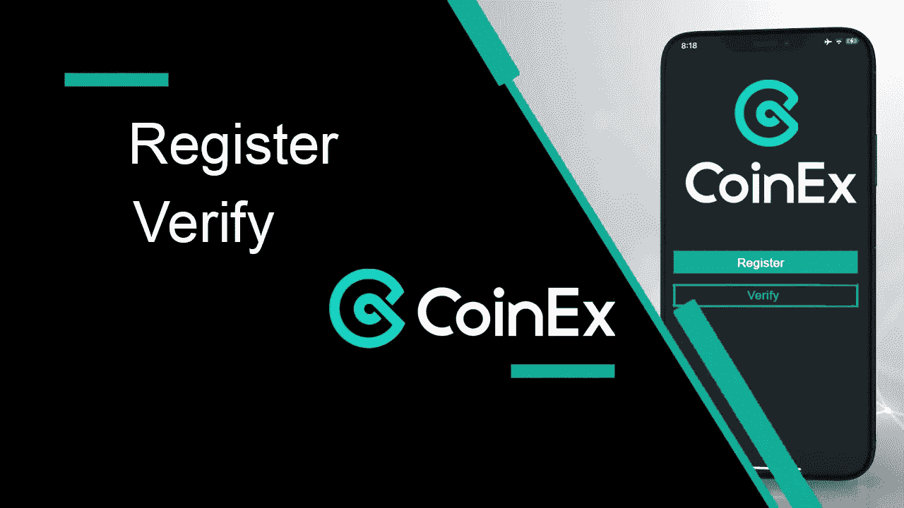
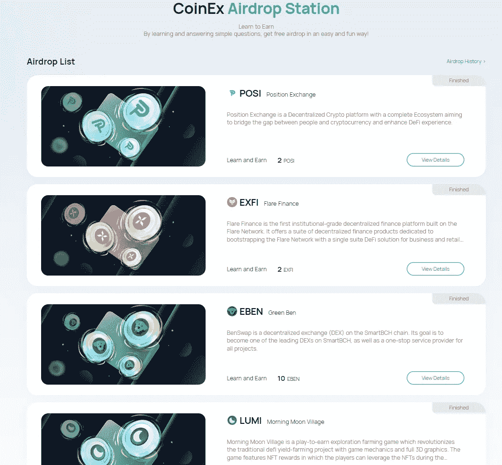

# 精益和盈利:CoinEx 版本

> 原文：<https://medium.com/coinmonks/lean-and-earn-coinex-version-e0c755b2a2b2?source=collection_archive---------51----------------------->

第 2 部分:学习和赚取永不消逝

嗨，朋友们，我总是试图给你们提供信息，让你们不用太多努力就能以合法的方式积累资产。今天我将向大家介绍一个不太熟悉的交易所。在 CoinEx，你可以通过参加学习和学习计划获得一些免费的密码。那我们开始吧。

> CoinEx 成立于 2017 年 12 月，是一家专业的全球加密货币交易所。CoinEx 核心团队成员来自世界领先的互联网和金融公司，包括加密货币的最早采用者和专业人士，他们拥有丰富的行业全球运营和服务经验。凭借我们专有的交易匹配系统和出色的用户体验，我们致力于为全球用户构建一个高度安全、稳定和高效的加密货币交易所。

**要求:**

要参加“学习和收获”计划，您必须满足以下标准:

*   你必须是 CoinEx 的注册用户
*   你必须通过 KYC
*   你必须是 1 级或以上的贵宾

**如何**

你必须看一些视频或阅读一些文章，回答 MCQ 的问题，这很容易。

**备注**

CoinEx 上的学习和收入计划是有时间和配额限制的。原则是先到先得。到目前为止，他们已经提供了:CET(原生令牌)，RTM，NABOX，波巴，LUMI，EBEN，EXFI 和 POSI。

如果你想从 CoinEx 的学习和收入开始，你最好的选择是从我的链接开始，以获得额外的 20%的交易费佣金。*[https://rebrand.ly/CoinExOfficial](https://rebrand.ly/CoinExOfficial)

这里没有任何金融建议，我也不是金融专家。请 DYOR

*这是一个附属链接