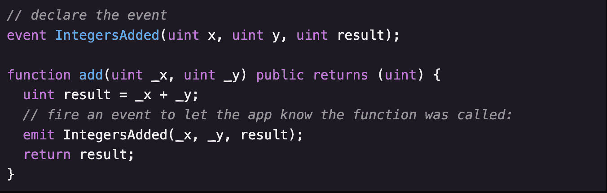

# 了解智能合同的基本概念

> 原文：<https://medium.com/coinmonks/learn-about-the-essential-concepts-of-a-smart-contract-938717bd18ba?source=collection_archive---------20----------------------->

在本文中，我将带您浏览一个*智能合约的所有基本概念，这将帮助您构建自己的智能合约，并对它们的工作方式有一个概述。*

**我假设你有一些用另一种语言编程的经验(例如 Javascript)。**

# *目录*

*   *基础*
*   *最佳化*
*   *时间单位*
*   *功能修饰符*
*   *使用“查看”功能节省汽油*
*   *复习第一部分*
*   *应付款修改量*
*   *随机数*
*   *以太坊上的代币*
*   *转移逻辑*
*   *断言与要求*

# *基础*

*从最基本的开始:*

**

*Solidity 的代码封装在**契约**中。A `contract`是以太坊应用的基本构建模块:*

*-所有的变量和函数都属于一个契约，这将是你所有项目的起点。*

*-所有 solidity 源代码都应该以“版本杂注”开始，即声明该代码应该使用的 Solidity 编译器的版本。*

> *pragma 实度> =0.5.0 <0.6.0;*
> 
> *contract HelloWorld **{***
> 
> ***}***

*- **状态变量**永久存储在合同存储器中。这意味着它们被写入以太坊区块链。把它们想象成写数据库。*

> *合同示例 **{***
> 
> **//这将永久保存在区块链中**
> 
> *uint myUnsignedInteger = 100*
> 
> ***}***

*-当你想要一个东西的集合时，可以用数组。Solidity 中有两种类型的数组:固定数组和动态数组:*

> **//固定长度 2 个元素的数组:**
> 
> *uint[2]fixed array；*
> 
> **//另一个固定数组，可以包含 5 个字符串:**
> 
> *string[5]字符串数组；*
> 
> **//动态数组——没有固定大小，可以不断增长:**
> 
> *uint[]dynamic array；*

*-你可以声明一个数组为 public，Solidity 会自动为它创建一个 getter 方法。*

> *人 *[]* 公众人物；*

*   ***存储** —变量是一个状态变量(存储在区块链上)*
*   ***内存** —变量在内存中，在函数被调用时存在*
*   ***calldata** —包含函数参数的特殊数据位置，仅对外部函数可用*

*-我们还提供了关于 _name 变量应该存储在哪里的指令-在**内存**中。这是所有引用类型(如数组、结构、映射和字符串)所必需的。*

*-如果一个函数不改变任何值，也不写任何东西。我们可以将它声明为**视图***

> *函数 sayHello()公共视图返回(字符串内存){ … }*

*- Solidity 还包含纯粹的**函数，这意味着你甚至不能访问应用程序中的任何数据。请考虑以下情况:***

> *function _multiply(uint a，uint b)私有纯收益(uint) {*
> 
> *返回 a * b；*
> 
> *}*

*注意:可能很难记住何时将函数标记为纯/视图。幸运的是，Solidity 编译器善于发出警告，让您知道何时应该使用这些修饰符之一。*

*-以太坊内置了哈希函数 ***keccak256*** ，是 SHA3 的一个版本。哈希函数基本上将输入映射为随机的 256 位十六进制数。输入中的微小变化都会导致散列值的巨大变化。*

> *ke ccak 256(ABI . encode packed(" aaaab "))；*

*- **事件**是你的合同向你的应用前端传达区块链上发生的事情的一种方式，它可以“监听”某些事件，并在事件发生时采取行动。*

**

*-在可靠性方面，有某些全局变量可供所有函数使用。其中之一是 msg.sender，它指的是调用当前函数的人(或智能合约)的地址。*

> *注意:在 Solidity 中，函数执行总是需要从一个外部调用者开始。在有人调用它的某个函数之前，一个契约将一直坐在区块链上，什么也不做。所以总会有一个 **msg.sender.***

*- **Internal** 与 private 相同，只是它也可以被从这个契约继承的契约访问。*

*- **外部**类似于 public，除了这些函数只能在契约之外调用*

*   *为了让我们的合同与不属于我们的区块链上的另一个合同进行对话，首先我们需要定义一个接口。*

*-在 Solidity 中，你可以从一个函数中返回多个值。*

*- **uint** 是 **uint256** 的别名*

*-记住对于字符串，我们必须比较它们的 **keccak256** 散列来检查相等性*

*-函数修饰符**看起来就像一个函数，但是使用了关键字修饰符而不是关键字函数。它不能像函数那样被直接调用——相反，我们可以在函数定义的末尾加上修饰符的名字来改变函数的行为。***

# *最佳化*

*-如果在一个**结构**中有多个**单元**，尽可能使用一个更小的**单元**将允许 Solidity 将这些变量打包在一起以占用更少的存储空间。*

*-您还需要将相同的数据类型聚集在一起(例如，在结构中把它们放在一起)，这样 Solidity 可以最小化所需的存储空间。例如，带有字段 ***uint c 的结构；uint 32 a；uint 32 b；*** 比字段为 ***uint32 a 的结构消耗的气体少；uint c；uint 32 b；*** 因为 uint32 字段是聚类在一起的。*

# *时间单位*

*坚实度还包含时间单位 ***秒、分、小时、日、周和年*** 。这些将转换成该时间长度内的秒数的**单位**。*

*所以，1 分钟是 60，1 小时是 3600 (60 秒 x 60 分钟)，1 天是 86400 (24 小时 x 60 分钟 x 60 秒)等等。*

# *功能修饰符*

**

*-您可以在这里看到 olderThan 修饰符像函数一样接受参数。并且 driveCar 函数将其参数传递给修饰符。*

# *使用“查看”功能节省汽油*

*-当用户从外部调用视图函数时，它们不会消耗任何资源。*

*-这是因为视图函数实际上不会更改区块链上的任何内容，它们只会读取数据。因此，用 view 标记一个函数告诉 web3.js，它只需要查询您的本地以太坊节点来运行该函数，而实际上它不必在区块链上创建一个事务(这需要在每个节点上运行，并且很费油)。*

> *注意:如果一个视图函数是从同一个契约中另一个不是视图函数的函数内部调用的，它仍然会消耗 gas。这是因为另一个函数在以太坊上创建了一个事务，仍然需要从每个节点进行验证。所以视图函数只有在被外部调用时才是自由的。*
> 
> *注意:创建内存数组时必须使用长度参数(在本例中为 3)。它们目前不能像存储数组那样使用 array.push()调整大小，尽管在 Solidity 的未来版本中可能会有所改变。*

# *回顾第一部分:*

*1)我们有可见性修饰符来控制何时何地可以调用函数: **private** 意味着它只能从契约中的其他函数调用；**内部**类似于**私有**，但是也可以被从这个继承的契约调用；**外部**只能在合同外调用；最后 **public** 可以在任何地方调用，包括内部和外部。*

*2)我们还有状态修饰符，它告诉我们函数如何与区块链交互:*

*   ***视图**告诉我们，通过运行该功能，不会保存/更改任何数据。*
*   ***纯粹的**告诉我们，这个函数不仅不会将任何数据保存到区块链，而且也不会从区块链读取任何数据。*

*如果从契约外部调用，这两个函数都不会消耗任何资源(但是如果由另一个函数内部调用，它们会消耗资源)。*

*3)然后我们有自定义修饰符: **onlyOwner** 和 **aboveLevel** ，例如。对于这些，我们可以定义自定义逻辑来确定它们如何影响功能。*

> *function test()仅外部视图 owner another modifier {*/*…*/*}*

# *应付款修改量*

*- **Payable** 函数是 Solidity 和 Ethereum 如此酷的部分原因——它们是一种可以接收以太的特殊类型的函数。*

> *注意:如果一个函数没有被标记为 payable，并且你试图像上面那样发送以太给它，这个函数将拒绝你的交易。*

*-请务必注意，除非地址类型为**应付地址**，否则您无法将乙醚转移至该地址。*

*——**地址(本)。balance** 将返回存储在合同中的总余额。*

**

# *随机数*

*-我们在可靠性方面最好的随机性来源是 ***keccak256*** 哈希函数。*

**

## *解释:*

*这样做的目的是获取现在为的**时间戳、 **msg.sender、**和一个递增的 **nonce** (一个只使用过一次的数字，因此我们不会使用相同的输入参数运行相同的哈希函数两次)。***

*然后它会“打包”输入，并使用 **keccak** 将它们转换成随机散列。接下来，它将把散列转换成一个 **uint** ，然后使用 **% 100** 只取最后 2 位。这将给我们一个 0 到 99 之间的完全随机的数。*

# *以太坊上的代币*

*以太坊上的**令牌**基本上只是一个智能合约，它遵循一些通用规则，即它实现了所有其他令牌合约共享的一组标准功能，例如:*

****transferFrom(地址 _ 发件人，地址 _ 收件人，uint256 _ 令牌 Id)和 balanceOf(地址 _ 所有者)*** 。*

*-基本上，令牌只是一个记录谁拥有多少令牌的合同，以及一些功能，以便这些用户可以将其令牌转移到其他地址。*

*- **ERC721** 令牌不可互换，因为每个令牌都被认为是唯一的，并且不可分割。你只能整单位交易，每一个都有唯一的 ID。因此，这些是一个完美的适合使我们的僵尸交易。*

> *注意:使用 ERC721 这样的标准有一个好处，那就是我们不需要在合同中实现拍卖或托管逻辑来决定玩家如何交易/出售我们的僵尸。如果我们符合规范，其他人可以为加密交易的 ERC721 资产建立一个交换平台，我们的 ERC721 僵尸可以在该平台上使用。因此，使用代币标准代替自己的交易逻辑有明显的好处。*

**

# *转移逻辑*

*1-第一种方式是令牌的所有者调用 **transferFrom** ，其中他的**地址**作为 **_from** 参数，他想要转移到的**地址**作为 **_to** 参数，以及他想要转移的令牌的 **_tokenId** 。*

**

*2-第二种方式是令牌的所有者首先调用 **approve** 和 **_tokenId** 以及他想要转移到的地址。然后，合同存储谁被批准使用令牌，通常存储在一个**映射中(uint256 = >地址)。**然后，当拥有者或被批准的地址从调用**transfer 时，契约检查 **msg.sender** 是否是拥有者或被拥有者批准接受令牌，如果是，它将令牌转移给他。***

**

# *断言与要求*

*   ***断言**类似于**要求**，如果为假，将抛出错误。**断言**和**要求**的区别在于**要求**会在某个功能失效时退还用户剩余的汽油，而**断言**不会。所以大多数时候你想在你的代码中使用**要求**；**断言**通常在代码出现严重错误时使用(比如 **uint** 溢出)。*

*祝贺您，您现在已经对所有事情的工作原理有了一个概念，所以在下一篇文章(下面的链接)中，我们将看到您如何使用 **web3.js** 从前端应用程序与智能合同进行交互。*

* [## 如何使用 web3.js 与智能合约交互

### 这篇文章是下面那篇文章的续篇:

medium.com](/@anasselabbadi.pro/how-to-interact-with-the-smart-contract-using-web3-js-3c10623385d7)*