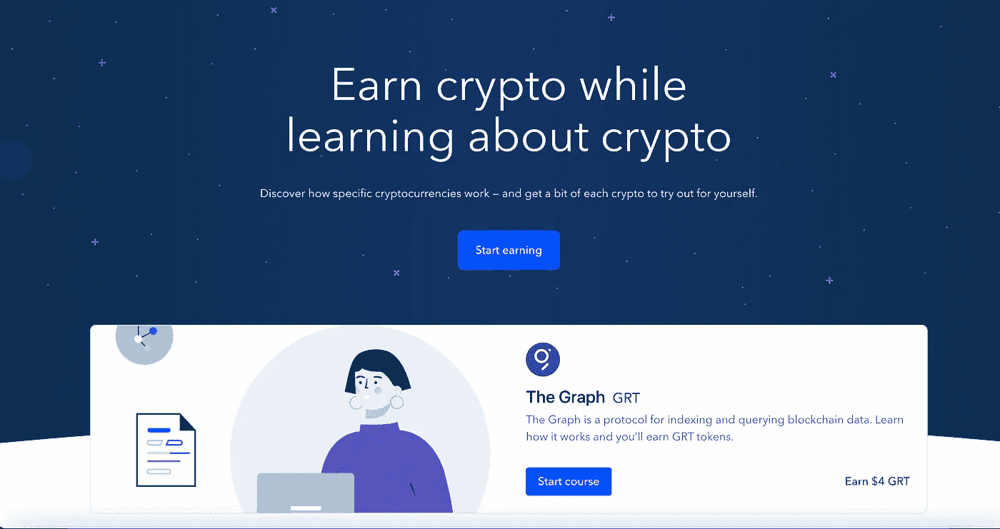
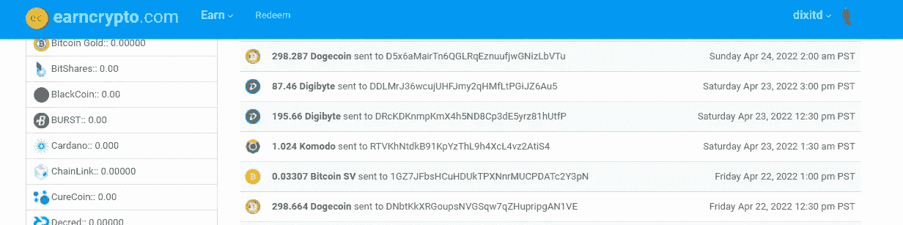
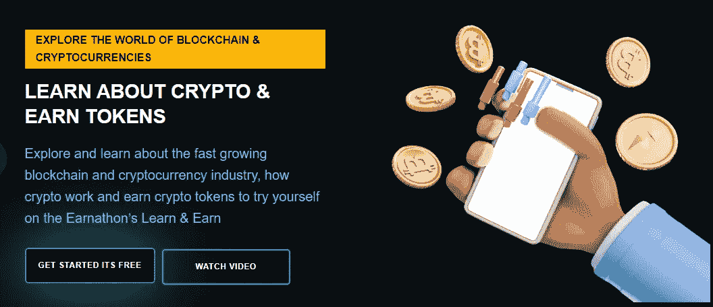
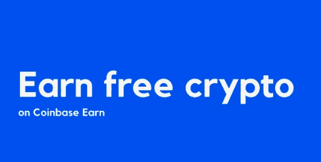
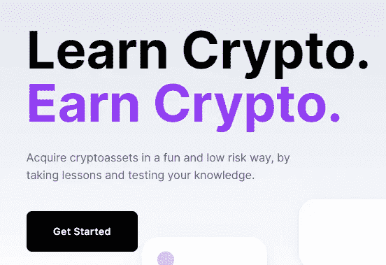
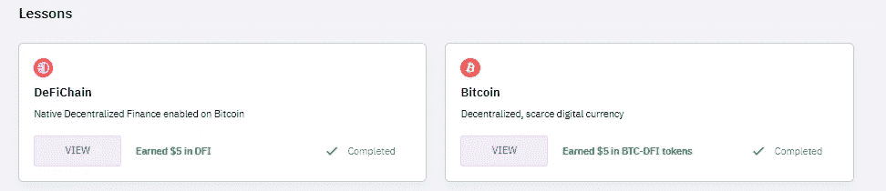

# 学习和获得计划

> 原文：<https://medium.com/coinmonks/learn-and-earn-programs-97fee2166212?source=collection_archive---------2----------------------->

获得免费密码的最有效方法

如果你是比特币世界的新手，不知道从哪里开始，那么“赚取”和“赚取”项目可能是一个不错的起点。要想投资成功，首先要了解加密货币的工作原理。学习和收入计划的最大好处在于，在完成课程后，你可以获得免费的加密货币。

## 到底什么是学有所得？

Learn and Earn 计划是专门创建的计划，用户学习并回答特定主题的问题，即可获得比特币作为回报。例如，您可以通过观看视频，然后参加一个简短的测验来了解一个加密货币项目。如果您成功回答问题，您将获得一定数量的代币作为奖励。

## 五大边学边赚项目

下面列出了用户可以访问的前 5 个学习和收入计划，以帮助您开始学习。

Photo by [Quantitatives](https://unsplash.com/@quantitatives?utm_source=medium&utm_medium=referral) on [Unsplash](https://unsplash.com?utm_source=medium&utm_medium=referral)

# 恩 Crypto

[EarnCrypto](https://www.earncrypto.com/earn-free-/?r=930941)

[EarnCrypto](https://www.earncrypto.com/earn-free-/?r=930941) 提供学习和赚取项目，以及其他加密货币相关服务。除了做额外的微任务，你还可以通过看电影和回答调查来赚取加密奖励。

因此，这个平台上的学习者有机会赚取超过 100 种加密货币的无限量。 [EarnCrypto](https://www.earncrypto.com/earn-free-/?r=930941) 也希望为其用户提供少量加密货币的第一手体验。您的钱包将被存入代币，然后您可以将代币传输到交易所。

迄今为止，它已经向用户支付了约 56，000 笔费用。使用 [EarnCrypto](https://www.earncrypto.com/earn-free-/?r=930941) ，您可能会获得 Ravencoin、Tron、Litecoin、Digibyte、Komodo、比特币现金和 Waves 等加密货币。要开始，只需注册一个免费帐户，然后开始。

# 欧纳森

[Earnathon](https://earnathon.com/signup?ref=dixitd)

Earnathon 的与众不同之处在于它是一个专注于学习和赚钱的平台。因为只有一种产品，所以鼓励您了解更多关于加密货币的技术和非技术元素。

它为用户提供了在真实交易中使用的加密令牌，以便创建有影响力和有效的教学模型。到 2025 年， [Earnathon](https://earnathon.com/signup?ref=dixitd) 希望让至少 1000 万人了解区块链技术。目标是到 2050 年达到 10 亿人。截至 2021 年，它目前拥有 339，000 多名活跃用户。

学习者会收到 ENA 代币，可用于在网站上下注、种植庄稼和发布产品。Earnathon 目前有一门关于“货币进化”的课程。

# 比特币基地·欧文

[Coinbase](https://coinbase.com/join/dixit_cmp) Earn

另一个类似的视频问答学习和赚取节目是[比特币基地](https://coinbase.com/join/dixit_cmp)赚取。您可以在了解区块链项目的同时获得本地代币奖励。通过参加此次活动，您可以获得高达 160 美元的奖励。

但是，您必须满足某些资格要求才能加入。首先，你需要一个已经完全通过 KYC 认证的[比特币基地](https://coinbase.com/join/dixit_cmp)账户。其次，你的账户必须通过内部的[比特币基地](https://coinbase.com/join/dixit_cmp)欺诈检测系统，该系统会验证其唯一性。

当我们输入这个的时候，你可能会了解到计价单位、NuCypher、图形、Celo、Compound 和许多其他著名的密码项目。因此，你可以赚取核磁共振，努，GRT，CGLD，COMP，XLM，和其他货币。这个程序，像 CoinMarketCap Earn，在某些地区是被禁止的，所以要仔细检查。

# 共同市场资本

[CoinMarketCap](https://coinmarketcap.com/invite?ref=K7G7MBKU)

CoinMarketCap Earn 是一项边学边赚的服务，您可以在观看视频后测试自己的知识。这是一种直接、愉快、低风险的赚取加密货币的方式。要参加，你需要一个经过 KYC 认证的币安用户 ID 和一个 [CoinMarketCap](https://coinmarketcap.com/invite?ref=K7G7MBKU) 账户。

在您成功完成测验后，奖励将通过算法发放到您的相关钱包中。另一方面，代币的分发在竞选结束后开始，大约需要一个月的时间来完成。

[CryptoMarketCap](https://coinmarketcap.com/invite?ref=K7G7MBKU) 与 Nervos Network、1inch、The Graph 等项目合作，提供其学习和收入计划。您可以通过参与赢得 CKB，GRT，沙，OXT，HNT，露娜，卡瓦和乐队。然而，你应该检查一下，看看你的国家是否是限制这一项目的不幸国家之一。

# 凯德菲

[Cake DeFi](https://cakedefi.com/?ref=335951)

Cake DeFi 是一家总部位于新加坡的分散式金融机构。所以，当我最近在脸书上看到它创造了一个“学习和收获”的计划时，我立刻受到了激励，要采取行动。

我很快在 Cake Defi 开设了一个账户，并完成了 DFI 课程。

老实说，得到这个价值 10 美元的 DFI 是小菜一碟，但是我必须先完成我的 KYC 验证。所以，我像一只听话的绵羊，提交了所有需要的文件。

这个价值 10 美元的 DFI 被发现自动押了一个月。

# 结论

有秘密赚钱的机会。

有许多可供选择的加密收入，这个馅饼足够大，可以容纳每个人。我希望你们中的一些人能够迅速行动，抓住这些机会。

祝你规划和收入顺利！

> 由[学会发布的内容。Block6.tech](https://learn.block6.tech)
> 
> 👉[不和](https://discord.gg/5SUs8QTJ8a) —现场直播
> 
> 👉[推特](https://twitter.com/block6_tech) —最新文章
> 
> w to 交易？在[最佳加密交易](/coinmonks/crypto-exchange-dd2f9d6f3769)上尝试[加密交易机器人](/coinmonks/crypto-trading-bot-c2ffce8acb2a)或[复制交易](/coinmonks/top-10-crypto-copy-trading-platforms-for-beginners-d0c37c7d698c)
> 
> 👉 [LinkTr.ee](https://linktr.ee/block6)