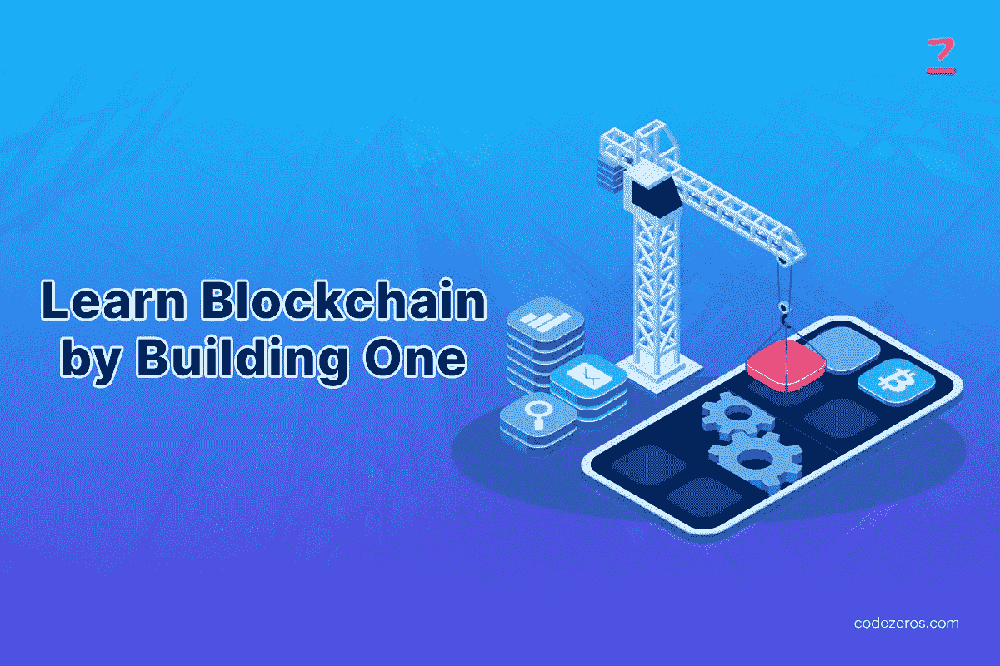

# 通过构建一个来学习区块链

> 原文：<https://medium.com/coinmonks/learn-blockchain-by-building-one-20b95dc57ec9?source=collection_archive---------29----------------------->

区块链是最大的机会之一，即使在未来几十年里也可以找到它的踪迹。如果你从事技术行业，你很可能听说过区块链机制。这是每种加密货币和大多数去中心化应用背后的最新底层技术。

区块链技术被认为是这个时代最好的发明。区块链技术跟踪所有数字资产或数据。该记录被称为“分类账”“事务”是指每一次交换的数据。在这篇文章中，我们将看到区块链是如何在 JS 中制作它的。

Learn Blockchain by Building One

为什么要考虑区块链？

区块链作为一种存储和保护数字货币的方法于 2008 年推出。区块链是为比特币创建的提案的一部分。区块链网络的第一个应用是比特币。主要的优点是，没有每个节点或参与方的参与，不能对记录的信息进行改变。 [**区块链开发服务**](https://www.codezeros.com/) 的其他一些优势如下:

*   分散化:交易发生在计算机网络上。
*   **打开:**每个节点都可以看到交易。
*   **不变性:**交易一旦发生，就不能修改。
*   **安全性:**区块链因为加密，安全性很高。

**从块开始:**

积木是一个拥有一些重要信息的盒子。块的一些属性是:

*   用于在区块链上记录的数据，例如交易数据。
*   块散列是利用加密技术生成的块 ID。
*   链内的前一个块的散列被记录在每个块中，用于将其链接到链并提高其安全性。
*   制作块并将其添加到区块链的时间戳。
*   工作的能力或证明是为导出当前块的散列所付出的努力。

**计算块的哈希:**

块的散列是利用加密策略创建的标识符。将通过利用 SHA256 算法散列先前的块散列、时间戳、当前块数据和 PoW 来接收块散列。密码将被用来对数据进行散列运算。你可以聘请一家名不见经传的 [**区块链应用开发公司美国**](https://www.codezeros.com/services/blockchain-development) 寻求专家建议，否则你将不得不做以下事情:

*   将块的数据转换为 JSON 格式。这将使我们能够把它作为一个字符串与其他信息联系起来。
*   需要连接前一个散列的 PoW、时间戳、数据和 PoW。
*   使用 SHA256 算法，需要生成早期连接的哈希。
*   散列结果需要用小写字母返回。

**挖掘最新区块:**

新块的挖掘包括产生具有几个前导零的块的散列，这是由当前区块链的难度提供的。这意味着，如果区块链的难度等级为 3 级，则需要开发一个以三个零开始的方块。

因为散列将从块的内容中导出，所以内容不能被改变。但是，在满足开采条件之前，功率肯定可以增加。你可以联系任何有经验的 [**区块链开发公司**](https://www.codezeros.com/services/) 开采新区块。

为了实现这一点，将为 Block 类创建 mine()，该类将不断增加 PoW 的值，并对块散列进行计数，直到我们收到有效的散列。

**定义区块链的类别:**

一个区块链玻璃杯中会有三个属性——一个表示难度的数字，一个创世纪区块，以及一个由链中其他区块组成的范围。第一个区块是区块链中的创世区块。

在区块链中声明了一个静态方法，用于利用难度初始化直接区块链。几乎每个 [**区块链解决方案和服务提供商**](https://www.codezeros.com/services/\) 都推荐利用难度等级。

**区块链新增区块:**

在为块成功实现计算它们的散列的功能之后，然后挖掘它们自己。

addBlock 方法将被添加到区块链类的原型中。

**区块链的确认:**

在实现了区块链的所有功能后，需要检查区块链的真实性，以确认区块链从未被篡改过。isValid 方法可以添加到区块链的原型中。

链上每个块的哈希都会重新计算，然后与存储在其中的哈希 id 进行比较，然后还会比较下一个块的 previousHash 属性，它必须等于当前块的哈希 ID。大多数区块链开发专家建议遵循正确的协议进行区块链验证。

**区块链测试:**

因为我们有一个功能完整的区块链，所有的功能都需要在实现后进行测试。测试功能可以添加到文件中，并通过使用命令行中的节点<filename.js>来运行。对于测试，你可以考虑 [**区块链应用开发服务**](https://www.codezeros.com/services/blockchain-development) 来确保一切都在正确的位置。</filename.js>

**结论:**

在本文中，我们了解了区块链是如何运作，以及如何利用 JavaScript 从头开始创建区块链。然而，如果你与区块链没有联系或者缺乏关于区块链的知识，建议寻求专业帮助来完成这项工作。

> 交易新手？尝试[加密交易机器人](/coinmonks/crypto-trading-bot-c2ffce8acb2a)或[复制交易](/coinmonks/top-10-crypto-copy-trading-platforms-for-beginners-d0c37c7d698c)