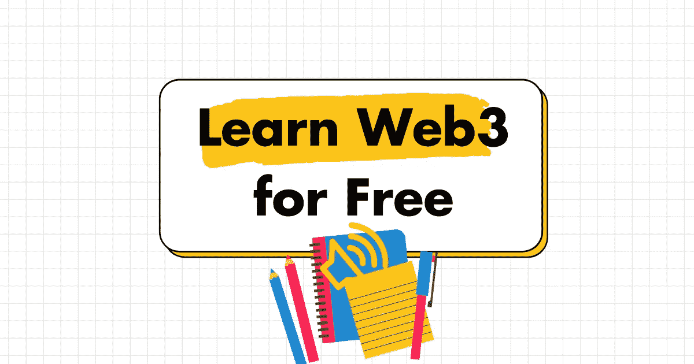

# 免费学习 Web3

> 原文：<https://medium.com/coinmonks/learn-web3-for-free-349af2e70237?source=collection_archive---------11----------------------->

播客是一种免费资源——以下是 20 种最好的资源

# NFT 现在是东道主

作者:[@ samhysell](https://twitter.com/samhysell)|[@ LuisANavia](https://twitter.com/LuisANavia)|[@ mattmedved](https://twitter.com/mattmedved)

焦点:NFT 如何重新定义创意经济，你如何成为其中一员

 [## nft now 播客:瑞茜·威瑟斯彭在苹果播客上谈论女性加入 Web3

### 多年来，瑞茜·威瑟斯彭一直作为好莱坞的领军人物之一出现在银幕上。玩过一个…

t.co](https://t.co/9P7bI1wqx6) 

# Pomp 播客主持人

作者: [@APompliano](https://twitter.com/APompliano)

聚焦:商界、金融界、比特币界最有趣的人脱颖而出一集:[兰迪·扎克伯格](https://medium.com/u/8bcda72c4104?source=post_page-----349af2e70237--------------------------------)

 [## Pomp 播客:#817 在苹果播客上教育大众关于兰迪·扎克伯格的 NFTs

### 兰迪·扎克伯格是企业家、投资者和慈善家。她最近在 NFT 世界孤注一掷…

t.co](https://t.co/pxuHbKcyUQ) 

# 可能没有主机

作者:[@ tz hong](https://twitter.com/TZhongg)|[@ alexisohanian](https://twitter.com/alexisohanian)

焦点:NFT 新闻、深度潜水和采访的一站式播客杰出剧集:[法罗克](https://medium.com/u/9b8f8d67d7ac?source=post_page-----349af2e70237--------------------------------)

 [## 大概没什么:Ep。8:法洛克在苹果播客上建立从 web2 到 web3 的社区

### 在《可能没什么》第八集里，TZ(@ tzhong)和亚历克西斯(@alexisohanian)与 Rug 的创始人法罗克(@法罗克)聊天…

t.co](https://t.co/d7BF6HoZ6s) 

# 兔子洞主机上的 DAOn

By: [@ddwchen](https://twitter.com/ddwchen)

焦点:人们了解 Web3 杰出剧集的首选播客: [@ljin18](https://twitter.com/ljin18)

 [## 《兔子洞上的道:S1·E5:共同建设所有制经济》(李进)苹果播客

### 在《兔子洞上的道》这一集里，我们将和李进对话，他是变异基金的联合创始人和普通合伙人

t.co](https://t.co/u9qPKUZwHl) 

# 它发生的地方主持人

作者: [@](https://twitter.com/SahilBloom) 萨希尔布卢姆| [格雷·伊森伯格](https://medium.com/u/9d17e1caa54?source=post_page-----349af2e70237--------------------------------)

焦点:帮助你确定今天的哪些趋势将塑造明天的机会

Web3 的无限潜力

 [## 发生在哪里:苹果播客上 Alexis Ohanian 的 Web3 的无限潜力

### Web3 已经出现，但它将改变世界工作方式的所有方式还没有被完全理解。在这一集里…

t.co](https://t.co/kfF9sShuuz) 

# 蒂姆·费里斯节目主持人

作者:[蒂姆·费里斯](https://medium.com/u/56d3bc91794f?source=post_page-----349af2e70237--------------------------------)

焦点:解构世界级的表演者，提炼出你可以使用的战术、工具和套路杰出剧集:[克里斯·狄克逊](https://medium.com/u/a8e3741de9e2?source=post_page-----349af2e70237--------------------------------)和[海军拉维康](https://medium.com/u/67f5049293c7?source=post_page-----349af2e70237--------------------------------)

 [## Chris Dixon 和 Naval ravi Kant——web 3 的奇迹，如何选择合适的山峰攀登，寻找…

### “最聪明的人在周末做的事情，是十年后其他人在工作日都会做的事情。”克里斯·狄克逊…

t.co](https://t.co/MM42T9pWVP) 

# 从区块链主机:

by[@ iamboredbecky](https://twitter.com/iamboredbecky)|[@ nftiginition](https://twitter.com/NFTignition)

焦点:什么是 NFT？你是如何买卖 NFT 的？安全吗？脱颖而出的插曲: [@Maliha_z_Art](https://twitter.com/Maliha_z_Art)

 [## 来自区块链:苹果播客上的 Maliha Abidi 的文化多样性和代表性

### 艺术是文化的延伸——数字艺术也不例外。我们认为 Web3 不仅仅是数字艺术的平台…

t.co](https://t.co/JtCqspXnew) 

# 硬币故事主持人

作者: [@natbrunell](https://twitter.com/natbrunell)

焦点:财务自由和独立与比特币脱颖而出插曲:[史蒂夫·艾勒](https://medium.com/u/b6ddcceea0b?source=post_page-----349af2e70237--------------------------------)

# 面向初学者的加密货币主机

作者: [@cryptocasey](https://twitter.com/cryptocasey)

焦点:为初学者简化加密货币、区块链和 web3

 [## 面向初学者的加密货币:使用 Crypto Casey:我的 32.5 万美元+ NFT 投资！(元宇宙深潜！)…

### 🤑iTrustCapital https://itrust.capital/caseyStart 加密交易今天免税！💙令牌税…

t.co](https://t.co/P6LIRaDFK5) 

# 未知的故事主持人

由 [@CharlieShrem](https://twitter.com/CharlieShrem)

焦点:深入探究一些 crypto 最有影响力的领导人的突出事件: [@matthewegould](https://twitter.com/matthewegould)

 [## 《不为人知的故事:物理身份的另一种选择》, Matthew Gould 在苹果播客上发表

### 我今天的嘉宾是马修·古尔德，不可阻挡域名的创始人兼首席执行官。不可阻挡的域名正在登上世界…

t.co](https://t.co/fsPhUd6nNx) 

# 在主机的另一边

作者: [@chaserchapman](https://twitter.com/chaserchapman)

焦点:密码、文化与人性杰出剧集: [@Sim_Pop](https://twitter.com/Sim_Pop)

 [## 另一边:13。新美乐股份公司流行音乐:为苹果播客上的人类繁荣而优化

### 新美乐股份公司·波普是《现状》杂志的社区战略家。新美乐股份公司谈测量价值，大自然能教给我们什么…

t.co](https://t.co/GwivcnPRTo) 

# [比特币基地](https://medium.com/u/b9034df3e57a?source=post_page-----349af2e70237--------------------------------):围绕街区主机

作者: [@katherineykwu](https://twitter.com/katherineykwu)

焦点:最简单的方法来保持对所有事情的了解

 [## 比特币基地:在街区周围:苹果播客上的多链世界

### 虽然进入加密很容易，但理解生态系统背后的技术、工具和协议需要…

t.co](https://t.co/Me7ueo8opk) 

# 斯潘塞和独唱主持人的新收入

作者: [@SDinwiddie_25](https://twitter.com/SDinwiddie_25)

焦点:成为新的“创造者经济”的一部分意味着什么突出的一集:加密如何加速创造者经济 w/ Naya，Jake Bain，厨师 Hoppie

 [## 斯潘塞和索罗的新投资:加密如何加速苹果播客的创作者经济

### 虽然每个影响者的领域都与其他人大不相同，但他们都有一个相似的目标:利用他们的社交…

t.co](https://t.co/149Rikwyyv) 

# 金钱重塑了主人

作者:[迈克尔·凯西](https://medium.com/u/8ace508694d5?source=post_page-----349af2e70237--------------------------------)

焦点:金融、人类文化和我们日益数字化的生活之间的联系

 [## CoinDesk 的《重新想象的金钱:隐私、安全、连接:我们能拥有一切吗？在苹果上…

### 展示 CoinDesk 的重新想象的金钱、Ep 隐私、安全性、连接性:我们能拥有一切吗？-2022 年 1 月 28 日

t.co](https://t.co/jU8ylR04Mm) 

# 道具和掉落主机

作者:[加里·维纳查克](https://medium.com/u/c4ec9163657c?source=post_page-----349af2e70237--------------------------------)

焦点:体育、投资和 web3 alpha 突出事件:米拉·库妮丝、NFL 在 web3 领域合并和建设

 [## Matt Kalish 和 GaryVee 的道具和空投:Ep17 -米拉·库妮丝，NFL 联合&在网上建设 3…

### 大集预警！这些家伙谈论 UFC，导致加里谈论他会怎么做，如果他进入战斗…

t.co](https://t.co/gt3Sdi39mM) 

# 超级战队道主持人

由[坦梅·巴特](https://medium.com/u/387b01bc0ddb?source=post_page-----349af2e70237--------------------------------)

焦点:探索印度 web3 生态系统杰出剧集: [@sumitgh85](https://twitter.com/sumitgh85)

# 证明主机

作者:[凯文·罗斯](https://medium.com/u/f9d429098ec7?source=post_page-----349af2e70237--------------------------------)

焦点:生成艺术场景，NFT 游戏/元宇宙，以及创始人为创作者和收藏家打造新工具杰出剧集:[@ IX _ shell](https://twitter.com/ix_shells)

 [## 证据:艺术家聚焦:苹果播客上 IX 外壳的加勒比故障艺术

### 突破男性主导的 NFT 艺术世界，九贝壳变得脆弱与凯文·罗斯和她的旅程从…

t.co](https://t.co/A5azvmXRLf) 

# 零知识主机

安娜·罗斯

焦点:去中心化和技术，开源社区突出插曲:[@ _ trente _](https://twitter.com/_trente_)|[@ MPtherealmvp](https://twitter.com/MPtherealmvp)|[@ _ Sam spike _](https://twitter.com/_samspike_)

 [## 零知识:第 205 集:用 JPG 苹果播客管理 JPEGs

### 这一周，安娜和塔伦与来自 JPG 的议员特伦特和萨姆谈论了 NFT 的连锁策展协议。他们走路…

t.co](https://t.co/V2X5OzivMn) 

# [无银行](https://medium.com/u/5ebd9777e392?source=post_page-----349af2e70237--------------------------------)主机

by[@ RyanSAdann](https://twitter.com/RyanSAdanns)s |[@ trusslesstate](https://twitter.com/TrustlessState)

重点:打造你的加密诀窍杰出剧集:[@ stable kwon](https://twitter.com/stablekwon)|[@ El 33 x4 or](https://twitter.com/el33th4xor)|[@ aeyakovenko](https://twitter.com/aeyakovenko)

 [## 无银行:寻找共同点|苹果播客上的索拉纳、雪崩、特拉

### ✨Finding 普通 Ground✨加密在 2021 年成长了很多！新的生态系统已经将新的私钥交到了 so…

t.co](https://t.co/PaXhq86Mvk) 

# 两只无聊的猿——NFT 播客主持人

作者: [@Zeneca_33](https://twitter.com/Zeneca_33) 和 [@JaimeMusing](https://twitter.com/JaimeMusings) s

重点:围绕 NFTs 进行教育、娱乐和创建社区突出插曲:猪在飞(亲民党的公牛回来了)

 [## 两只无聊的猿——NFT 播客:第 25 集——苹果上的猪在飞(亲民党的公牛回来了)…

### 在《两只无聊的猿》第 25 集，詹姆和罗伊讨论了 NFT 市场一直以来的牛市狂热。他们…

t.co](https://t.co/dEmZEBKqfl) 

有许多高质量的 web3 播客。

# 👇还有哪些 Web3 播客？

> 👋**在[媒体](/@pooriaarab)—[LinkedIn](https://www.instagram.com/pooria.arab/)—[Twitter](https://twitter.com/pooria_arab)—[insta gram](https://www.instagram.com/pooria.arab/)—[抖音](https://www.tiktok.com/@pooria.arab)**
> 
> 更多关于 Web3，Crypto，NFTs，DeFi 等的好东西…
> 
> 点击获取 NFT 发布的终极策略