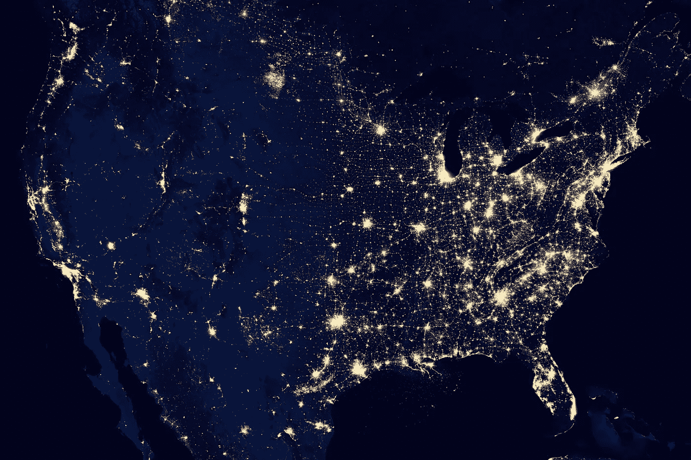

# 在 100 天内学会 Web3—# 1 什么是互联网，它与 web 3 有什么关系

> 原文：<https://medium.com/coinmonks/learn-web3-in-100-days-1-what-is-the-internet-and-how-relevant-to-web3-ada4bc8e16e5?source=collection_archive---------18----------------------->

Photo by [NASA](https://unsplash.com/@nasa?utm_source=unsplash&utm_medium=referral&utm_content=creditCopyText) on [Unsplash](https://unsplash.com/s/photos/internet?utm_source=unsplash&utm_medium=referral&utm_content=creditCopyText)

我推出这个新系列是为了帮助人们学习 Web3。Web3 并不是一个真正的新想法，而是一个建立在 Web2 之上的进步想法。你不可能通过忽略 Web2 来学习 Web3。网络上有很多炒作，但这真的只是炒作。真正的 Web3 离我们还有几十年。然而，这并不意味着我们会等待 Web3 的到来…