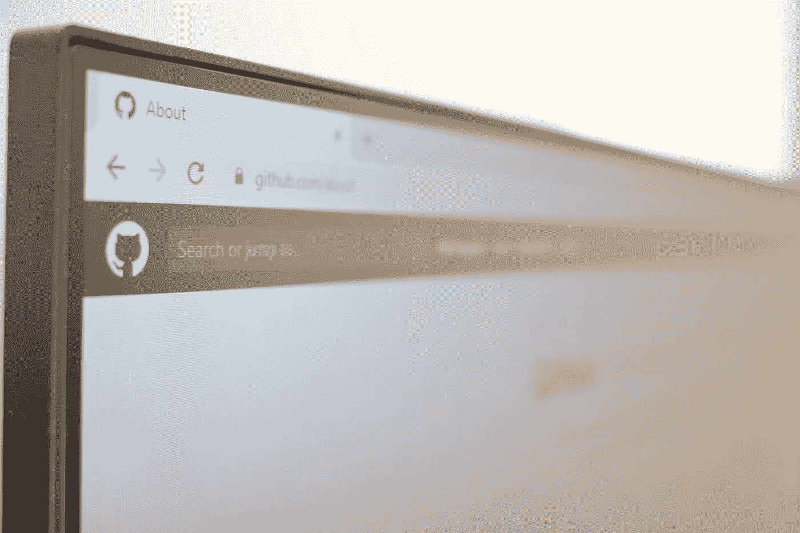

# 100 天学会 Web3 第 2 天:浏览器和服务器是什么

> 原文：<https://medium.com/coinmonks/learn-web3-in-100-days-day-2-what-are-the-browsers-and-servers-29ae56189aa9?source=collection_archive---------42----------------------->

Photo by [Richy Great](https://unsplash.com/@richygreat?utm_source=unsplash&utm_medium=referral&utm_content=creditCopyText) on [Unsplash](https://unsplash.com/s/photos/browser?utm_source=unsplash&utm_medium=referral&utm_content=creditCopyText)

你有没有想过浏览器实际上是如何工作的？如果你知道，那就跟着我的想法走。即使你没有，也来加入我的想法吧。

**TL；博士**

什么是浏览器

什么是服务器

超文本传送协议