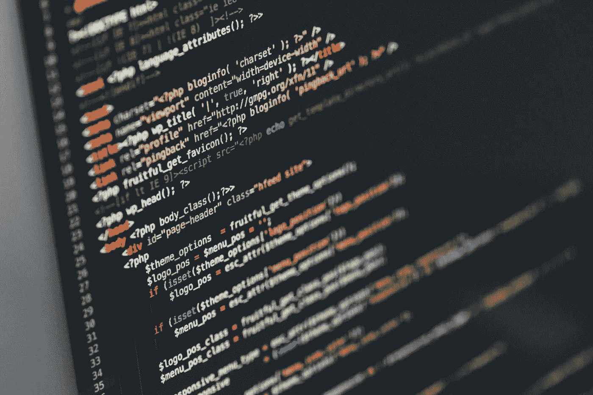

# 100 天学会 Web3 第 4 天:HTML、CSS 和 JS

> 原文：<https://medium.com/coinmonks/learn-web3-in-100-days-day-4-html-and-css-and-js-8aea8735a51f?source=collection_archive---------6----------------------->

Photo by [Ilya Pavlov](https://unsplash.com/@ilyapavlov?utm_source=unsplash&utm_medium=referral&utm_content=creditCopyText) on [Unsplash](https://unsplash.com/s/photos/website?utm_source=unsplash&utm_medium=referral&utm_content=creditCopyText)

让我们来探索 HTML、CSS 和 JS 是如何相互作用以显示在 web 上的。

**TL；博士**

什么是 HTML

什么是 CSS

HTML + CSS = Web 1.0

JS 是什么

HTML + CSS + JS = Web 2.0

什么是 Web3