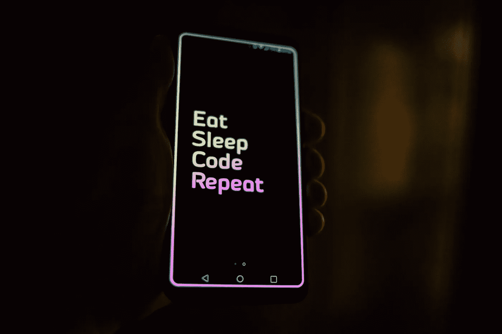

# 100 天学会 Web3 第 5 天:什么是编程

> 原文：<https://medium.com/coinmonks/learn-web3-in-100-days-day-5-what-is-programming-56262bf5ac8d?source=collection_archive---------19----------------------->

Photo by [Roman Synkevych 🇺🇦](https://unsplash.com/@synkevych?utm_source=unsplash&utm_medium=referral&utm_content=creditCopyText) on [Unsplash](https://unsplash.com/s/photos/programming?utm_source=unsplash&utm_medium=referral&utm_content=creditCopyText)

我们来探讨一下为什么需要通过自学来学习编程。

**TL；博士**