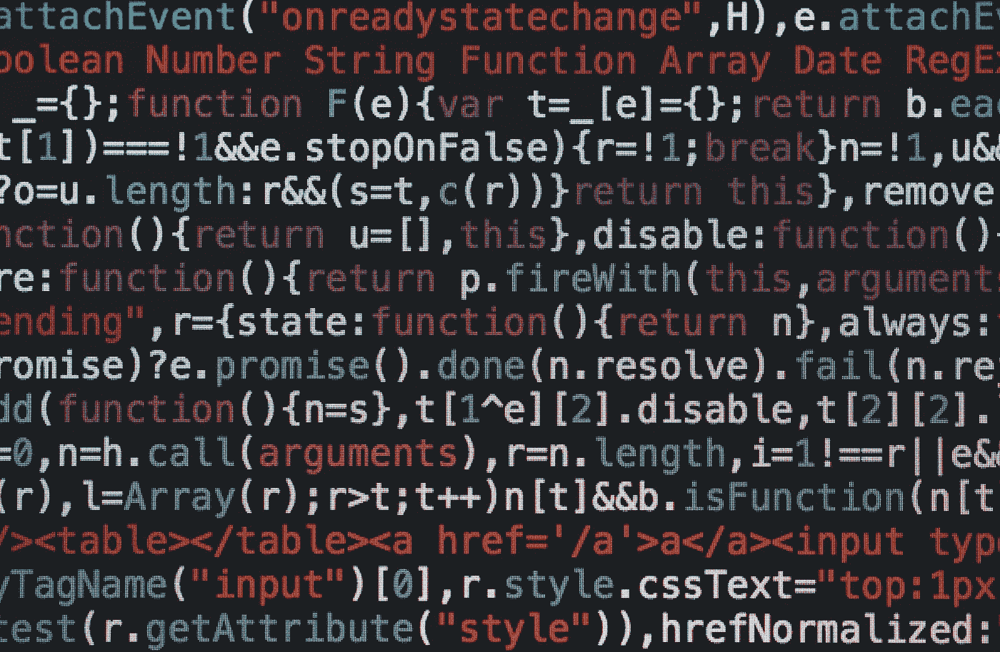

# 100 天学会 Web3 第 6 天:标记、元素、标签和超链接

> 原文：<https://medium.com/coinmonks/learn-web3-in-100-days-day-6-markup-elements-tags-and-hyperlinks-76453264e736?source=collection_archive---------19----------------------->

Photo by [Markus Spiske](https://unsplash.com/@markusspiske?utm_source=unsplash&utm_medium=referral&utm_content=creditCopyText) on [Unsplash](https://unsplash.com/s/photos/code?utm_source=unsplash&utm_medium=referral&utm_content=creditCopyText)

让我们更深入地探索 HTML。

**TL；博士**