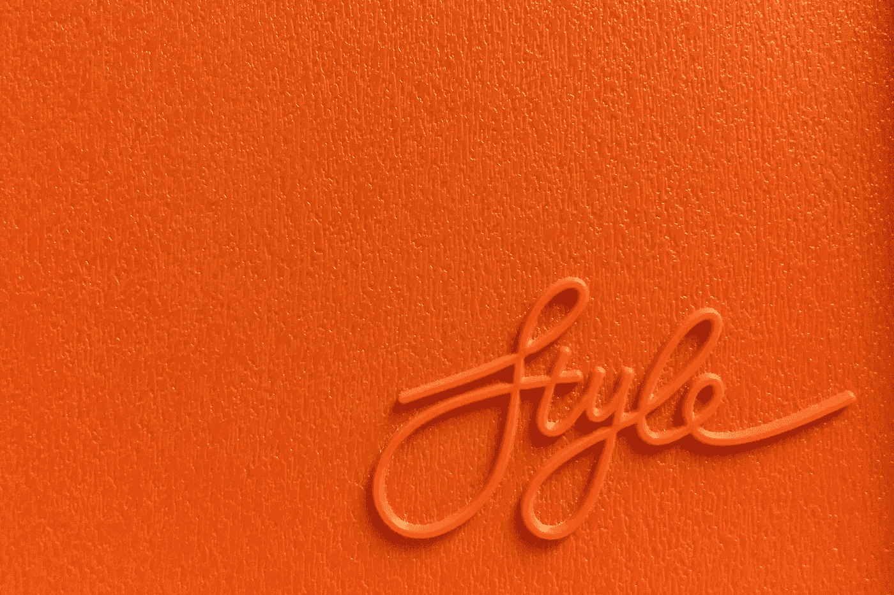

# 100 天学会 Web3 第 7 天:设计您的网站

> 原文：<https://medium.com/coinmonks/learn-web3-in-100-days-day-7-style-your-web-f3b910770aa5?source=collection_archive---------35----------------------->

Photo by [Marcus Ganahl](https://unsplash.com/@marcus_ganahl?utm_source=unsplash&utm_medium=referral&utm_content=creditCopyText) on [Unsplash](https://unsplash.com/s/photos/style?utm_source=unsplash&utm_medium=referral&utm_content=creditCopyText)

让我们更深入地探索 CSS。

**目录**

设计您的网站

关注点分离

区块链中的层

HTML 到 CSS 的链接

CSS 动画

最后