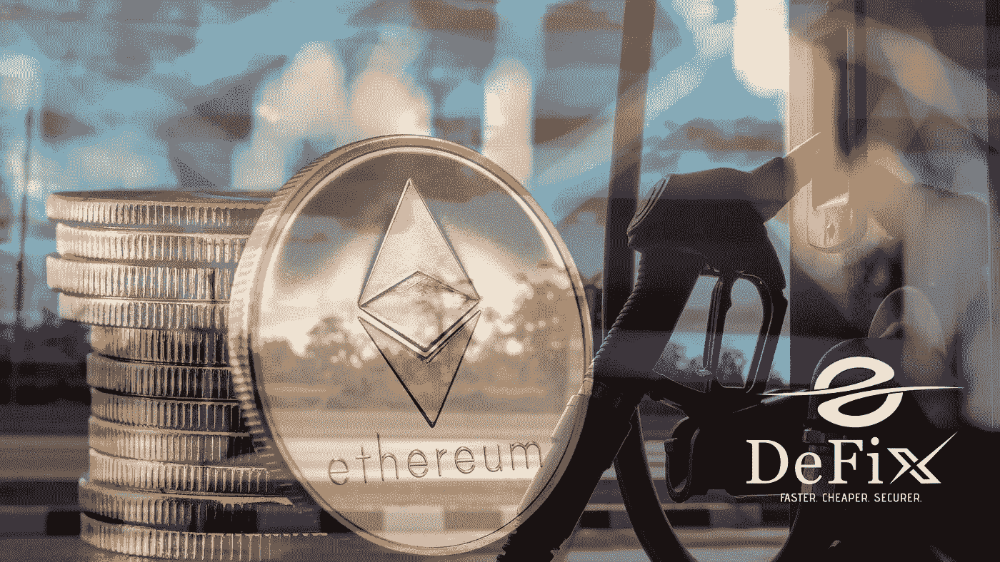

# 了解以太坊燃气费上涨的原因

> 原文：<https://medium.com/coinmonks/learn-why-ethereum-gas-fees-are-accelerating-1f1132050e42?source=collection_archive---------35----------------------->

术语“气体”是指在以太坊区块链上有效完成任何操作所必须支付的成本。矿工提供接受支付和保持系统运行所需的计算能力，并赚取部分费用；以太坊组织不分摊费用。

每当你生成一个 NFT、改变底价、提供一件待售商品或在区块链发起任何其他交易时，你口袋里的 ETH 量都将被要求支付汽油费。

当以太坊网络超负荷时，天然气可能会贵得令人望而却步；然而，开发商一直在努力尽可能降低天然气价格。当谈到汽油的成本时，有两个因素起作用:你希望多快完成支付，以及交易时系统有多拥挤。

## 但是为什么会这么高呢？

当以太坊区块链见证了大量的交易时，天然气的成本可能会变得高得惊人。上传到以太网的每个新块中包含的事务数量受到每个块中可用空间量的限制。由于供需关系，矿商被迫接受天然气价格上涨的交易，以增加利润。如果天然气成本很高，这并不意味着以太坊区块链是不可操作的；相反，它是网络配置方式的结果。

你总是可以选择接受高昂的油费或者拒绝这样做。如果你的钱包邀请你支付汽油，你将有三种选择，以你选择的价格和速度进行交易。支付最便宜的汽油价格可能会导致你的交易花费最长的时间来完成，甚至可能被放弃。

如果你想更快地完成付款，你可以选择支付额外的汽油价格来加快付款过程。在您的钱包中输入交易后，选择“加速”选项加快交易速度。您将能够以更高的费用重新提交相同的交易，以便更快地完成交易。

## **未来？**

根据以太坊(密码:ETH)网络的发明者 Vitalik Buterin 的说法，网络正处于一场深刻的技术革命的边缘。

一年后，区块链以太坊将被改造成一个利益相关证明(PoS)网络。它将允许投资者通过用他们的令牌验证区块链交易(这一过程被称为赌注)来赚取利息，以闪电般的速度设计和执行内部当事人合同(智能合同)，并在利用区块链时消耗更少的能源。

随着计划中的以太坊 2.0 网络更新，当前缓慢且不完整的系统将从根本上得到改善。

然而，签订这些智能合同所需成本下降的可能性——在加密货币世界中被称为“汽油费”——使得以太坊目前似乎是一个如此巨大的投资机会。我们将讨论是什么让它成为这样一个游戏规则改变者，以及为什么它让以太坊成为目前一个极好的投资，等等。

## **以太坊 2.0**

因为以太坊 2.0 的推出将把这些气价削减到接近于零的水平，未来用户利用 DeFi 服务将更加简单。为此，Buterin 希望将 ERC 20 加密货币网络发展到每秒可执行超过 10 万笔交易的水平。

> 加入 Coinmonks [电报频道](https://t.me/coincodecap)和 [Youtube 频道](https://www.youtube.com/c/coinmonks/videos)了解加密交易和投资

# 另外，阅读

*   [如何购买 Monero](https://coincodecap.com/buy-monero) | [IDEX 评论](https://coincodecap.com/idex-review) | [BitKan 交易机器人](https://coincodecap.com/bitkan-trading-bot)
*   [CoinDCX 评论](/coinmonks/coindcx-review-8444db3621a2) | [加密保证金交易交易所](https://coincodecap.com/crypto-margin-trading-exchanges)
*   [红狗赌场评论](https://coincodecap.com/red-dog-casino-review) | [Swyftx 评论](https://coincodecap.com/swyftx-review) | [CoinGate 评论](https://coincodecap.com/coingate-review)
*   [Bookmap 点评](https://coincodecap.com/bookmap-review-2021-best-trading-software) | [美国 5 大最佳加密交易所](https://coincodecap.com/crypto-exchange-usa)
*   [如何在 FTX 交易所交易期货](https://coincodecap.com/ftx-futures-trading) | [OKEx vs 币安](https://coincodecap.com/okex-vs-binance)
*   [CoinLoan 评论](https://coincodecap.com/coinloan-review) | [YouHodler 评论](/coinmonks/youhodler-4-easy-ways-to-make-money-98969b9689f2) | [BlockFi 评论](https://coincodecap.com/blockfi-review)