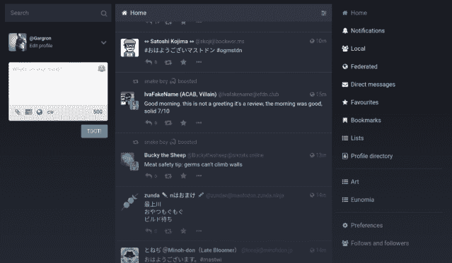
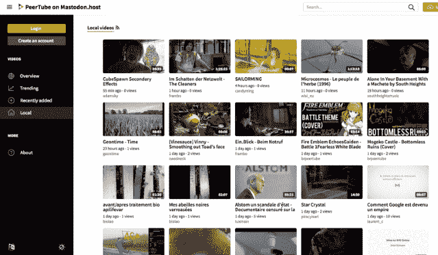
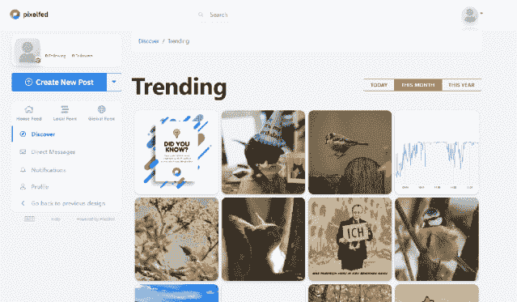
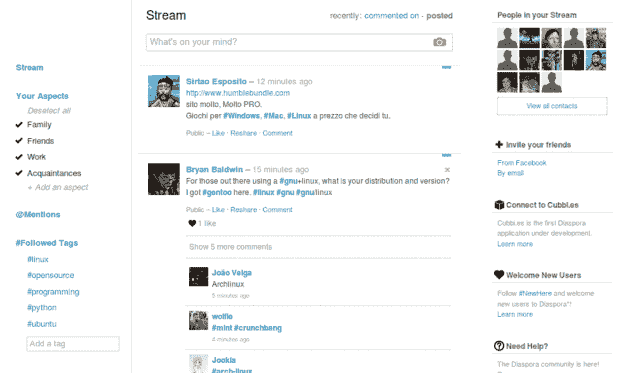
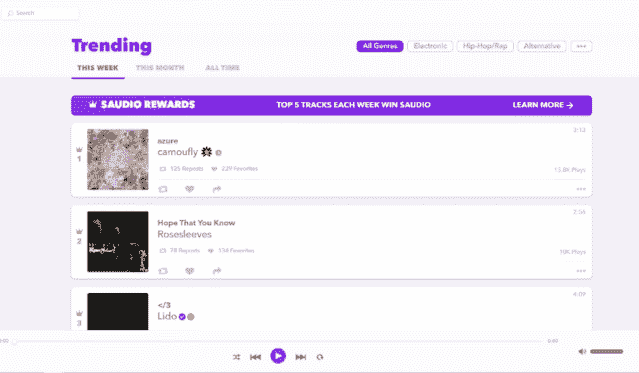

# 离开推特？试试这 5 个分散的社交媒体平台

> 原文：<https://medium.com/coinmonks/leaving-twitter-try-these-5-decentralised-social-media-platforms-instead-ea221f20ce2a?source=collection_archive---------11----------------------->

去中心化的社交媒体平台正迅速成为脸书和推特等大型平台的可行替代品。这里有一些你可以跳上的平台。

世界首富之一，[埃隆·马斯克最近以 440 亿美元(610 亿新元)的价格收购了](https://techcrunch.com/2022/04/25/twitter-accepts-elon-musks-43b-acquisition-offer/)社交媒体平台 Twitter。以真正的马斯克风格，他通过在互联网上与公司员工进行[激烈的言辞，开始了他对公司的收购。](https://www.reuters.com/technology/twitter-ceo-faces-employee-anger-over-musk-attacks-company-wide-meeting-2022-04-29/)

更重要的是，当地球上最富有的人之一可以不花太多心思就买下一个使用率最高的社交媒体平台时，会有什么潜在后果？脸书和 Instagram 等集中式社交媒体平台因收集大量用户数据而臭名昭著。如果你将这一点与埃隆拥有的几乎无限的资源结合起来，当这种权力掌握在少数人手中时，这对社交媒体用户来说不是好兆头。

也就是说，在这个数字时代，社交媒体对于与他人交流至关重要。作为用户你能做什么？这就是去中心化社交媒体平台的用武之地。

# 什么是去中心化的社交媒体平台？

去中心化的社交媒体本质上是建立在区块链上的平台。与区块链的工作方式类似，它们以分散的方式存储信息，没有任何中央数据存储。

为什么选择这些平台而不是传统的社交媒体平台？拥有你的数据是一个很好的理由。与传统平台不同的是，由于它们的点对点性质和没有第三方，用户可以控制谁查看或访问他们的数据。此外，数据是密码加密，这提高了个人隐私信息的安全性。

也就是说，你可以利用哪些去中心化的社交平台？

# [乳齿象——推特的替代品](https://joinmastodon.org/)

如果你正在离开 Twitter，但又离不开这种一口大小的文本格式，那么乳齿象应该是你去中心化社交媒体平台的第一站。这个免费的开源平台允许你像在 Twitter 上一样发布视频、图片、消息或更新你的个人资料。

由于其分散性，用户不会像在 Twitter 上那样在一个网站上创建个人资料。新的个人资料或社区被称为“实例”，它们可以用自己的规则设置自己的社区。然后，用户可以跳到不同的实例上，像一个标准的社交团体一样与它们互动。

我们喜欢这个社交媒体平台的是它自己的反滥用工具，即使没有集中的权威也能保护你自己，它的可见性设置让你可以控制哪些帖子可以或不可以被看到。

# [peer tube——Youtube 的替代品](https://joinpeertube.org/)

虽然 Youtube 是一种用优秀视频内容打发时间的有趣方式，但该平台已经看到了内容创作者的抱怨，这些内容创作者被算法击倒，或者用户被随机取消订阅他们最喜欢的创作者。

Cue PeerTube 是流行视频网站的一个分散式替代方案。由 Framasoft 开发的这个免费平台旨在将内容控制权放回创作者手中。与 Mastodon 类似，用户可以创建一个名为 Instance 的 PeerTube 服务器来托管他们自己创建的内容。

等等！如果 PeerTube 是去中心化的，那是不是意味着加载一个视频需要更长的时间？不尽然，该平台使用点对点协议来广播视频。这意味着，当大量用户同时观看视频时，处理负载会在用户之间分担，从而优化视频负载。

# [pixel feed——insta gram 替代](https://pixelfed.org/)

与 Instagram 类似，PixelFed 允许你在 feed 上与其他人分享图片。这个开源平台允许你创建一个账户，让你在注册后几分钟内就可以开始上传图片。

我自己创建了一个帐户，我对该平台的易用性和出色的用户界面感到惊讶。虽然 PixelFed 还没有手机应用程序，但如果你想通过手机上传图片，在线浏览器的网络界面也很好。Instagram 用户，你肯定需要去看看这个平台。

# [散居者——脸书另类选择](https://diasporafoundation.org/)

脸书。你可能喜欢它，也可能讨厌它，但无疑是社交媒体平台启动了我们今天所知道和喜欢的过多的社交媒体平台(抱歉，MySpace，但这是事实)。虽然它在今天的年轻用户中没有那么受欢迎，但脸书无疑会在这里呆很长一段时间。

平台有替代品吗？是的，那就是 Diaspora，一个非盈利的分布式社交网络。写为 diaspora*加一个星号，也将用户联系在一起，同时强调去中心化、自由和隐私。

用户界面不是脸书的翻版，但试用 Diaspora 的用户会对它的功能感到如鱼得水。您可以查看中提到您的帖子，关注与您的兴趣相关的标签，或者轻松设置帖子。

就像其他分散的社交媒体平台一样，用户可以创建自己的实例或 Diaspora 称之为“pod ”,或者加入其他人托管的现有 pod。这些充当支撑整个平台的网络节点。关于其安全性，用户还可以在平台上报告恶性行为，以确保其他用户的安全。

脸书的替代品？是的，请。随着数据隐私成为一个主要问题，Diaspora 被证明是两者之间的更好选择。

# [Audius — Spotify 替代方案](https://audius.co/trending)

如果你正在寻找一个高保真播放列表或浏览一首新歌，跳过 Spotify 应用程序，尝试前往 Audius。分散式音乐流媒体由区块链提供支持，该平台还带有社交媒体功能。

Audius 作为主流音乐平台的解决方案，削弱了音乐创作者的作用，旨在通过让音乐人决定如何在与粉丝直接联系的同时将内容货币化，将控制权还给音乐人。

Audius 远远不是一个三流的音乐社交媒体平台，它已经看到了许多大牌球员，如史奇雷克斯、威泽、deadmau5、Diplo 和 Odesza 跃上平台。最精彩的部分？用户可以免费使用该平台，而不必在 Audius 上接触艺术家之前支付额外费用。

Audius 会取代 Spotify 吗？随着它的迅速崛起，看起来的确如此。

探索新的社交媒体平台来发布或分享内容总是一种令人惊叹的体验。但随着 Web3 和数据隐私问题的兴起，去中心化社交媒体的未来可能会比你想象的来得更快。

> 加入 Coinmonks [电报频道](https://t.me/coincodecap)和 [Youtube 频道](https://www.youtube.com/c/coinmonks/videos)了解加密交易和投资

# 另外，阅读

*   [最佳加密分析或链上数据](https://coincodecap.com/blockchain-analytics) | [Bexplus 评论](https://coincodecap.com/bexplus-review)
*   [NFT 十大市场造币集锦](https://coincodecap.com/nft-marketplaces)
*   [AscendEx Staking](https://coincodecap.com/ascendex-staking)|[Bot Ocean Review](https://coincodecap.com/bot-ocean-review)|[最佳比特币钱包](https://coincodecap.com/bitcoin-wallets-india)
*   [Bitget 回顾](https://coincodecap.com/bitget-review)|[Gemini vs block fi](https://coincodecap.com/gemini-vs-blockfi)|[OKEx 期货交易](https://coincodecap.com/okex-futures-trading)
*   [美国最佳加密交易机器人](https://coincodecap.com/crypto-trading-bots-in-the-us) | [不断回顾](https://coincodecap.com/changelly-review)
*   [在印度利用加密套利赚取被动收入](https://coincodecap.com/crypto-arbitrage-in-india)