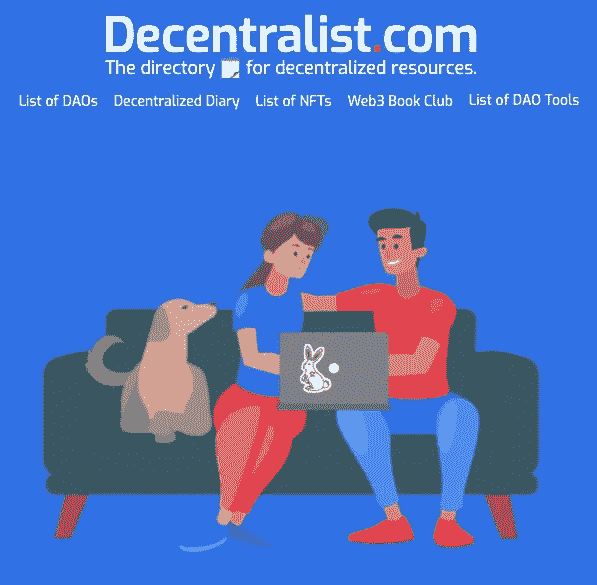

# 法律游戏规则改变者…卡利岛

> 原文：<https://medium.com/coinmonks/legal-game-changer-kali-dao-97fbf48376c5?source=collection_archive---------6----------------------->

Photo by [David Briggs](https://unsplash.com/@bravediggs?utm_source=medium&utm_medium=referral) on [Unsplash](https://unsplash.com?utm_source=medium&utm_medium=referral)

现在有一个新的 DAO 应用程序，它是一个合法的游戏规则改变者。它的名字… **卡利道**，根据它的 Twitter 个人资料页面，卡利道的目标是“在几秒钟内推出具有法律利益的道”

首先，一些背景。在我的第一个故事中，“*一个寻找分散自治组织(DAO)的简单创业公司”，*我说我想创办一个 DAO，但是:

> “光是制定章程的法律费用就相当可观。因此，在这一点上，我停下来，认为它必须“自举”。“我必须先想出另一个帮助社区的主意。通过这样做，我将发展一个网络，并能够利用“退出社区”策略(或启动 DAO)离开该项目。
> 
> [https://medium . com/@ list of daos/a-simple-startup-to-search-for-decentralized-autonomous-organizations-daos-c 638472 ebb 9 a](/@listofdaos/a-simple-startup-to-search-for-decentralized-autonomous-organizations-daos-c638472ebb9a)

Dao 的名单就是这么来的。创建这个项目是为了帮助形成一个网络，并帮助解决我在开始我的兔子洞之旅时看到的一个问题(没有简单的网站可以搜索)。(道双关语爱死他们了！)

在其他 DAO(lex DAO)的支持下，Kali DAO 的创建者们带着他们的新应用程序来了。他们向 DAO 世界传递了一个信息，即他们正在简化 DAO 的法律结构，这可能会解决许多创始人(像我一样)面临的一个重大障碍。

他们的产品提供“…端到端的令牌化、投票和法律支持，如 LLC 组建和协议起草软件”，使 DAO 初创公司很容易形成一种结构，可以*帮助成员限制他们的责任。(*我不是律师，这不是财务或法律建议，咨询你自己的律师，见下面的免责声明)。

他们刚刚开始！到目前为止，有四种类型的协议(怀俄明道有限责任公司、特拉华道有限责任公司、非公司非营利协会和投资俱乐部)。此外，Kali DAO 提供了易于使用的模板，或者允许用户根据自己的喜好定制他们的 DAO。

随着镇上新警长的上任，事情会有所改变，我期待着看到项目的进展，以及未来会有哪些其他的法律结构(也许是合作？).

最后，巴兹说，“飞向无限甚至更远！”

decentralized 是分散资源的目录🗒。包括[刀客列表](https://www.decentra-list.com/list-of-daos)、[刀工列表](https://www.decentra-list.com/list-of-dao-tools)、[非刀客列表](https://www.decentra-list.com/list-of-nfts)、 [Web3 书友](https://www.decentra-list.com/web3-book-club)、[分散日记](https://www.decentra-list.com/decentralized-diary)等资源。请访问我们在 www.Decentralist.com 的网站或关注我们的推特。

*内容仅供参考。本文中的任何内容都不构成对 DAO 的投资建议、恳求、推荐、认可或提供证券、令牌、NFT 或应用。这不是投资或法律咨询。请自行研究。*

参考资料:[https://docs.kalidao.xyz/faq/#what-is-kali](https://docs.kalidao.xyz/faq/#what-is-kali)
[https://twitter.com/_KaliDAO](https://twitter.com/_KaliDAO)

> 交易新手？试试[加密交易机器人](/coinmonks/crypto-trading-bot-c2ffce8acb2a)或[复制交易](/coinmonks/top-10-crypto-copy-trading-platforms-for-beginners-d0c37c7d698c)