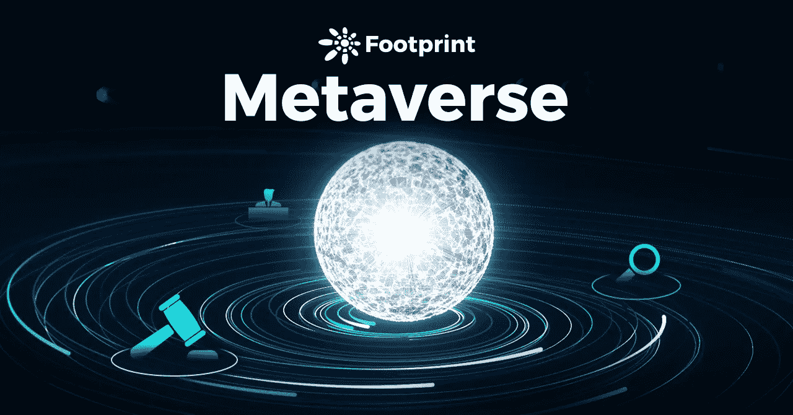
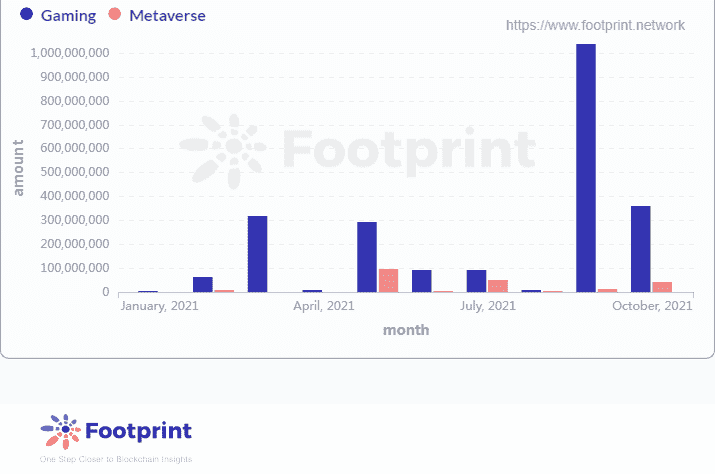

# 关于元宇宙的法律思考(一):知识产权|足迹分析

> 原文：<https://medium.com/coinmonks/legal-thoughts-on-metaverse-i-intellectual-property-rights-footprint-analytics-e3d9e980a566?source=collection_archive---------14----------------------->

说明:知识产权纠纷是元宇宙项目中可能出现的问题之一。

2022 年 1 月 Helen@footprint.network

数据来源:足迹分析[筹款仪表板](https://www.footprint.network/guest/question/273488d7-ec3a-48fc-87bd-f0a53c5b92d1/gaming-metaverse-financing-amount#secret=D3BB91B[%E2%80%A6]00B3671459D78BD)

**关于元宇宙**

去年，[元宇宙](https://footprint.cool/LuSs)已经成为[区块链](https://www.footprint.network/guest/dashboard/blockchain-new-dapps-fp-2c69d927-1968-4fba-9b9a-b5bd6dd41fa6?channel=u-DBc983#secret=0F6B7883491EA58D92C6107D4CEFD04A)炒作的一个爆发点，在元宇宙赛道上一个著名项目 Cryptovoxels 的支持下，脸书将其更名为 Meta 达到高潮。

元宇宙是元+宇宙的缩写。它最早出现在美国著名科幻作家尼尔·斯蒂芬森 1992 年的小说《雪灾》中。

目前公认最接近元宇宙的是 2018 年上映、斯皮尔伯格执导的《就绪玩家一》中的游戏——绿洲。

重大新闻包括 Axie infinity、Roblox 和其他几十个较小但仍然重要的元宇宙项目的增长。例如

*   9 月 30 日:Bloktopia 完成 420 万美元的私人融资
*   10 月 9 日:区块链游戏孕育了 120 万美元的种子轮
*   10 月 13 日:GameFi 元宇宙项目 DeHorizon 完成 850 万美元融资
*   10 月 15 日:韩国科技巨头 Naver 向元宇宙音频技术公司 Gaudio Lab 投资 952 万美元

[*Footprint Analytics: Monthly Fundraising of GameFi & Metaverse*](https://www.footprint.network/guest/question/273488d7-ec3a-48fc-87bd-f0a53c5b92d1/gaming-metaverse-financing-amount#secret=D3BB91B[%E2%80%A6]00B3671459D78BD)

虽然美国的大部分新闻聚焦于美国和欧盟公司，但世界各地的公司开始在该领域迅速发展，这表明了一种全球趋势。

*   9 月 3 日:腾讯申请注册“汪哲·元宇宙”和“田原·元宇宙”等商标
*   9 月 30 日 **:** 字节跳动 9 月底推出元宇宙游戏*重启世界*，与腾讯的*乐百氏*竞争
*   11 月 2 日:百度申请注册“meta app”商标，其国际分类涉及网站服务和“科学仪器”

虽然元宇宙的目的是在区块链建立一个单独的现实，但现实世界的传统法律仍然需要适用，例如:

*   知识产权纠纷
*   数据保护和隐私
*   刑事犯罪

在本文中，我们将重点讨论知识产权纠纷。

# 知识产权登记

区块链项目不同于传统实体的一个方面是，许多项目是受治理的 Dao，即分散的自治组织。作为一个没有中央集权和自下而上领导的实体，DAOs 在未来将不可避免地制造一些有趣的法律难题。

怀俄明州已经承认中央集权自治组织的法律地位，并承认有限责任公司可以转变为一个道组织。因此，道组织可以作为知识产权的申请人，直接合法拥有知识产权。

# 知识产权侵权

版权侵权案件占所有涉及游戏知识产权案件的 85%左右，也很可能出现在《元宇宙世界》项目中。

常见的版权侵权案件分为以下几类:

*   **破解和复制源代码**

这是指个人或实体侵犯了游戏的计算机软件版权。例如，如果员工设法复制游戏的源代码，并导致类似的侵权游戏或产品被制造出来。

10 月 30 日，CoinDesk 发表了一篇题为“脸书通过其荒谬的更名再次窃取加密思想”的文章作者认为，脸书的元宇宙与区块链工业提出的最初的元宇宙愿景几乎没有任何关系。作者认为元宇宙应该是开放的、透明的、没有限制的，而脸书是封闭的、不透明的、有限制的。

Oculus 的首席技术官也公开表示，Meta 可能不会对加密世界完全开放。

诸如此类的封闭代码项目为破解和复制源代码带来了侵权的可能性。

*   **未经授权发布游戏**

当一个网站发布一个游戏，通常是一个迷你游戏，未经创作者许可，侵犯了后者的权利。网站运营者经常为自己辩护是平台服务商。在这种情况下，法院一般会调查谁上传了游戏，以确定游戏网站是否是直接侵权人，并检查其是否履行了合理的注意义务。

这是一种可能的情况:

毫无疑问，将会有许多类似于 Roblox 的平台允许玩家发布迷你游戏供所有人玩。有一天，一个人上传了一个扑克迷你游戏。但是，迷你游戏不是这个人创作的，也没有得到游戏原创作者的认可。

*   **游戏中的侵权元素**

这是指在游戏中复制受版权保护的角色、图片或其他元素。在游戏世界中，当创作者使用名人的肖像时，这种情况有时会发生。

当人们开始复制名人和公众人物的 NFT 时，会发生什么？据推测，元宇宙平台的开发商将不得不进行尽职调查，以避免打官司。

*   **游戏侵犯作品改编权**

当游戏是对小说、电影或电视节目中的人物或情节的改编时，它侵犯了原作者的改编权。在这种情况下，原告通常会添加不正当竞争的起诉理由。

一个例子是围绕*哈利波特世界设计的元宇宙游戏平台。*这显然侵犯了适应权。

*   **游戏公司之间的互动诉讼**

此类案件主要涉及游戏公司之间的抄袭纠纷，比如 IP+互换引发的纠纷。

在开源代码的情况下，不同平台之间可能会互相模仿和借鉴，可能会引起平台之间的纠纷。所以这种情况会影响一些商业平台开源代码的决心。

# 结论

虽然元宇宙项目与博彩业有很大的交叉，但元宇宙的新元素，如分散的组织结构，无疑需要对判例法和先例进行新的解释。

作者希望有一天元宇宙也能有一个由目前的法院系统管理和运作的法院，专门审理元宇宙的案件。虽然这似乎有些牵强，但几十年前没有人会想到今天会有专门的互联网法院，可以在需要时在线裁决。