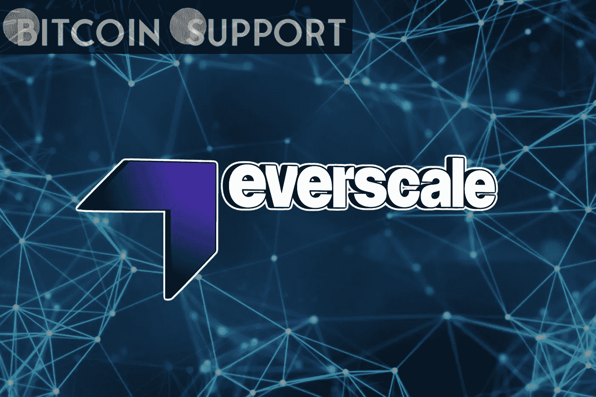
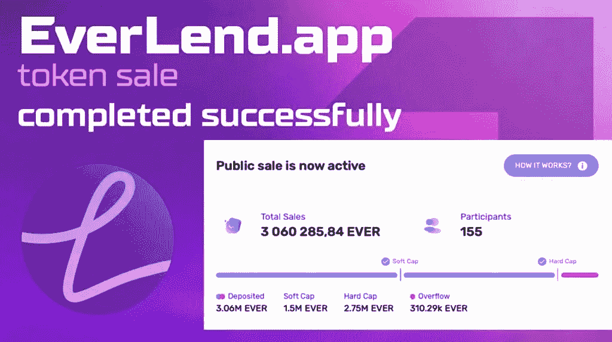
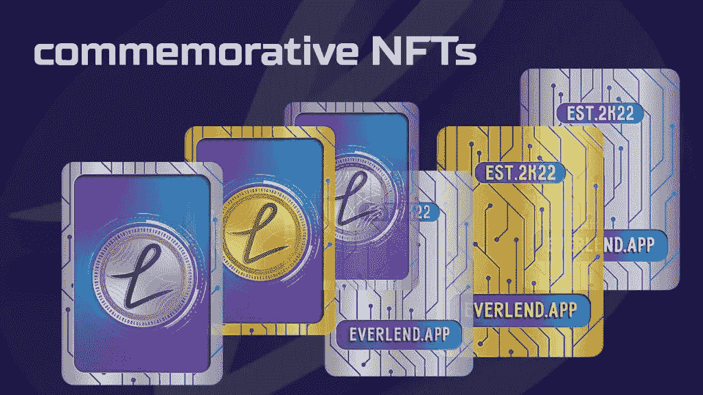

# EverLend 引入了出借令牌，这是 Everscale 网络上的第一个出借协议

> 原文：<https://medium.com/coinmonks/lend-token-launched-by-everlend-first-lending-protocol-on-everscale-network-3c32b69d5e0c?source=collection_archive---------61----------------------->

**Visit our website:-** [**https://bitcoinsupports.com/**](https://bitcoinsupports.com/)

EverLend.app 是一个 Everscale 支持的安全贷款协议。2022 年 3 月 18 日，该平台及其自带的效用令牌成功上线。通过托管资金池，利率由 Everscale 的资产供求算法决定，该平台实现了 DeFi 贷款。EverLend.app 是一种协议，用户可以在其中扮演贷款人、借款人或两者的角色，并在协议内部进行交互，以赚取或支付可调整的利率。其核心是一个安全的贷款平台，对使用的资金收取利息。SVOI.dev 团队已经在这个平台上工作了六个多月。

EverLend 的概念灵感来自市场领先的复合程序。该项目的目标之一是为最终用户提供一个直观简单的借贷平台。同时，开发团队与顾问团队合作，更新并最终确定原始模型的一些参数(例如，系统安全协议)。此外，实施已完全定制的 Everscale 区块链的独特特征。需要强调的是，该项目正在通过 Everscale 竞赛接受严格的验证程序。虽然借贷平台的合同在正式网络认证之前已经公布，但这些合同仅限于逐渐增加的金额。

随着平台的正式亮相，项目创建者还通过 EverStart 启动池为平台发行了一个实用工具令牌 LEND。LEND 将使用户能够参与平台的治理，并将奖励流动性提供者和贷款者。

社群将决定所有监管问题以及一般发展决策。EverLend.app 将是一个全功能的分散自治组织(DAO)，其中 LEND tokens 的持有者(实际上是项目的所有者)将能够提交平台提案供社区投票，以及对其他人提出的问题进行投票，如建立某些指标。

每个成员都会对项目的增长有一定程度的控制。对平台无利可图的东西对整个社区都无利可图，包括平台使用非市场指标导致的用户流失。其他几个基于 Everscale 的平台，如 Octus Bridge 平台，以前也采用了类似的方法。

**Visit our website:-** [**https://bitcoinsupports.com/**](https://bitcoinsupports.com/)

**借出代币代币销售于 2022 年 3 月 31 日成功结束。**

已超过 250 万元人民币的硬上限，累计存入 3060285.84 元人民币。

LEND token 以 EverStart 格式推出，这意味着通过在 token pool 中存款，消费者并没有立即获得指定数量的 token，而是将其 EVER 添加到公共池中。当达到硬上限时，借出令牌的最大可能值是 5。代币销售成功结束后，所有代币将根据用户的池份额发放给用户，超过硬上限的任何现金将按照投放金额的比例返还给用户。代币销售是 Everstart.io 上的首次活动，Everscale 的全新代币发布平台。

EverLend 在网站上创建了一个特殊页面，其中包含有关代币发行流程、锁定期、授权和代币持有者初始机会的所有必要信息。

**Visit our website:-** [**https://bitcoinsupports.com/**](https://bitcoinsupports.com/)

EverLend 的设计者为每个参与者设计了纪念性的 NFT。

已经开发了三种类型的 NFT:

—白金—将授予前十名注册者。

—金牌—11–60 名竞争对手

—61–155—银牌(其余全部)。EverLend.app 是目前该网络唯一的借贷协议。据该项目的设计者称，该协议旨在成为生态系统中最关键、应用最广泛的倡议之一。

**访问我们的网站:-**[**https://bitcoinsupports.com/**](https://bitcoinsupports.com/)

**免责声明:以上为作者观点，不应视为投资建议。读者应该自己做研究。**

> *加入 Coinmonks* [*电报频道*](https://t.me/coincodecap) *和* [*Youtube 频道*](https://www.youtube.com/c/coinmonks/videos) *了解加密交易和投资*

# 另外，阅读

*   [如何在 FTX 交易所交易期货](https://coincodecap.com/ftx-futures-trading) | [OKEx vs 币安](https://coincodecap.com/okex-vs-binance)
*   [CoinLoan 评论](https://coincodecap.com/coinloan-review) | [YouHodler 评论](/coinmonks/youhodler-4-easy-ways-to-make-money-98969b9689f2) | [BlockFi 评论](https://coincodecap.com/blockfi-review)
*   [XT.COM 评论](https://coincodecap.com/profittradingapp-for-binance) | [币安评论](https://coincodecap.com/xt-com-review)
*   [SmithBot 评论](https://coincodecap.com/smithbot-review) | [4 款最佳免费开源交易机器人](https://coincodecap.com/free-open-source-trading-bots)
*   [比特币基地僵尸工具](/coinmonks/coinbase-bots-ac6359e897f3) | [AscendEX 审查](/coinmonks/ascendex-review-53e829cf75fa) | [OKEx 交易僵尸工具](/coinmonks/okex-trading-bots-234920f61e60)