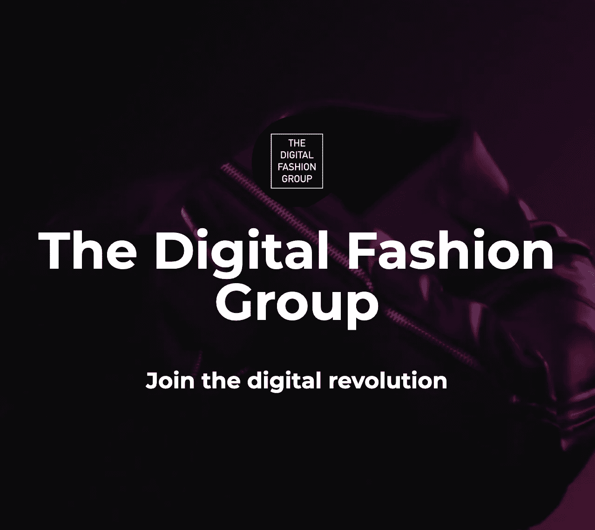

# 莱斯利·霍尔登讨论了数字时尚、元宇宙和区块链如何重塑时尚产业

> 原文：<https://medium.com/coinmonks/leslie-holden-discusses-the-metaverse-digital-fashion-blockchain-reshaping-the-fashion-industry-d9e4b193b394?source=collection_archive---------22----------------------->

Leslie Holden 是数字时尚集团的创始人之一，也是一位有远见卓识的人，这是一个由欧洲人领导的时尚学术界和产业界的合作组织。自从从伦敦皇家艺术学院毕业后，Leslie 已经在时尚界工作了很多年。他曾是男装设计师、设计总监和企业家，供职于登喜路、Stefanel、Byblos、博柏利和 Liberty 等公司。Leslie 在行业和国际高等教育领域拥有超过 25 年的经验，是阿姆斯特丹时装学院(AMFI)的时装与设计主管。

Leslie 简直棒极了，看完这一集 NewForum 你就明白为什么了。我们与 Leslie 进行了很好的交谈，了解了更多关于数字时尚集团的信息，他对元宇宙如何重塑时尚产业的看法，时尚品牌如何进入 Web3，以及他对数字时尚未来的预测和愿景。

# 我们很想知道更多关于 Leslie 的背景和经历，以及这一切是如何让他成为今天这个数字集团的联合创始人的。

Leslie 的历史可以追溯到很久以前——他在爱丁堡获得了时装设计学位，然后在伦敦皇家艺术学院获得了硕士学位。之后，他开始与上述各种品牌合作。

> “我渐渐进入了时尚教育领域，但并没有意识到。事情就这样发生了，然后突然，我意识到我从事时尚教育已经很长时间了，我想我发现这很有意义。我可以看到我在时尚行业多年的经验——引领时尚教育……”——les lie

2020 年初，Leslie 意识到自己已经在阿姆斯特丹时装学院(AMFI)做了 15 年的教育工作者，是时候继续前进了。他问自己余生想做什么，对时尚的数字化有一个深刻的疑问。

> “2007 年，我在 AMFI 开设了第一批 3D 虚拟原型课程，因此在创意如何使用虚拟原型方面我有很多经验……”—les lie

莱斯利补充说，就在 2020 年封锁开始时，他和他的商业伙伴肖恩·奇里斯在视频聊天上进行了一次对话，并决定他们想创办数字时尚集团。

> 正如我对他说的，COVID 会改变一切；我们工作的整个方式，我们看待工作的方式，我们考虑如何学习的方式都会改变，正统的时尚教育也将不再一样。再也不会像以前一样了……”——莱斯利

听听他如何渴望改变职业生涯，并寻求回答一个关于时尚数字化的深刻问题，从而导致他共同创立了数字时尚集团。他还在他的完整采访中分享了你需要了解的关于数字时尚集团的所有信息！

> “我们认为自己在引领时尚教育的对话。我们着眼于改变现状，以及如何推进行业的数字化和社会的数字化转型。我们认为，通过在教育中从零开始接受数字化思维，应该制定数字化战略来解决时尚产业对我们的环境和整个社会的有害影响等问题……”—莱斯利

Leslie 确实是时尚界的 OG。我们喜欢他的思考方式，拥抱我们所知的时尚发展，并在时尚教育中扮演如此重要的角色。我们还想知道 Leslie 对品牌如何加入 Web3 开始建立他们的数字品牌有什么想法。

Leslie 分享说，他认为有很多机会，但仍处于早期阶段，每个人都很快对 Web3 的潜力感到兴奋。他补充说，他认为我们需要正确看待这件事。

莱斯利是一个教育家，的确；他不只是直奔答案。考虑到我们社区的初学者，他花时间给我们讲述了一些关于 Web3 的历史。Leslie 将 Web3 描述为互联网的第三个版本。Leslie 说，人们对 Web3 和 Web2 与元宇宙之间的区别感到困惑。据莱斯利说，有人说只有一个元宇宙，有人说有几个元诗句。

Leslie 解释说，我们正处于早期阶段，因此定义不会如此清晰，他向我们的社区提出的令人难以置信的问题是，谁在定义这个元宇宙？

他将 Web3 描述为互联网的第三个版本，Web2 见证了谷歌和亚马逊等巨头的诞生，脸书、Instagram 和 Twitter 等社交媒体平台，以及所有这些大公司的诞生。
Web2 是关于拥有这些平台的大型科技公司；他解释道:我们利用这些平台，为这些公司融资，让它们变得更大、更有控制力。

Leslie 分享说，Web3 最令人兴奋的事情是它如何使个人能够拥有他们的数据，协作或交易并一起工作，而无需通过大型管理机构，允许用户和供应商为自己公开透明地一起工作。观看 Leslie 的完整采访，听听他如何分析 Web3 的优点以及他对元宇宙的定义。

# 我们还邀请 Leslie 分享他对品牌如何加入 Web3 以建立其数字品牌或身份的看法。

> “这些新工具可以为各种不同的新品牌和企业提供可能性——时尚品牌可以利用这一点，不仅在财务上，而且从可持续发展的角度来看，Web3 的未来基本上是多元化的……”—莱斯利

观看 Leslie 的采访，听他阐述品牌如何加入 Web3 来建立他们的数字身份。他还分享了他对元宇宙及其在重塑时尚产业中的作用的看法。Leslie 解释说，元宇宙目前是一个营销平台，但它在许多方面继续发展，重新定义了我们对时尚的看法。

> *但我认为它目前是一个包罗万象的术语，可以描述从奢侈品品牌与游戏开发商合作，与巴黎世家和堡垒之夜或拉夫·劳伦和 Roblox，或鳄鱼和《我的世界》等公司一起创建皮肤，或者像 DRESSX 这样的公司创建这种社交媒体照片”——les lie*

我们不能谈论数字时尚和元宇宙，而不讨论它如何可持续地影响时尚产业。我们请 Leslie 告诉我们他对区块链和数字时尚如何帮助解决时尚行业面临的环境问题的看法。

> “我们的主要目标之一是将数字视为一种实用的工具，有助于时装业的可持续发展。我认为数码时尚集团就像 Web3 和元宇宙一样，它实际上是帮助我们变得更加可持续的工具……”—les lie

Leslie 分享了区块链和数字时尚如何在解决我们所知的时尚行业的可持续发展问题中发挥重要作用。
我们也喜欢听他分享他鼓舞人心的背景和向 Web3 过渡的故事。

在这一集的 NEWFORUM 中，Leslie 谈到了时尚集团的愿景、使命和价值观，甚至描述了任何有兴趣了解数字时尚的人都可以报名参加。

除了作为一名有几年经验的教育工作者，Leslie 还与知名时尚品牌合作，如登喜路、Stefanel、Byblos、博柏利和 Liberty 这引发了关于品牌如何加入 Web3 的讨论——开始建立数字身份。Leslie 分享了他对这一主题的深刻见解和清晰观点。这一集以关于元宇宙、数字时尚、区块链以及它们如何重塑时尚产业以解决对环境的负面影响的对话结束。

请收听这一关于时尚产业未来的信息丰富、见解深刻的节目！

[加入社区](https://twitter.com/newforum_nco)了解@ [数码发烧友小组](https://www.instagram.com/thedigitalfashiongroup/) 并发现 web3 社区中的其他创作者！

✨Follow 莱斯利霍尔登&数字时尚集团！Twitter:[@ Digital _ fash 1](https://twitter.com/digital_fash1)LinkedIn:[les lie-holden](https://www.linkedin.com/in/leslie-holden-4418ba10/)|[The-Digital-Fashion-Group](https://www.instagram.com/thedigitalfashiongroup/)insta gram:[The Digital Fashion Group](https://www.instagram.com/thedigitalfashiongroup/)Vimeo:[The Digital Fashion Group](https://vimeo.com/thedigitalfashiongroup)YouTube:[The Digital Fashion Group pacademy](https://www.youtube.com/c/thedigitalfashiongroupacademy)Discord:[The Digital Fashion Group](https://discord.com/invite/aUgQbGDdt9)

#新论坛#网络 3 #数字时尚#元宇宙#未来教育#社会 3 #区块链

爱 x 新论坛

# Twitter @newforum_nco

不和谐[@加入](https://discord.gg/DHepA4WTkN)

# 新论坛

[NEWFORUM](https://newforum.notion.site/newforum/Welcome-to-NEWFORUM-48f9661398ec4ec6a1af37fcc96dc926) 由 [Newcoin Foundation](https://newcoin.org/) 提供支持，专注于促进去中心化社交应用的扩展，也被称为 Social 3.0，形成一个生态系统和一个由远见者、创造者和投资者组成的社区。它为思想者提供了一个安全的交流、传播和分享思想的空间，以确保一个新网络的自觉和道德发展，嵌入关怀、自由和创造力的价值观。✨每周新集！在 [Twitter](https://twitter.com/newforum_nco) 、 [Newlife](https://newlife.io/) 、 [Youtube](https://www.youtube.com/channel/UCWvHyau1nIJBffmaaj6FmbQ) 和 [LinkedIn](https://www.linkedin.com/showcase/newforum/) 上关注我们，了解 web3 的更多信息，认识生态系统！加入生态系统[不和](https://discord.gg/DHepA4WTkN)！

> 加入 Coinmonks [电报频道](https://t.me/coincodecap)和 [Youtube 频道](https://www.youtube.com/c/coinmonks/videos)了解加密交易和投资

# 另外，阅读

*   [我的密码交易经验](/coinmonks/my-experience-with-crypto-copy-trading-d6feb2ce3ac5) | [《比特币基地评论》](/coinmonks/coinbase-review-6ef4e0f56064)
*   [CoinFLEX 评论](https://coincodecap.com/coinflex-review) | [AEX 交易所评论](https://coincodecap.com/aex-exchange-review) | [UPbit 评论](https://coincodecap.com/upbit-review)
*   [AscendEx 保证金交易](https://coincodecap.com/ascendex-margin-trading) | [Bitfinex 赌注](https://coincodecap.com/bitfinex-staking) | [bitFlyer 审核](https://coincodecap.com/bitflyer-review)
*   [麻雀交换评论](https://coincodecap.com/sparrow-exchange-review) | [纳什交换评论](https://coincodecap.com/nash-exchange-review)
*   [拥护卡审核](https://coincodecap.com/uphold-card-review) | [信任钱包 vs MetaMask](https://coincodecap.com/trust-wallet-vs-metamask)