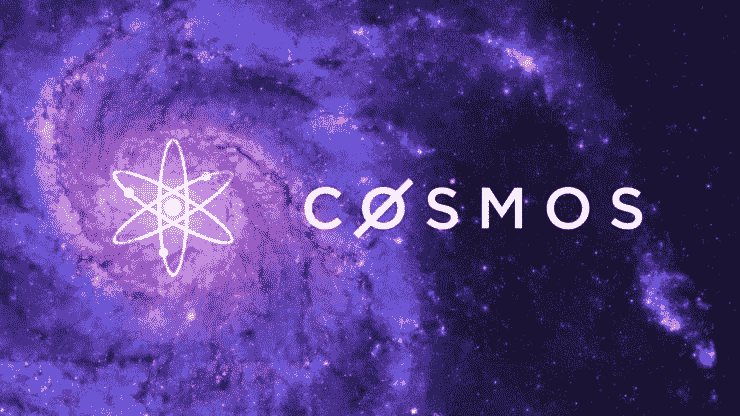
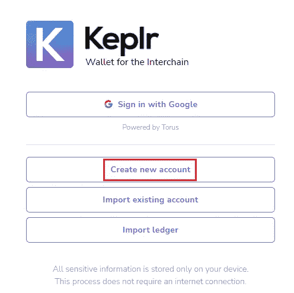
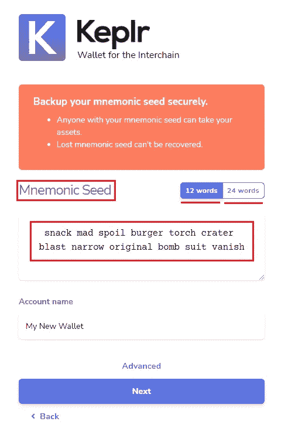
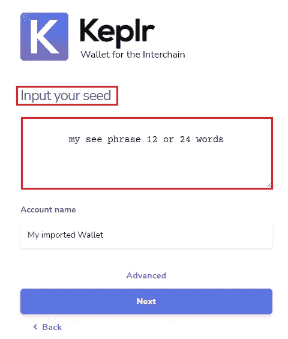
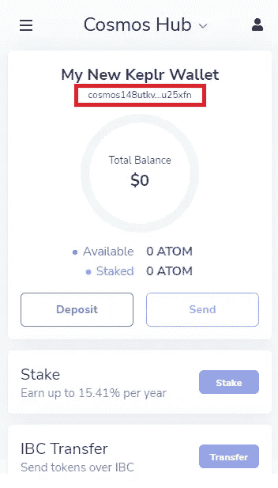
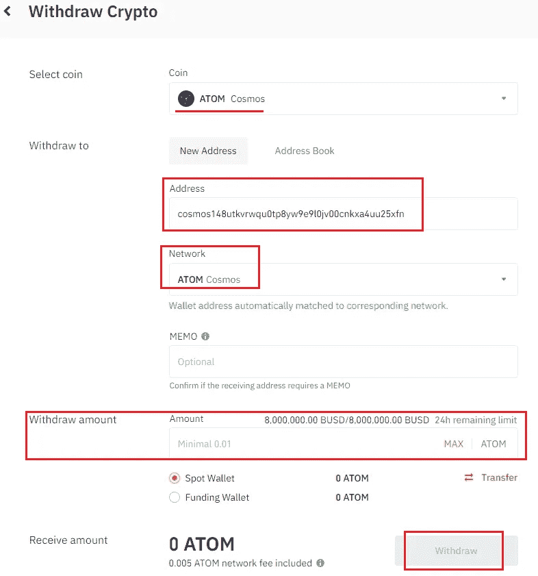

# 第一课-进入宇宙

> 原文：<https://medium.com/coinmonks/lesson-1-entering-the-cosmos-38714164939e?source=collection_archive---------25----------------------->

这是许多旨在教导新用户如何与 Cosmos 生态系统交互的简单简短教程的第一课。通过这些课程，你将学会购买$Atom，委托/入股，互换，交易和提供流动性，购买 NFT，与其他连锁店交易，使用 IBC，并成为一名完全的宇航员。

[Source](https://www.bitcoininsider.org/article/129469/cosmos-saw-1-million-transfers-within-single-month-its-ecosystem-should-you-invest)

什么是宇宙？

宇宙被称为区块链的互联网。它是几个区块链的枢纽，这些通过一种叫做 IBC(区块链间通信协议)的技术相互连接。宇宙令牌被命名为$Atom。

**我为什么要费心加入宇宙？**

Cosmos 运行先进的区块链架构，并为开发人员提供无与伦比的工具和功能来运行他们自己的区块链，部署可互操作的智能合同，并与数百个其他区块链进行交互，所有这些都很容易。由于比特币区块链无法与以太坊区块链互动，以太坊区块链无法与雪崩或索拉纳区块链兼容，因此宇宙中的所有区块链都是兼容的、可互操作的和互连的，无需建立桥梁或依赖复杂的技术。

您可以自由地将资产从一个区块链转移到另一个，用一枚硬币交换另一枚，或者使用同一个钱包无缝地参与不同区块链的不同协议，完全自由轻松。与另一个区块链相反，你可以使用同一个钱包自动与所有宇宙区块链互动。

**我在哪里签名，如何加入？**

$Atom 在各地各大交易所都能买到。你可以下载 Keplr wallet 作为浏览器的 chrome 扩展，或者作为苹果/谷歌商店的手机应用。

为了能够充分参与 Cosmos 提供的一切，最好使用 chrome 扩展，因为它可以更容易地参与 Cosmos 提供的许多活动。

【Keplr 钱包是如何工作的？

您可以使用 google 帐户或创建新帐户来设置钱包。作为去中心化的忠实信徒，我将讨论后者，并向您展示如何使用“创建新帐户”选项。

安装 Keplr 后，点击创建新帐户按钮。它将提示您安全地备份助记符种子短语。助记种子短语是一组 12 或 24 个独特的单词，您需要写下来、保密并安全存储，因为它们是您在数据丢失时找回钱包的密码短语。

> 不要与任何人分享你的种子短语，也不要在任何地方输入它，即使它是由一个看似可信的网站或团体提示的。

唯一需要使用种子短语的情况是在新设备上安装 keplr 或者在数据丢失后重新安装 keplr。届时，您将需要使用“导入现有帐户”按钮来找回您的钱包。您将被提示输入您的种子短语，如下所示，这是您使用它的唯一安全时间。

> 已知的网络钓鱼诈骗以用户种子短语为目标，诱骗他们显示种子短语或在某处键入种子短语。然后他们可以代替你进口你的钱包，窃取你的资金，这就是之前警告背后的原因。

加密钱包是一切，但一个种子短语(助记种子)让您访问和控制您的数据和资产永远存储在区块链，如您的硬币和他们的余额。

如果您卸载了 keplr 应用程序或 chrome 扩展，丢失了手机，电脑出现了问题，您只需使用 Keplr 的导入钱包选项并输入您保存的助记符种子短语，就可以调用您的钱包。一切都会恢复。在区块链号上没有任何东西会丢失。

我在 exchange 上购买了一些$Atom 并安装了 Keplr wallet，现在怎么办？

现在您可以发送和接收$atom 了。通过自我保管你的 atom，意味着把它从交易所拿出来，放进你的钱包，你朝着控制你的资金和与区块链互联网互动迈出了第一步。下图中突出显示的地址是您用来接收$Atom 的 Cosmos 地址。点击它将复制它。点击接收会以二维码形式显示地址。

第一步是前往您的交易所的提款页面，提取您的$Atom。交易所会要求你提供一个宇宙地址和一份备忘录。由于您正在将$Atom 提取到新创建的 Keplr 钱包中，因此您不需要担心备忘录。这是不需要的，让它空白是非常好的。只有在向交易所发送硬币时才需要备忘录。它用于将存款链接到用户帐户。这不是自我保管或分散财务中使用的东西。

因此，你所需要做的就是复制你的 Keplr cosmos 地址，在接收/提取字段输入并确认交易。您将很快获得新创建的 Keplr 钱包中的$Atom 的监护权。

Binance withdrawal interface

如图所示，确保选择 Cosmos 作为网络，输入您的地址和$Atom 的金额，然后点击取款。不需要如前所述填写备忘录字段。

**现在怎么办？**

您应该会在 Keplr 钱包中看到新的$Atom 余额。现在可能性是无限的，天空是极限。不要担心，我不会让新宇航员蒙在鼓里，我会通过这些课程涵盖宇宙生态系统中所有可用的用例。

[**点击此链接，将你的$SCRT 委托给阿耳忒弥斯。使用 keplr 浏览器应用程序的红色验证程序！**](https://wallet.keplr.app/#/secret/stake?tab=inactive-validators&modal=detail&validator=secretvaloper1jjlfeshltdy6ngnf5tg6aeaygsvf0kxg8wck04)

**这里列出了宇宙中可能发生的事情。所有这些话题都将在这个媒介账户下解决:**

*   下注您的代币，赚取费用/奖励/空投。
*   使用您的赌注代币参与治理投票，并参与区块链的决策。
*   [**如何选择一个验证器。**](/coinmonks/everything-you-need-to-know-to-successfully-choose-your-validators-7e752900d489)
*   宇宙内部的分散金融。使用分散的交易所购买、出售、交换硬币。
*   在分散的交易所中提供流动性，以获得交换费和奖励。
*   铸造你的第一个 NFT。
*   使用 NFT 市场，买卖 NFT 的。
*   发现 Juno 网络并与之互动。
*   发现渗透带并与之互动。
*   [**发现并与秘网互动**](https://artem1s.medium.com/letting-you-in-a-little-secret-introducing-the-secret-network-63335747255b) **。**
*   探索星际之门并与之互动。
*   发现阿卡什网络并与之互动。
*   发现哨兵网络并与之互动。
*   使用 Akash 网络在区块链上部署网站。
*   使用分散式 VPN 通过 Sentinel 网络私下连接到互联网。
*   在宇宙中拥有你的名字和身份。用任何名字替换你的钱包地址，用 Starname 接收加密。
*   Cosmos 中有哪些可供开发者和高级用户使用的工具？
*   使用 CLI(命令行界面)进行委派、取消委派、查询节点和投票。
*   设置一个节点。
*   设置验证器。
*   更新验证程序并排除故障。

## 你可以通过点击此链接将你的$SCRT 委托给[秘密网络](https://medium.com/u/2ed86f2ac861?source=post_page-----38714164939e--------------------------------) [上的](https://wallet.keplr.app/#/secret/stake?tab=inactive-validators&modal=detail&validator=secretvaloper1jjlfeshltdy6ngnf5tg6aeaygsvf0kxg8wck04) [Artemis.red](https://artemis.red) 验证器来支持我。

## 谢谢你。