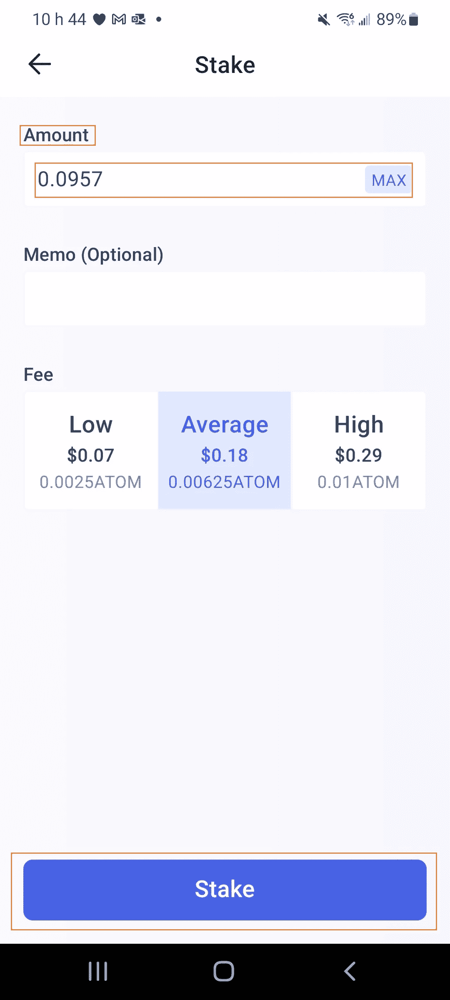

# 第 2 课—下注$Atom

> 原文：<https://medium.com/coinmonks/lesson-2-staking-atom-d76392d5ec7e?source=collection_archive---------14----------------------->

> 使用您的宇宙生态系统资产赚取被动收入，方法是将它们押在不同宇宙链的验证器上，并赚取每日可兑现的奖励。

[Cosmos Hub](https://hub.cosmos.network/main/hub-overview/overview.html)

所以现在你的 Keplr 钱包里有了一些$Atom，宇宙生态系统中最受欢迎的活动之一就是“打桩”。

赌注是将你的资金存入智能合约或验证器节点以获得回报的行为。让我们更多地关注验证器，也称为“委托”。

由于 Cosmos chains 是基于一种称为“赌注证明”的技术，为了保护网络，人们可以将他们的硬币(例如 Atom)“押”或“委托”给验证者。验证器是用于处理区块链上的区块的服务器，使用被押入/委托给它们的资金的投票权。更深入的指导可以在 [**这里**](/coinmonks/everything-you-need-to-know-to-successfully-choose-your-validators-7e752900d489) 找到。

在本文中，我们将重点关注基础知识。

对于用户来说，赌注是一个非常好的活动，因为它不需要保管，这意味着你可以控制你的硬币，可以非常有利可图。以下是赌注的一些好处:

*   赚取平均介于 10%到数千%之间的被动收入，具体取决于你下注的$硬币。
*   在连锁经营中投票，参与你投资的区块链的决策和运作。
*   有资格获得空投和其他奖励。通过赌注，你有时可能会收到来自项目的其他令牌，这些令牌希望引导来自不同宇宙链的用户，并使他们对他们的项目感兴趣。这些激励通常是通过赌注被动获得的。

## **如何使用 Chrome 浏览器和手机下注$ Atom】**

**Chrome & keplr 扩展:**
前往[https://wallet.keplr.app/](https://wallet.keplr.app/)并使用您的 keplr 钱包进行连接。

Keplr wallet chrome extension

通过选择左侧支持链列表中的 Cosmos Hub，您将看到您的$Atom 余额。点击**“Stake”**，您将看到验证器列表。在这个例子中，我们用 post human——一个伟大的宇宙验证器——赌上了我们的$Atom。为了更好地选择你的验证器，你可以阅读这里的**。**

**一旦您选择了您的验证器，按下**“管理”**，您将看到以下窗口:**

****

**您现在所要做的就是点击**“委托”**，Keplr wallet 会提示您通过点击**“批准”**来验证交易，并支付**“汽油费”**，这是区块链为处理交易而收取的一笔小额交易费。**

> **非常重要:当您委托代币时，您总是希望留下一些剩余代币来支付 2 或 3 笔交易费用，以便能够取消委托或重新委托您的奖励。因此，每次您重新授权奖励时，请确保为下一次交易留下一些代币。**

****

**一旦你的委托完成，你可以检查你的 Keplr 钱包仪表板，你应该有类似于:**

****

> **使用 Keplr Wallet 下注硬币时，您再也不用担心“备忘录”栏了。**

# ****使用 Keplr 移动应用程序下注$ Atom:****

## ****打开你的 Keplr 手机应用程序，在主页面点击“赌注”****

****

## ****您将获得所有验证器的列表，如下所示:****

****

## ****如果您知道您想要委托的验证者的姓名，您可以使用搜索字段来查找他。我们想委托给 Posthuman，所以我们将搜索他的验证器。****

****

## **一旦你找到了你的验证者，你就可以选择他并点击“下注”来下注你的$Atom。**

****

## ****将金额输入“赌注”并再次点击“赌注”确认****

****

## **我们必须再次确认连锁店的交易并支付汽油费。使用 Keplr Wallet 时与之前相同的警告。所有的赌注、取消赌注、重新授权和资金转移都是连锁交易，需要支付少量的汽油费，才能由区块链处理。**

> ****非常重要:当您授权您的代币时，您总是希望留下一些剩余代币来支付 2 或 3 笔交易费用，以便能够取消授权或重新授权您的奖励。因此，每次您重新授权奖励时，请确保为下一次交易留下一些代币。****

****

## **你应该有一个显示成功交易的屏幕。**

****

## **如果你查看你的赌注控制面板，你可以看到你的委托给你选择的验证者，并要求你的奖励或每天重新获得它们，以利用复利效应。**

****

**这就是关于委托/分配你的$Atom 的指南。**

**在第 3 课中，我们将了解如何“交换”硬币，用我们的$Atom 交换其他宇宙生态系统硬币，如$SCRT、$露娜、$UST、$奥斯莫或$朱诺，并进行所谓的 IBC 交易(跨链交易)。一旦你将你的$ATOM 换成另一枚硬币，你可以使用与此处所示相同的过程，将该硬币委托给该特定链的验证器。**

## **你可以点击此链接，将你的$SCRT 委托给[秘密网络](https://medium.com/u/2ed86f2ac861?source=post_page-----d76392d5ec7e--------------------------------) [上的](https://wallet.keplr.app/#/secret/stake?tab=inactive-validators&modal=detail&validator=secretvaloper1jjlfeshltdy6ngnf5tg6aeaygsvf0kxg8wck04) [Artemis.red](https://artemis.red) 验证器来支持我。**

## **谢谢你。**