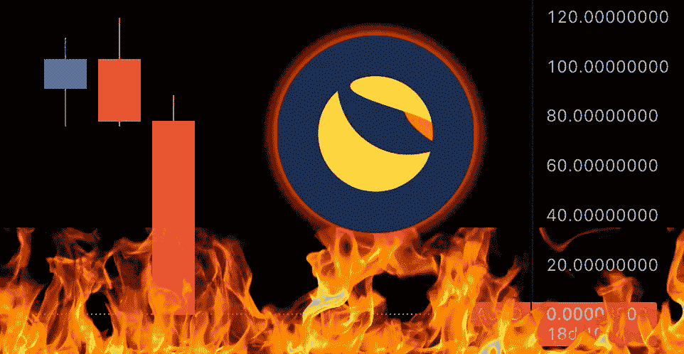

# 从月神跌落到 0 美元的教训

> 原文：<https://medium.com/coinmonks/lessons-to-take-away-from-luna-dropping-to-0-59353b5c368?source=collection_archive---------11----------------------->

在我写这篇文章的时候，LUNA 已经从 116 美元的历史高点跌至 0.0001406 美元。这个下降很疯狂，很多人因为这个项目亏了很多钱。我将谈论一些从 LUNA 身上学到的可以应用于任何加密方面的经验。

# 第一课

首先要记住的是，永远不要孤注一掷。我不是说你必须分散 100 种不同的密码，但至少要持有一些不同的硬币。如果你手里的任何一个密码出了什么事，你不会失去你所有的东西。

# 第二课

第二件要做的事情是兑现利润。你们中的一些人涨了几倍，却没有获利。至少，当你赚了那么多的时候，拿出你的初始投资。太多的人把 crypto 当成可口可乐的股票，认为它在未来 10 年肯定会上涨。我疯狂看好加密，我真的有比特币纹身。然而，我并没有忘记这样一个事实，即代用币是你可以投资的风险最高的东西之一。如果你要把你的收获截图给你的朋友看，或者发布在社交媒体上，这意味着可能是时候获利了。钻石手文化在最危险的事情上被美化了，就像你赚了 100 倍，你也可能会失去它。不要被抓到拿着袋子，记住你永远不会破产获利，也许你会错过成为百万富翁的机会，但这些故事是罕见的。

# 第三课

最后我想说的是不要放弃。我搞砸了几个账户，最重要的是永远记住从你的交易中学习。回头看看自己的损失，以后一定要改正自己。这适用于交易或投资。如果你想把损失的钱赚回来，你必须头脑清醒地去投资。不要试图在一次交易中赚回所有的钱。太多的人看到一个人的推特，认为如果那个人相信这个秘密或股票，那么我也应该相信。当密码或股票下跌时，这些人会向那个人咨询是否应该继续持有。别人对投资的信念不应该是你的信念。自己做研究。我希望你们都能成功投资或交易，并关注更多这样的文章。