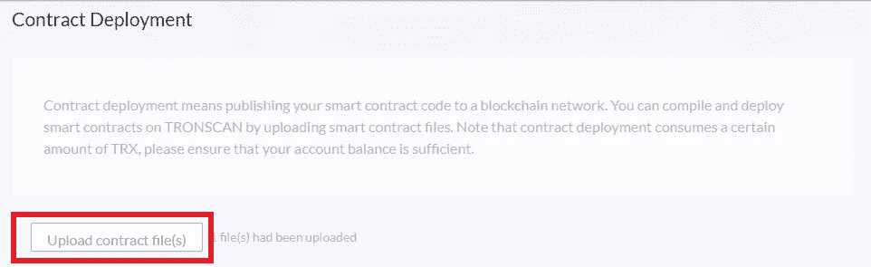
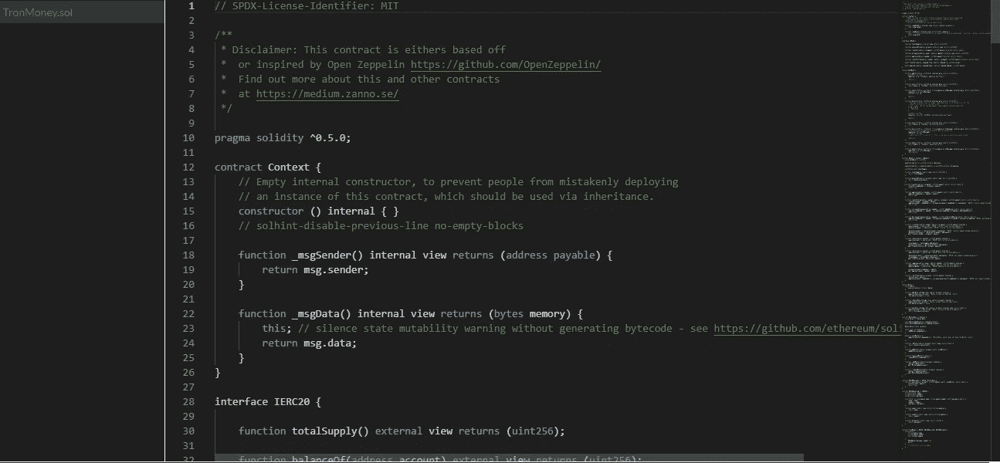

# 让我们创建一个 TRC-20 (Tron)令牌

> 原文：<https://medium.com/coinmonks/lets-create-a-trc-20-tron-token-18b195acec?source=collection_archive---------2----------------------->

之前我们已经讲述了如何制作 [**ERC-20 代币**](/coinmonks/how-to-make-your-own-cryptocurrency-e1146cb1d11e?source=user_profile---------9-------------------------------) (以太坊，币安&多边形)以及在 Zilliqa 上制作 [**代币。**](https://coinsbench.com/create-your-own-coin-on-zilliqa-bafc8d5e32c6?source=user_profile---------0-------------------------------)

***-高吞吐量-*-高可扩展性-*-高可用性-*** 这是 Tron 网络对自己的描述。就我个人而言，我没有和 Tron 一起工作过很多，对于描述是否正确，我没有什么看法。

*看不懂全文？成为中等* [***的一员在这里***](https://medium.zanno.se/membership)

在今天之前，除了时不时地拥有一些他们的硬币，我对创没有任何经验，所以我不知道会发生什么。所以当我开始研究如何制作 TRC-20 代币时，我惊讶地发现它是如此简单。

**看看我的网站，里面有很多在线博彩和赌场指南！**

[**creepybits . bet**](https://creepybits.bet)

TRC-20 和 ERC-20 非常相似。我所做的是拿起我电脑上的一份旧的 ERC-20 合同，或多或少只是更改了其中的令牌名称，然后它就可以部署了。就像这样，我们在 Tron 网络上有一个可铸造的令牌，铸造者角色被分配给部署合同的任何地址。

在 [**Github**](https://github.com/Creepybits/BEP-20-contracts/blob/Master/TronMoney.sol) 找到完整合同。

我们必须收缩，现在我们需要一种方法来部署它。如果你还没有安装 Tron Link 钱包，你应该从 [**Chrome 网上商店**](https://chrome.google.com/webstore/detail/tronlink%EF%BC%88%E6%B3%A2%E5%AE%9D%E9%92%B1%E5%8C%85%EF%BC%89/ibnejdfjmmkpcnlpebklmnkoeoihofec) **获取。**基本上就是 Trons 版的 MetaMask。一旦你设置好钱包并添加了一些 TRX(我使用 testnet 来部署这个合同，所以我从 [**testnet 水龙头**](https://www.trongrid.io/shasta) )你应该去 Trons online [**编译器/部署器**](https://shasta.tronscan.org/#/contracts/contract-compiler) 。

与 [**Remix**](https://remix.ethereum.org/) 不同的是 [**Tron 编译器**](https://shasta.tronscan.org/#/contracts/contract-compiler) 不允许你直接在上面写代码，所以你需要保存合同到你的电脑上，命名为 WhateverNameYouWant.sol

按“上传合同文件”按钮并选择您的合同文件，代码将显示在下面的窗口中。

在代码窗口下有两个按钮，一个显示“编译”，另一个显示“部署”。按下“编译”按钮，选择你的编译器。

满意后，按确认。如果你做了所有正确的事情，另一个窗口将出现在代码窗口下，并显示一条消息，说明编译成功。

现在按下“部署”按钮，从下拉菜单中选择实际硬币的合同。我把我的合同命名为 TronMoney，所以这就是我选择的。

给你的硬币命名，给它一个符号和初始供应量(总是初始供应量+小数)。当您对信息满意时，请按“确认”。在 Tron Link 中签署交易，可能一分钟后会出现另一个窗口，显示 tx 哈希和合同地址。

非常重要:不要将您的令牌命名为“任何您想要的东西”！结果他们对你给你的令牌取什么名字很敏感，我不得不重复这个过程 3 次，他们才满意。

你现在在 Tron 网络上有一个令牌，但是在这种状态下你不能用它做很多事情。让我们继续和 [**核实合同**](https://shasta.tronscan.org/#/contracts/verify) **。**

填写所有正确的信息，上传源文件，然后按“验证并发布”。您的合同现在将被验证。

现在我们只需将我们制作的自定义令牌添加到我们的 TronLink 钱包中，对吗？

为了让您新创建的令牌不会完全没有价值，您必须做的下一件事是将令牌放在 [**记录上，首先是**](https://shasta.tronscan.org/#/tokens/create/Type) 。

I have no idea why this is required

非常重要:不要将您的令牌命名为“任何您想要的东西”！
事实证明，他们对如何命名令牌非常敏感，在他们满意之前，我不得不重复这个过程 3 次。

更多意想不到的事情。合同得到验证，令牌记录有信息、徽标并已被接受。但是我仍然不能把代币加到我的钱包里。也许因为它在测试网上，如果有人知道请给我发消息。

您仍然可以与代币互动，并通过直接与智能合约互动来发送/接收代币，当您在 Tronscan 检查您的在线钱包时，代币的数量会更新。可以在 这里找到令牌 [**。**](https://shasta.tronscan.org/#/token20/TEv6rwGqYELxLJxLLQhBxPcSR8wxtk9Puq/code)

将令牌添加到钱包的问题将不得不在另一天令人头痛。我希望你喜欢读这篇文章！

您可能感兴趣的其他文章。

[如何创建您自己的加密货币](/coinmonks/how-to-make-your-own-cryptocurrency-e1146cb1d11e)
[分配您的硬币(龙头)](/coinmonks/distribution-of-your-coin-part-1-43a9a7cd54e3)
[分配您的硬币(众筹)](/cryptostars/distribution-of-your-coin-part-2-a274d36d9961)
[创建您自己的可铸造代币](/cryptostars/create-your-own-mintable-token-d8431cfee55f)
[创建初始硬币发售 ICO](/cryptostars/creating-an-initial-coin-offering-ico-d83ef4f5ed5e)
[在 Zilliqa 上创建您自己的硬币](https://coinsbench.com/create-your-own-coin-on-zilliqa-bafc8d5e32c6)

非常感谢捐赠！

比特币地址:**BC 1 q 3 yweqw 6 dvdr DJ 999 prmuxzuw 6y 6 C3 Sam 3 e 2 PAC**

Litecoin 地址:**ms 6 nu 4 e 4r w6 z 5z 53 fy 2 TF 6 fvkxeawr 4 szt**

ETH/BSC 地址:**0x 662 BD 246 ebb 857 f1 ab 368500527 c 54 ef 0 b 864 BD 8**

联系人:zanno@creepybits.org

> 加入 Coinmonks [电报频道](https://t.me/coincodecap)和 [Youtube 频道](https://www.youtube.com/c/coinmonks/videos)了解加密交易和投资

## 另外，阅读

*   [3 商业评论](/coinmonks/3commas-review-an-excellent-crypto-trading-bot-2020-1313a58bec92) | [Pionex 评论](https://blog.coincodecap.com/pionex-review-exchange-with-crypto-trading-bot) | [Coinrule 评论](/coinmonks/coinrule-review-2021-a-beginner-friendly-crypto-trading-bot-daf0504848ba)
*   [莱杰 vs n rave](/coinmonks/ledger-vs-ngrave-zero-7e40f0c1d694)|[莱杰 nano s vs x](/coinmonks/ledger-nano-s-vs-x-battery-hardware-price-storage-59a6663fe3b0) | [币安评论](/coinmonks/binance-review-ee10d3bf3b6e)
*   [Bybit Exchange 审查](/coinmonks/bybit-exchange-review-dbd570019b71) | [Bityard 审查](https://blog.coincodecap.com/bityard-reivew) | [Jet-Bot 审查](https://blog.coincodecap.com/jet-bot-review)
*   [如何开始通过加密贷款赚取被动收入](https://blog.coincodecap.com/passive-income-crypto-lending)
*   [BigONE 交易所评论](/coinmonks/bigone-exchange-review-64705d85a1d4) | [电网交易 Bot](https://blog.coincodecap.com/grid-trading)
*   [氹欞侊贸易评论](https://blog.coincodecap.com/anny-trade-review) | [CoinSpot 评论](https://blog.coincodecap.com/coinspot-review)
*   [新加坡十大最佳加密交易所](https://blog.coincodecap.com/crypto-exchange-in-singapore) | [购买 AXS](https://blog.coincodecap.com/buy-axs-token)
*   [投资印度的最佳加密软件](https://blog.coincodecap.com/best-crypto-to-invest-in-india-in-2021) | [WazirX P2P](https://blog.coincodecap.com/wazirx-p2p)
*   [7 个最佳零费用加密交易平台](https://blog.coincodecap.com/zero-fee-crypto-exchanges)