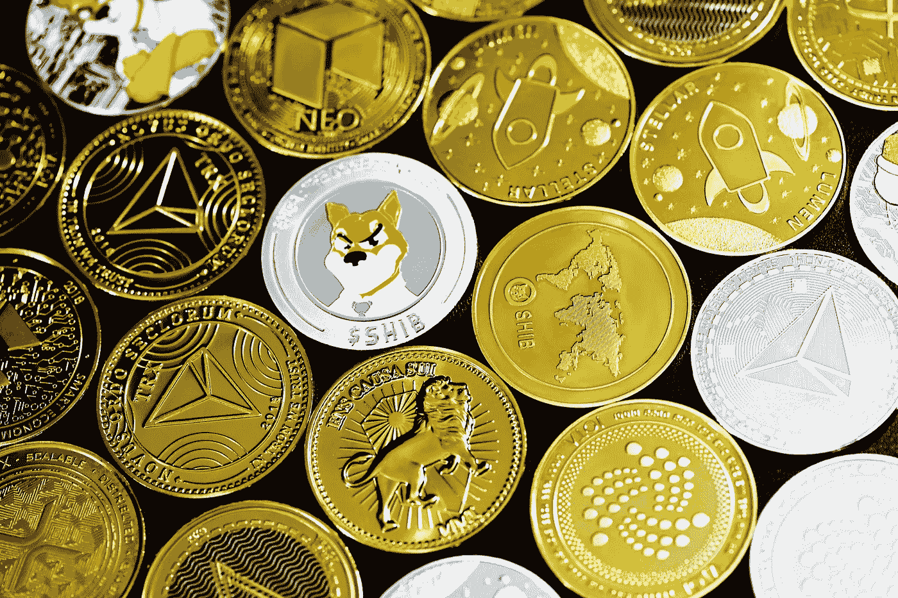

# 让我们摧毁加密货币的神话！

> 原文：<https://medium.com/coinmonks/lets-destroy-cryptocurrency-myths-bc69d8db9aa8?source=collection_archive---------81----------------------->

加密货币在千禧一代中变得流行，部分原因是它们在年轻人中普遍受欢迎，以及它们的投资收益潜力。然而，有几个关于加密货币的神话可能会导致千禧一代错过这个机会。

人们创造了关于加密货币的神话，因为他们害怕这项技术以及它如何接管世界。他们认为加密货币将使犯罪分子更容易洗钱，并被用于资助恐怖主义。另一个担忧是，如果加密货币的价值崩溃，人们会失去所有的钱。

## 1.加密货币只被犯罪分子使用

这是关于加密货币最常见的神话之一。虽然确实有一些犯罪分子使用它们来买卖非法商品，但绝大多数加密货币用户都是守法公民。事实上，现在很多商家都接受比特币作为支付方式，甚至还有可以用现金购买比特币的自动取款机。

## 2.加密货币不受监管

关于加密货币的另一个神话是它们不受监管。这不是真的；事实上，大多数国家现在都出台了加密货币的相关法规。例如，在美国，证券交易委员会已经开始监管首次硬币发行(ico)。

## 3.加密货币是一个骗局

出现了一些高调的加密货币骗局，但这并不意味着所有的加密货币都是骗局。事实上，许多人认为加密货币有可能彻底改变金融系统。例如，比特币可以用于国际汇款，而不必通过银行或其他金融机构。

## 4.你不能用加密货币购买任何东西

虽然并非所有企业都接受加密货币作为支付手段，但越来越多的企业接受了。例如，微软接受比特币作为其 Xbox 和 Windows 平台上数字内容的支付方式。Overstock 是另一家受欢迎的零售商，它接受比特币作为家具和电子产品等物品的支付方式。

## 5.加密货币不安全

这是另一个关于加密货币的常见神话。虽然没有系统是 100%安全的，但加密货币实际上是非常安全的。例如，比特币使用一种名为区块链的技术，这使得它很难被黑客攻击。此外，大多数加密货币交易所现在已经实施了了解客户(KYC)措施，以防止欺诈和洗钱。

## 6.加密货币是匿名的

虽然你可以在不暴露身份的情况下发送和接收加密货币，但交易实际上不是匿名的。用加密货币进行的每一笔交易都存储在一个名为区块链的公共账本上。这意味着，如果有人想，他们可以追踪到你的钱包地址交易。

## 7.加密货币存在泡沫

这很难预测，因为没有人确切知道加密货币的未来会如何。然而，许多专家认为，比特币目前的价格是可持续的，它没有出现泡沫。只有时间能证明这是真的还是假的！

## 8.你需要成为投资加密货币的专家

这根本不是真的！任何人都可以投资加密货币——你不需要成为该领域的专家。有很多方法可以开始，比如通过交易所购买比特币，或者通过传统的股票和股份投资一家与加密相关的公司。

## 9.比特币的价值永远不会上升

当比特币在 2009 年首次推出时，一 BTC 价值不到 0.01 美元。今天，一个 BTC 价值超过 4000 美元——所以可以肯定地说，比特币的价值已经上升了！当然，比特币的价格是不断变化的，无法预测未来的价格。

## 10.加密货币只被投机者使用

虽然有些人确实会投机加密货币的价格，但这并不是唯一的用例。加密货币还可以用来发送和接收支付，以及存储价值。例如，许多人现在将比特币作为对冲通胀或其他经济不稳定的一种方式。

总之，我们可以看到关于加密货币有各种各样的神话。一些人认为加密货币只被犯罪分子使用，而另一些人认为加密货币只被富裕的投资者使用。然而，事实是，任何想投资加密货币的人都可以使用加密货币。你不需要很富有，也不需要有任何投资经验。

阅读更多关于 Cryptochartis.com 的此类文章，它是真实、公正的加密货币新闻、预测和市场分析的主要来源。

> *加入 Coinmonks* [*电报频道*](https://t.me/coincodecap) *和* [*Youtube 频道*](https://www.youtube.com/c/coinmonks/videos) *了解加密交易和投资*

# 另外，阅读

*   [Bookmap 评论](https://coincodecap.com/bookmap-review-2021-best-trading-software) | [美国 5 大最佳加密交易所](https://coincodecap.com/crypto-exchange-usa)
*   最佳加密[硬件钱包](/coinmonks/hardware-wallets-dfa1211730c6) | [Bitbns 评论](/coinmonks/bitbns-review-38256a07e161)
*   [新加坡十大最佳加密交易所](https://coincodecap.com/crypto-exchange-in-singapore) | [收购 AXS](https://coincodecap.com/buy-axs-token)
*   [红狗赌场评论](https://coincodecap.com/red-dog-casino-review) | [Swyftx 评论](https://coincodecap.com/swyftx-review) | [CoinGate 评论](https://coincodecap.com/coingate-review)
*   [投资印度的最佳加密软件](https://coincodecap.com/best-crypto-to-invest-in-india-in-2021)|[WazirX P2P](https://coincodecap.com/wazirx-p2p)|[Hi Dollar Review](https://coincodecap.com/hi-dollar-review)