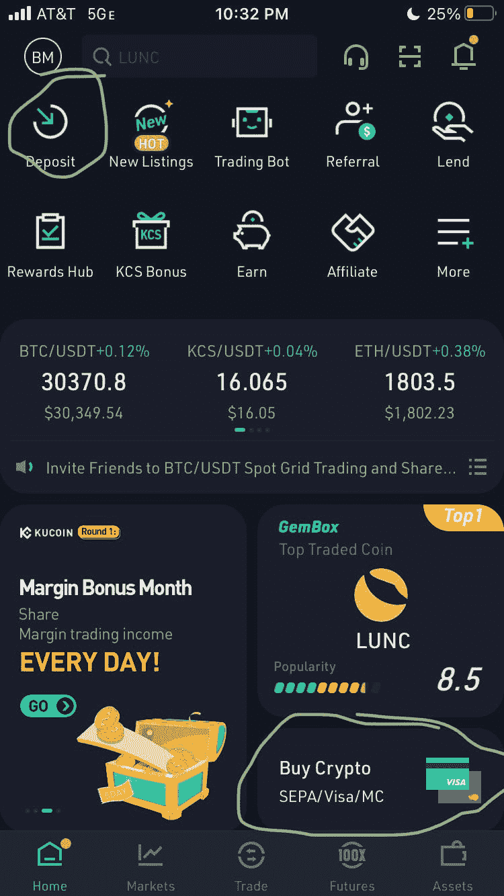
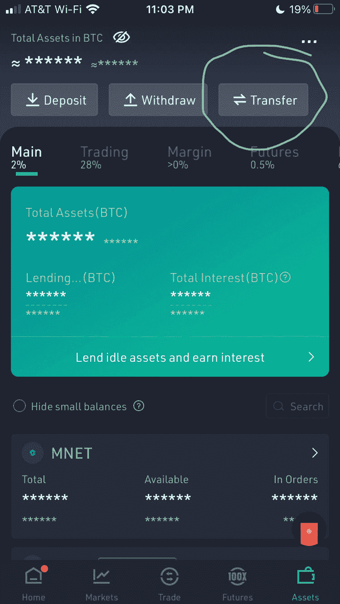
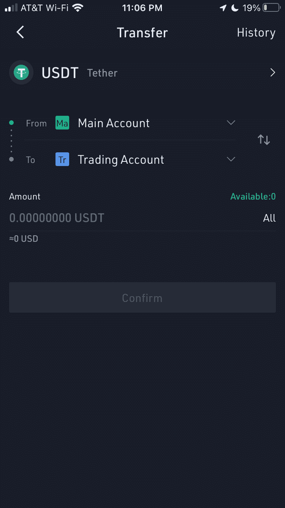
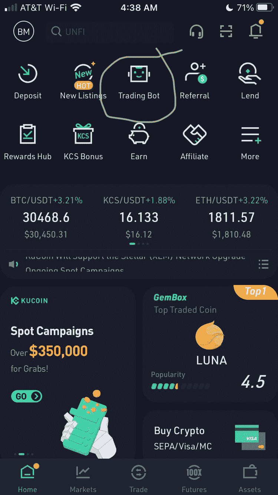
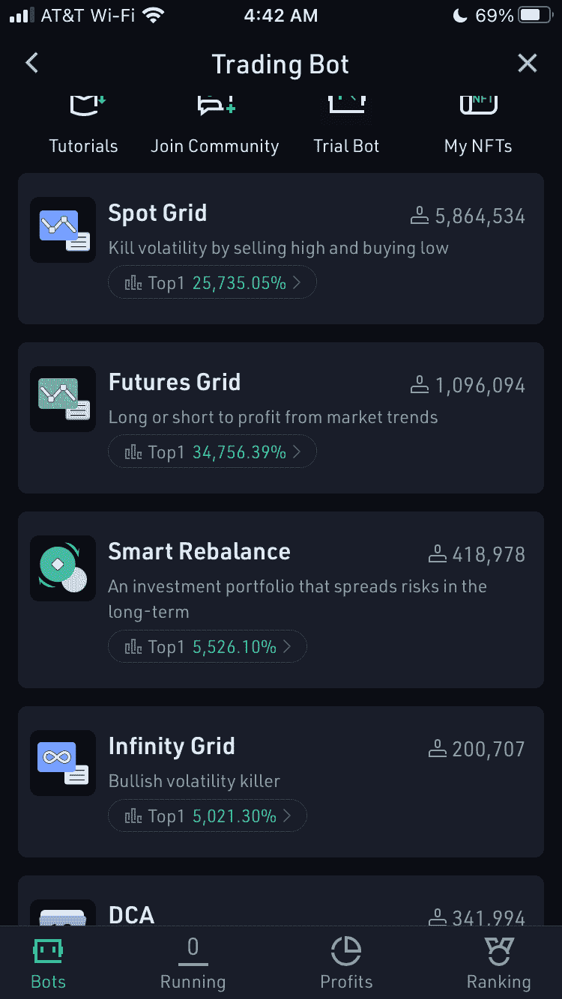
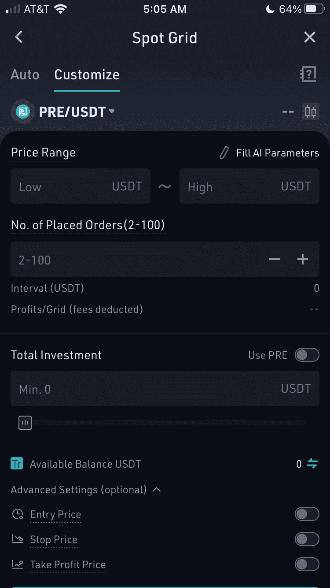
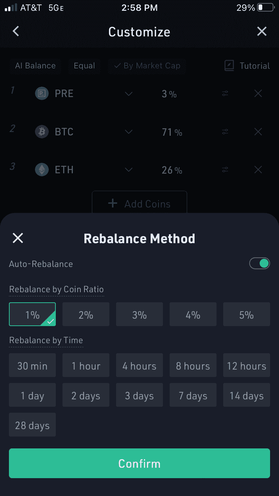
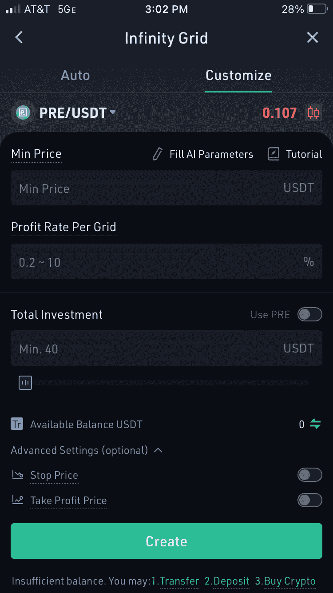
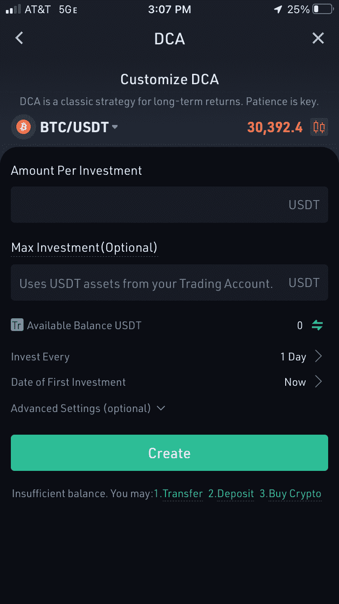

# 让我们在币安上市预研吧！

> 原文：<https://medium.com/coinmonks/lets-get-presearch-listed-on-binance-33fd4d793e76?source=collection_archive---------8----------------------->

很多人要求预研在币安上市，但他们都不太符合要求。这意味着他们需要我们的帮助。

币安要求每日最低交易量达到 100 万美元才有资格上市。要在币安增加预搜索功能，我们需要 20 倍于目前的日交易量。

我将介绍:

1.币安的要求。

2.利用 KuCoin 增加交易量。

3.不同类型的库币机器人交易前。

4.如何使用每个库币机器人？

5.Presearch 如何让在 KuCoin 上购买 PRE 变得更容易。

# 币安要求

币安要求在他们的交易所推出硬币的各种先决条件。这些要求是:

1.  在[https://www.binance.com/my/coin](https://www.binance.com/my/coin)填写的申请表。

2.回答一份 8 页的申请。很简单。我已经复习了这些问题，即使没有 Trey 或 Colin 的知识，我也能回答所有的问题。

3.支付币安新硬币费(我听说预研不需要支付这个费用。)

4.等待 2 周到 1 个月的批准。

5.提供每周或每月的进度报告。已经这样做了。

6.日交易量超过 100 万美元

7.将 BNB/BUSD 纳入申请。也许我们可以从搜索引擎上买到硬币？

8.为你的社区提供币安的支持。

欲了解更多有关币安上市要求的信息，请访问[https://www . binance . com/en/support/FAQ/053 E4 BDC 48364343 b 863d 1833618 D8 ba](https://www.binance.com/en/support/faq/053e4bdc48364343b863d1833618d8ba)

现在您已经知道了币安上市的要求，让我们看看如何使用 Kucoin。

# 在 KuCoin 获得资金

如果您还没有 KuCoin 帐户，您需要注册一个。你可以用我的推荐代码注册。

【https://www.kucoin.com/r/rf/rJ3CUXG 

注册后，你需要将资金转移到 KuCoin。你可以用借记卡购买 USDT 或 BTC。或者，你可以将密码存入 KuCoin。

当你在 KuCoin 有资金后，你需要把它们转到你的交易账户。要转移，请单击右下角的资产。在下一页上，单击转移

然后你会进入一个页面，显示你所有的硬币。选择一个你想转移到交易。然后它会带你到下面的页面。

输入金额并“确认”

现在你准备启动一个交易机器人，但是你应该使用哪个呢？

# KuCoin 机器人

对于那些从未使用过 KuCoin 机器人的人，你可以在 KuCoin 应用程序中找到它们。我在下面的截图里圈出来了。

KuCoin 目前共有 6 款机器人可供选择:

1.专色网格(仅限 USDT 之前)

2.期货网格(预不可用)

3.智能再平衡(预加机器人最多 5 个其他硬币)

4.无限网格(仅限 USDT 之前)

5.DCA(仅适用于 PRE/USDT)

所有机器人都将拥有:

1.  您希望交易的硬币。大多数情况下，您会希望使用 PRE/USDT。
2.  一个带有硬币支付选项的总投资箱。最低 40 美元，但根据对硬币的需求而浮动。我见过最低要价 1000 美元的。
3.  止损价格:如果价格低于这个点，退出硬币。
4.  获利回吐:如果价格上涨到这个价位左右，退出硬币。
5.  自动/自定义功能:使用自动来使用人工智能建议的设置或自定义创建自己的。

此外，每个机器人将有其他领域，你可以填写。这些字段因您选择的 bot 而异。

让我们从观察斑点网格开始。

## 库币现货网格交易机器人

如果您选择使用现货网格，您将需要包括低价格和高价格、订单数量和总投资。在撰写本文时，USDT 之前的机器人的最低价格为 126.668 美元。

你也可以指定进场价格、止损价格和获利价格。

现货网格机器人的工作原理是，当价格低于根据您的设置计算出的价格时买入 PRE，当价格高于特定水平时卖出 PRE。

例如，如果您有以下规格:

参赛作品:0.1 美元

低:0.07 美元

高:0.13 美元

订单:100

投资:200 美元

你一启动机器人就要花 100 美元买 PRE(或者 PRE 价格达到入门价格)。

那么你的售价是 0.1006 美元。

$.1012, $.1018, $.1024 … $.13.

在 0.0994 美元、0.0988 美元、0.0982 美元……0.07 美元买入。

利润是根据买价和卖价之间的差额获得的。在这个例子中，最低利润是每笔 2 美元的交易 0.012 美元。大多数时候，现货网格机器人每天做 100-1000 笔交易。因此，在这个例子中，一个 200 美元的机器人将产生 200-2000 美元的交易量。

## 期货网格

期货网格不提供预搜索，但它像现货网格一样工作，而且你可以做空或做多一枚硬币，保证金高达 5 倍。

## 智能重新平衡(进行前置/BTC 或前置/以太网的唯一方法)

智能再平衡是一个机器人，其工作方式类似于自动化指数基金。你最多可以选择 12 枚硬币，并按投资组合的一定比例分配给它们。

您还需要设置基于百分比变化或时间段的自动重新平衡功能。

我建议 1%的变化，因为它往往有更好的回报，但 30 分钟的时间将保证 48 笔交易，无论市场在做什么。不过，如果 30 分钟内没有明显的市场变化，它可能会遭受损失。

目前运行一个 BTC-ETH 之前的机器人最低需要 215 美元。

随着价格的上升和下降，它会自动调整，以保持相同的百分比，由美元价值。

## 无限网格

我个人比较喜欢这个。

无限网格是现货网格的看涨版本。点网格的一个问题是范围有一个上限值。

无限网格不受范围限制。只要设定最低价格，每格利润，以及你想放多少进去。之后，它每上涨 0.2%-10%就交易一次，直到你选择止损或者它达到止盈价(当设定时)。

## DCA 机器人

在本指南中，DCA 机器人的交易量最低。

如果你想把平均成本转化为利润，你可以使用这个机器人。只需设置每期要投资的金额、最大投资(可选)、频率即可。

DCA 选项包括 1 小时、2 小时、4 小时、8 小时、12 小时、1 天、2 天、3 天、4 天、1 周和 2 周。

# 关闭

这就是如何使用 KuCoin 上的不同机器人来帮助 Presearch 在币安上市。

感谢您的阅读。如果你喜欢这个博客，一定要关注我。如果您还没有使用 Presearch，[今天就试试吧](https://presearch.com/signup?rid=2270247)。

如果你已经在运行机器人，分享你对帮助他人成功的策略的评论。

> 加入 Coinmonks [电报频道](https://t.me/coincodecap)和 [Youtube 频道](https://www.youtube.com/c/coinmonks/videos)了解加密交易和投资

# 另外，阅读

*   [加密货币储蓄账户](/coinmonks/cryptocurrency-savings-accounts-be3bc0feffbf) | [YoBit 审核](/coinmonks/yobit-review-175464162c62)
*   [Botsfolio vs nap bots vs Mudrex](/coinmonks/botsfolio-vs-napbots-vs-mudrex-c81344970c02)|[gate . io 交流回顾](/coinmonks/gate-io-exchange-review-61bf87b7078f)
*   [CoinFLEX 评论](https://coincodecap.com/coinflex-review) | [AEX 交易所评论](https://coincodecap.com/aex-exchange-review) | [UPbit 评论](https://coincodecap.com/upbit-review)
*   [AscendEx 保证金交易](https://coincodecap.com/ascendex-margin-trading) | [Bitfinex 赌注](https://coincodecap.com/bitfinex-staking) | [bitFlyer 点评](https://coincodecap.com/bitflyer-review)
*   [Bitget 回顾](https://coincodecap.com/bitget-review)|[Gemini vs block fi](https://coincodecap.com/gemini-vs-blockfi)cmd |[OKEx 期货交易](https://coincodecap.com/okex-futures-trading)
*   [AscendEx Staking](https://coincodecap.com/ascendex-staking)|[Bot Ocean Review](https://coincodecap.com/bot-ocean-review)|[最佳比特币钱包](https://coincodecap.com/bitcoin-wallets-india)