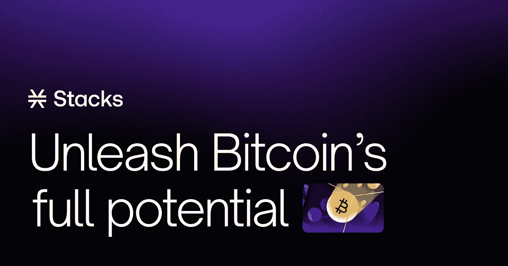
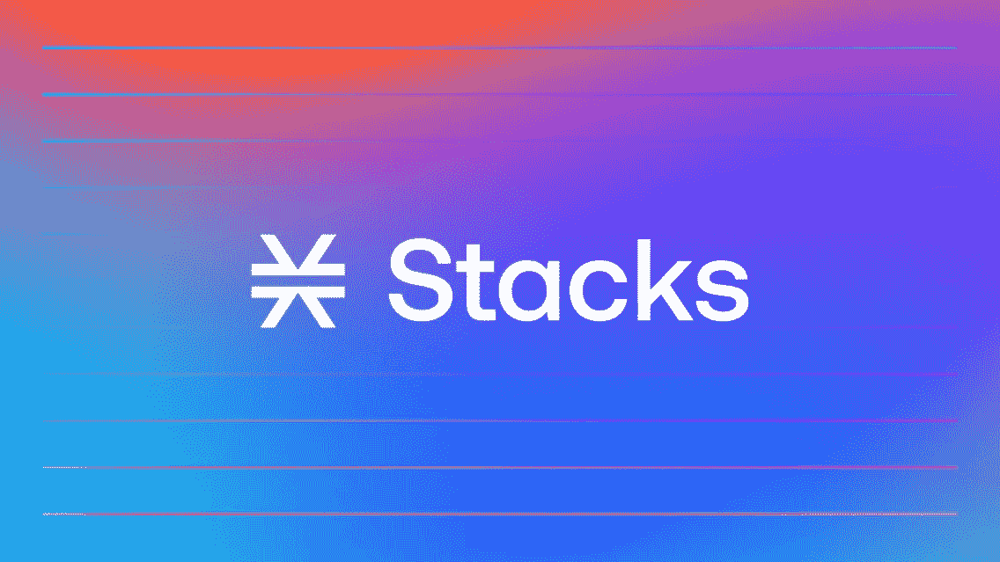
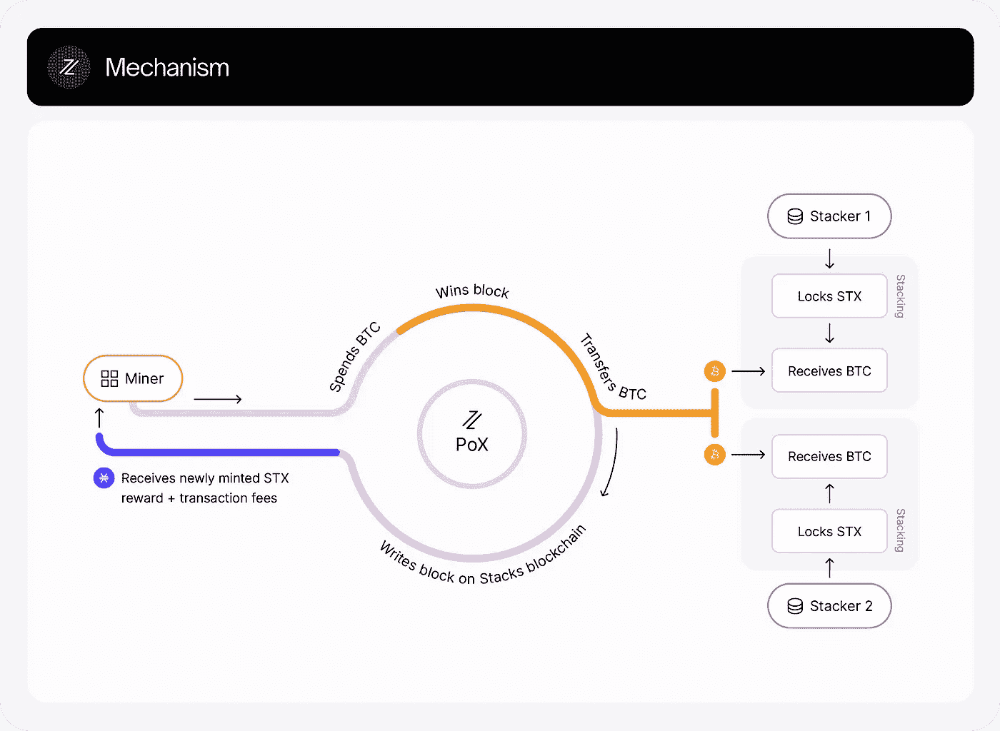
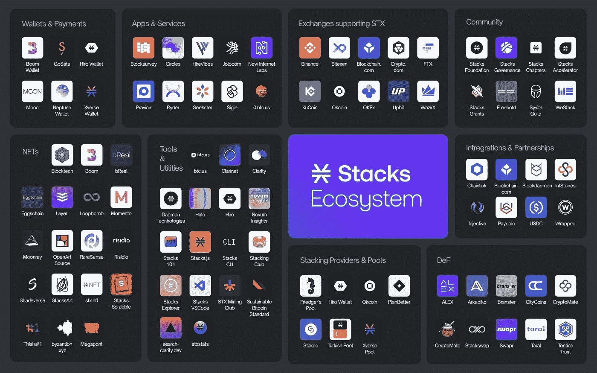

# 让我们得到这些堆栈

> 原文：<https://medium.com/coinmonks/lets-get-these-stacks-e64fa296e1a?source=collection_archive---------44----------------------->

分散融资一直是区块链科技的最大特点之一，大量投资者看到了这个生态系统中的无限机遇，纷纷涌入。在过去的一年中，Stacks 生态系统也经历了巨大的增长。周五，Okcoin 宣布与 Stacks Accelerator、Stacks Foundation 和一些风险投资合作伙伴合作，资助[比特币奥德赛](https://blog.okcoin.com/2022/03/10/were-launching-the-bitcoin-odyssey/)项目后，STX 价格比 24 小时每日开盘上涨了约 75%。比特币奥德赛是一项为期一年的倡议，旨在向基于堆栈和比特币区块链的项目部署 1.65 亿美元。可以考虑的项目将是(但不限于)DeFi、GameFi、NFTs 和元宇宙项目领域的比特币和堆栈项目，以及 DAOs 和 GovTech 项目。对于开发者和创始人来说，这是一个巨大的验证信号，他们多年来一直通过堆栈来构建比特币。

这给那些接触加密货币并被告知比特币不可编程的人带来了问题——那么这些创新将如何建立，或者它们是如何建立在比特币上的？这就是 Stacks 的人进来的地方。

# **什么是书库？**

> 根据算法系统，计算机语言更容易对图灵完成的编程语言进行编码或解码。因此，对于双方的交易来说，比特币是一个更加可行和安全的选择，因为它更难被解码。

Stacks 之前被称为 Blockstacks，由 Muneeb Ali 和 Ryan Shea 推出，是一个用于构建去中心化区块链应用程序和智能合同的开源平台。Blockstacks 于 2017 年推出，并于 2019 年被 SEC 注册为证券，成为第一个 SEC 注册的令牌产品，因此允许该公司向公众分发其加密货币令牌 STX。2021 年 1 月，Stacks mainnet 推出，这意味着它们不再是一种证券，可以自由交易。

Stacks 是一个第 1 层区块链，与比特币区块链并行运行，利用比特币的安全性、稳定性和经济实力来运行智能合约和构建去中心化应用。它可以被称为虚拟区块链，因为堆栈上的所有交易都被编码在比特币块中的交易元数据中。它基本上是给缺乏可编程性的比特币带来了智能合约。建立比特币的决定是基于他们的信念和论点，即比特币是价值结算的标准。对任何潜在黑客来说，影响或攻击比特币网络都是不切实际的，它经受住了时间的考验。

比特币有两个对其网络有益的特点，但当你想更多地使用它时，它们会使其网络受到限制。

1.  **可扩展性**:每个比特币区块上可以进行的交易数量非常有限。

**2。安全合约**:比特币区块链使用的脚本语言不支持通用智能合约。这不是一个错误，因为它在比特币基础层提供了安全性。

Stacks 部署的独特共识算法在比特币和区块链 Stacks 之间运行，解决了这些问题，因此可以直接在比特币上构建用例。

## 转移共识机制的证明

这就是运行在栈和比特币之间的共识机制。

> 它回收比特币的工作证明，以实现高度的去中心化和可扩展性，而不会产生额外的环境影响。

[Proof of Transfer | Stacks](https://docs.stacks.co/understand-stacks/proof-of-transfer)

随着 Stacks mainnet (Stacks 2.0)的推出，转移证明(POX)挖掘得以实现，并锚定了比特币的安全性。有了 POX，矿商们用他们的 BTC 来验证交易，执行智能合同，在 STX 区块链上开采新区块，然后赚取 STX 作为奖励。另一方面，STX 持有者通过堆叠和运行节点获得了投标 BTC。这就像是工作证明和利益相关共识机制的结合。

## 清晰智能合约

Stacks 使用 clarity 编程语言来运行它的智能合同。清晰是一种可判定的语言，也就是说，你可以从代码中确定地知道程序能做什么。有了这个，开发者可以分析一个程序将做什么，它的数据使用和运行程序的成本。此外，clarity contract 的源代码按照开发人员编写的方式在区块链上进行解释和广播，不需要编译器，因此消除了编译器错误的问题。

# 为什么你会对书库感兴趣？

Stacks 旨在为多个用例释放比特币生态系统中的深层资本。如果你相信比特币的终结性，还想要去中心化，你得看看 stacks 在做什么。他们正在扩展比特币的功能。目前，通过 STXNFT、Byzantion.xyz 等，比特币上已经有了 NFT。比特币 DeFi(例如 Arkadiko，AlexGo)正在释放数万亿美元，使比特币变得更有生产力，而不仅仅是一种被动资产。目前没有比通过堆栈更好的方法了。其他解决方案如 lightning、taproot 和 Liquid 为比特币做了很多，但 Stacks 增加了很多，并且仍然与这些其他创新一起工作。

Stacks Ecosystem

Stacks 已经建立了一段时间，他们的生态系统不断变大变强。我相信他们会实现他们设定的目标。在很长一段时间内，比特币仍将是最大的加密货币和最安全的结算协议。在其他类似的协议中，我认为比特币将仍然是标准，我愿意打赌堆栈会添加必要的香料，使这种汤更美味。

> 加入 Coinmonks [电报频道](https://t.me/coincodecap)和 [Youtube 频道](https://www.youtube.com/c/coinmonks/videos)了解加密交易和投资

# 另外，阅读

*   [红狗赌场评论](https://coincodecap.com/red-dog-casino-review) | [Swyftx 评论](https://coincodecap.com/swyftx-review) | [CoinGate 评论](https://coincodecap.com/coingate-review)
*   [Bookmap 评论](https://coincodecap.com/bookmap-review-2021-best-trading-software) | [美国 5 大最佳加密交易所](https://coincodecap.com/crypto-exchange-usa)
*   [如何在 FTX 交易所交易期货](https://coincodecap.com/ftx-futures-trading) | [OKEx vs 币安](https://coincodecap.com/okex-vs-binance)
*   [CoinLoan 评论](https://coincodecap.com/coinloan-review) | [YouHodler 评论](/coinmonks/youhodler-4-easy-ways-to-make-money-98969b9689f2) | [BlockFi 评论](https://coincodecap.com/blockfi-review)
*   [XT.COM 评论](https://coincodecap.com/profittradingapp-for-binance)币安评论 |