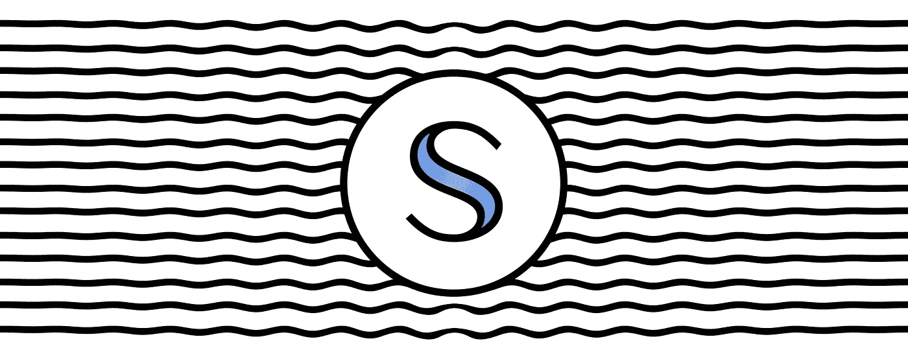
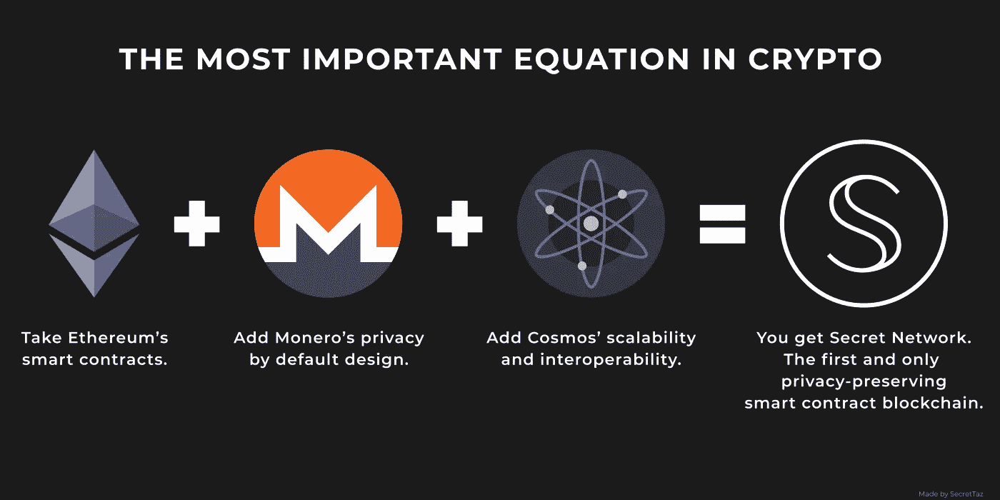
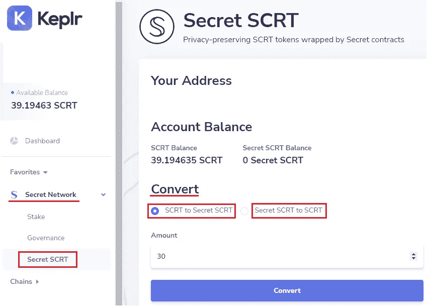
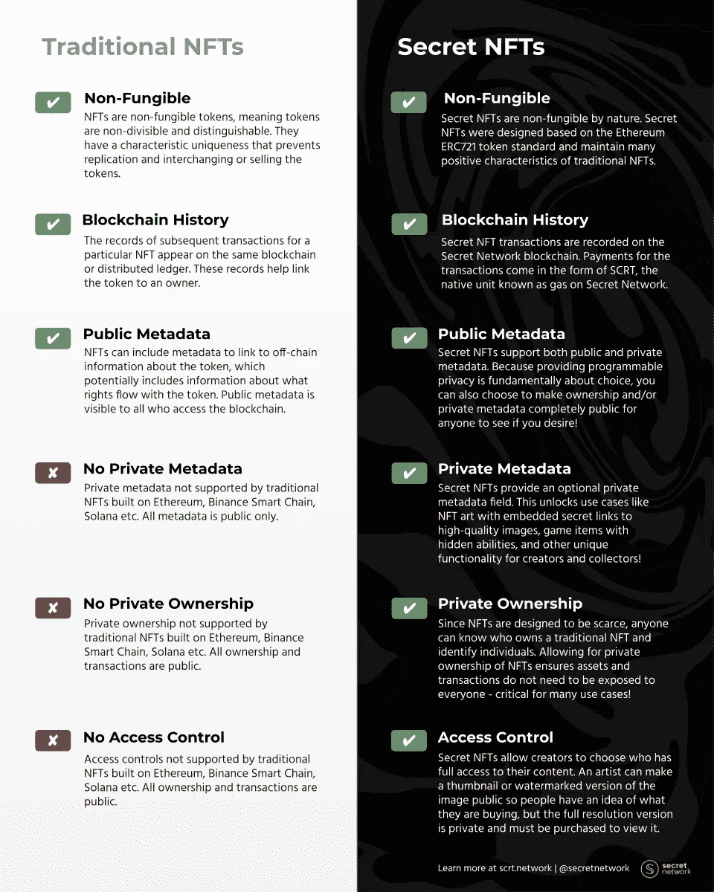
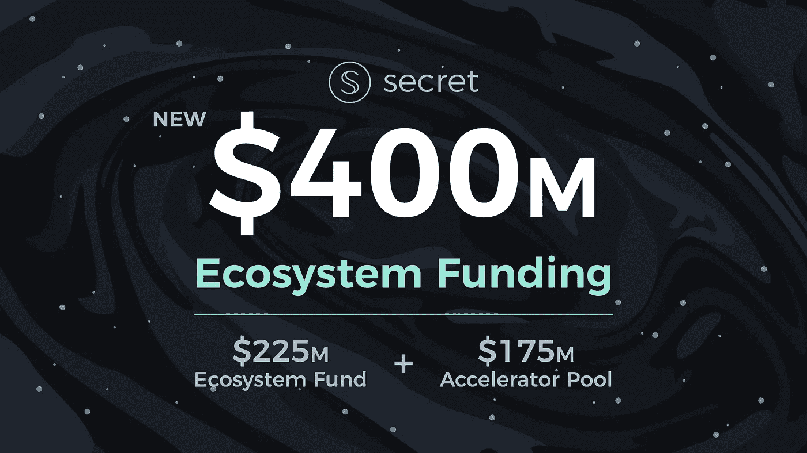

# 让你知道一个小秘密:介绍秘密网络

> 原文：<https://medium.com/coinmonks/letting-you-in-a-little-secret-introducing-the-secret-network-63335747255b?source=collection_archive---------10----------------------->

> 早上好 Anon，[秘密网络](https://medium.com/u/2ed86f2ac861?source=post_page-----63335747255b--------------------------------)需要你，如果你选择接受它，你的任务是作为一名秘密特工加入秘密网络，了解链及其应用，渗透到它的社区，以捕捉所有可用的阿尔法，并向总部报告。一如既往，如果你或你的团队中的任何成员被抓或被胁迫，部长将否认对你的行为知情。这篇文章不会在 5 秒内自毁。祝你好运。

Source : [Secret Network docs](https://docs.scrt.network/)

**秘密网络**

Secret Network 是一款保护隐私的区块链，其架构和技术的核心是保护隐私。虽然 Secret Network 在智能合同、交易、节点架构、与链的交互中实现隐私的方式非常技术性，但本文的重点不是解决技术问题，而是向您介绍该网络及其生态系统。

关于秘密网络所基于的隐私保护技术的更深入的解释，你可以从阅读秘密网络[常见问题](https://scrt.network/about/faq)开始。如果你的兴趣达到顶点，你可以通过成为[密探](https://scrt.network/get-involved/become-secret-agent)，完成秘密任务，赚取奖励，并成为密探社区的一员来学习更多关于秘密网络的知识。

[Source](/amityhaven/the-secret-network-f2d57168b75f)

**什么是特工**

秘密特工是能够完成秘密网络提供的招募过程和前几个秘密任务*(如果你选择接受的话)*的宇航员。一旦你通过测试，你就可以进入一个机密的 discord 频道，在那里你可以见到你的秘密特工同事，参加每天和每周不同难度的任务，并在证明完成后对你的时间和努力给予奖励。你也可以在秘密特工的行列中前进，并根据你的技能和喜好承担特殊任务。

**首先，什么是$SCRT，我怎样才能得到一些？**

$SCRT 是秘密网络区块链的原生货币，用于区块链层面的赌注和治理，以确保网络安全。它还用于支付汽油费，并在与不同的秘密网络应用程序交互时作为一种货币。

**您可以使用**购买$SCRT

*   **去中心化交易所:** Osmosis，JunoSwap，SecretSwap，Sienna。
*   **集中交易所:**币安、Bitmart、CoinEx、Mexc、Gate.io
*   **菲亚特 onramp 供应商:** Transak。

$SCRT 与 Keplr 钱包完全兼容。

**什么是$sSCRT？**

虽然 Secret Network 基于隐私，但它被设计为一个选择加入功能，这意味着$SCRT 是公共的，可以更改为$sSCRT，这是将用于私人/秘密交易的令牌的秘密版本。用户可以选择保持公开或转为私有。

要将您的$SCRT 换成$sSCRT 或相反，您可以使用 Keplr wallet 接口，该接口允许您自由地从一个版本的令牌转换到另一个版本，如下图所示。

**下注$SCRT**

可以使用 Keplr wallet 标桩接口来标桩/委托$SCRT，以保护网络并对治理提案进行投票。赌注者可以预期每年 24.58%的赌注回报。

**秘密网络上可用的应用程序**

[**秘密互换**](https://secretswap.net/)

Secret Swap 是建立在秘密网络上的跨链流动性协议，它通过允许使用加密的秘密智能合约来为用户提供增强的隐私，从而充分利用了网络的隐私特性。

在 Dex 的架构中，这一特性不可低估，因为它可以防止前端运行和从 Defi 用户提取值。在以太坊区块链，所有的交易都是公开的，在网络上公开展示。用户的交易一个接一个地排队，并由矿工根据每个交易花费的天然气量优先处理。由于所有的信息都是公开的，交易可以被读取，并被提供比初始交易更多的汽油费的克隆所取代，以优先处理。由于值捕获已经被利用，初始事务将被延迟或失败。这是通过使用专门的机器人来实现的，这些机器人通过前端运行的交易来获取价值，并抓住用户的某些机会。机器人运营商和矿工(他们从机器人那里获得丰厚的报酬来跳过这条线)是这一系统的唯一受益者，这使他们能够领先大多数套利、造币和价格行动机会。许多像以太坊这样的区块链允许这些掠夺性系统发生。最终用户通常是在协议级别运行的不同参与者的受害者，使他们没有机会竞争或保护自己。

Secret Swap 通过充分利用秘密网络技术解决了这一问题，使他们能够在智能合约级别加密数据。如果交易及其背后的意图是加密的，则在区块链上执行之前不能被读取，也不能被机器人提前运行/替换，因为没有办法首先知道交易是关于什么的，从而保护用户免受任何操纵或提前运行。

秘密交换还使以太坊和币安智能链的用户能够通过使用秘密交换桥将他们的资产跨越到网络。Secret Swap 的本机治理令牌是$Sefi，用于对治理提案进行投票，并奖励流动性提供者

[**锡耶纳互换**](https://sienna.network/swap/)

西耶娜交换是秘密网络的另一个热门指标，提供类似秘密交换的功能，同时也允许 IBC 包装。IBC 包装是将来自另一个宇宙 IBC 使能链的令牌桥接到秘密网络并创建所述令牌的私有版本的行为，该私有版本可以在秘密网络内的 Defi 中使用。像$sCRT 一样，你可以把$osmo，$Atom，$HuaHua，$Juno 带到秘密网络，创建它们的秘密版本，用它们来提供流动性，交易等等，在 Sienna 内部借贷。$Sienna 令牌用于管理协议和奖励 Sienna 内的 Defi 活动。

**Snip-721**

Snip-721 是保密网络的 NFT 技术。它允许私人/秘密 NFT，但也允许创建者插入私人元数据，只有 NFT 的所有者才能访问，使 NFT 能够持有秘密和 NFT 交易完全保密。

Source : [Secret Network 2021 in review](https://scrt.network/blog/secret-ecosystem-update-2021-in-review)

[**Stashh**](https://stashh.io/)

斯塔什是 NFT 首屈一指的市场。该应用程序在去年年底迎来了宇宙 NFT 季节，是不断增长的宇宙 NFT 空间的驱动力。

Stashh 在这个领域是一个强有力的竞争者，它的 UI/UX 与某些行业领导者不相上下，甚至更好。Stashh 计划推出拍卖，优惠，秘密徽章(秘密网络的独特功能)和口香糖机(一个战利品箱/老虎机机械)。这是一个非常雄心勃勃的项目，位于宇宙 NFT 运动的核心。许多 NFT 项目，如 Anons，编校俱乐部，MetaRats，秘密女友，秘密帮派，秘密朋克，秘密猿，秘密猫选择在秘密网络和名单上造币。

[**涂改**](https://altermail.live/)

Alter 是一个建立在秘密网络上的私人安全消息应用程序，利用其加密功能提供私人和分散的通信(电子邮件、消息、聊天、群组)、安全访问控制和数据安全。正如我们所说的，Alter 正在 Alter 内部提供帐户创建和电子邮件通信。他们最近谈到很快会发布他们的消息功能。

[**阴影协议**](https://shadeprotocol.io/)

几周前发布的 Shade protocol 是一个基于秘密网络的连接隐私保护 Defi 应用程序。它是真正的秘密网络上分散金融的骨干。

Shade 将提供一个名为$Silk 的算法稳定币，默认启用交易隐私。$Silk 将成为 Shade Protocol Defi 平台的核心，允许铸造、铆接、库存、液体铆接和合成材料。

[**黑盒**](https://blackbox.cash/) ***由繁琐的节点***

BlackBox 是一个应用程序集合，旨在为默认情况下公开的区块链交易带来隐私、安全和匿名性。

斗篷可以在不留下任何痕迹的情况下在另一个钱包中植入$SCRT 气体，从而逃脱兑换或其他钱包。斗篷作为一个增加隐私的混合器。

**DeadDrop** 允许您创建一个别名，发送者将使用该别名代替您的地址向您发送令牌。因为别名/地址对存储在加密的契约中，所以接收者信息对公众和发送者是保密的。

[**忍者协议**](https://www.sbtc.ninja/)

Shinobi 协议是一个不可信的双向桥梁，将比特币用户连接到秘密网络。通过哈希验证系统，Shinobi 协议避免了传统的直接保管模式，而是成为一个隐私安全的无信任桥。通过 Shinobi 协议，比特币持有者将有可能直接访问秘密网络 defi，同时受益于该网络提供的所有隐私功能。Shinobi 承诺没有中间人，并且与秘密网络通信的 peg in/out 动作与比特币区块链上的普通交易不可区分，从而保护了秘密网络上比特币 defi 交易的隐私。

**光明的未来**

Secret Network 是目前正在开发的许多伟大项目的家园，如 SecretDao(隐私保护 Dao toolings)、Stake Easy(Secret Network Liquid Staking solution)、Secret Invoice(一种私下发送发票的方式)、Jackal(分散式云存储解决方案)、Secret Heroes、Secret Dreamscape、Orbem Wars(所有 NFT/P2E 游戏都是在 Secret Network 上开发的)、LegenDao(mint 的一个游戏，提供独特的 NFT 游戏化)等等。

这里介绍的所有项目都有一个共同点，那就是它们都非常新，都处于开发的早期阶段。这是秘密网络作为一个洞的状态，它是一个雄心勃勃的沙盒环境，仍然处于其早期阶段，是一个伟大的建设者创造和扩展链提供的隐私功能的铸造厂。

**4 亿生态系统基金**

Source : [Secret Network blog](https://scrt.network/blog/secret-network-400m-ecosystem-funding-new-investors)

今年早些时候，Secret Network 宣布，DeFiance Capital、Alameda Research、CoinFund 和 Hashkey 收购了该网络的关键股份，使他们有能力资助一个 2.25 亿英镑的生态系统基金，旨在扩展 Secret Network 的应用层，以及一个 1.75 亿英镑的加速器池，旨在提供非稀释性资本、赠款和生态系统激励措施，以扩大用户采用。

Secret Network 取得了长足的进步，这要归功于它的草根应用程序和早期采用者，他们能够有机地构建该领域中一些最具创新性的项目。这些基金和新投资者开创了供应链发展的新时代，并为新的建设者提供了加入网络的机会。

**在秘密网络中阳光并不总是明媚的**

在过去的几周里，随着大量的 mints，stashh 应用程序的成功和 shade protocol airdrop，连锁店一直承受着很大的压力，仍然遭受着拥堵。这些高需求事件导致了一些关键的网络基础设施短缺，产生了不良性能的多米诺骨牌效应。链的基础设施被放到测试和秘密实验室，秘密网络背后的开发者正与秘密网络验证器一起工作来解决这种情况。如果您受到这些问题的影响，请耐心等待，因为事情正在积极处理中。

**现在好消息来了！秘密网络的空投季节终于到了吗？**

虽然没有什么是确定的，但 Shade Protocol 肯定以其$SHD 空投揭开了序幕，许多谣言正在流传，其他协议正准备通过空投引导用户。上述谣言的来源是秘密网络社区的可信成员，通常对秘密阿尔法知情，因此，我没有理由不相信我所听到的。和空投一样，耐心是关键。消息传出后我会通知你的。

**闭幕词**

秘密网络是一个由创新和隐私理念推动的新兴动态生态系统。在与 Secret Network 的社区互动后，我立即被吸引住了，并对他们能够帮助和欢迎新用户感到惊讶。我希望你能体验到和我一样的热情欢迎，一如既往，随时伸出手来聊天，我总是在我的宇航员和特工同事的支配下。

任务完成。

## 你可以点击此链接，将你的$SCRT 委托给[秘密网络](https://medium.com/u/2ed86f2ac861?source=post_page-----63335747255b--------------------------------) [上的](https://wallet.keplr.app/#/secret/stake?tab=inactive-validators&modal=detail&validator=secretvaloper1jjlfeshltdy6ngnf5tg6aeaygsvf0kxg8wck04) [Artemis.red](https://artemis.red) 验证器来支持我。

## 谢谢你。