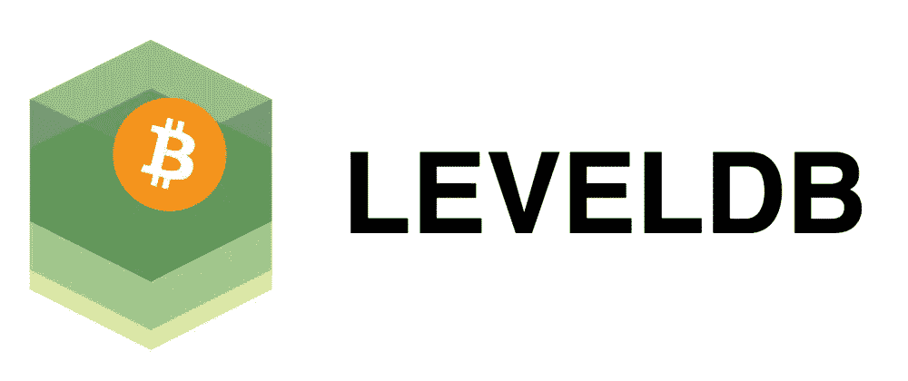

# LevelDB —由谷歌发明，由比特币(₿)等加密货币使用

> 原文：<https://medium.com/coinmonks/leveldb-invented-by-google-and-used-by-cryptocurrencies-like-bitcoin-9fb35f1efb6a?source=collection_archive---------12----------------------->

## 什么是 LevelDb？

evelDB 是一个由 Google 编写的快速键值存储库，它提供了从字符串键到字符串值的有序映射。除了是开源的，它是用 C++编写的，于 2011 年推出。

此外，LevelDB 是一个基于 LSM 的键值存储，它提供了增强的写吞吐量和合理的读吞吐量。本质上，LevelDB 擅长随机读写。

## 比特币&以太坊是如何使用的？

在继续讨论它如何使用 LevelDB 存储数据之前，我们首先需要了解任何加密货币中的 UTXO(未用交易输出)是什么。

让我们假设你从你父亲那里得到 5 ₿，从你母亲那里得到 3 ₿，从一个店主那里得到 2 ₿。你有 3 个 UTXO。

> 比特币钱包余额= 5**₿**+3**₿**+2**₿**

你总共有 10 个₿.现在，你去买了一个标价为 6.98 ₿.的小玩意因为你有足够的比特币，你转了 5 ₿ & 2 ₿来买这个小玩意。

> 比特币钱包余额= 3 **₿**

因为，余额还剩 0.02 ₿。你得到 0.01 ₿回来，因为 0.01 ₿被扣除作为交易的费用。现在，您将 3 UTOX 转换为 2 UTOX。

> 比特币钱包余额= 3 **₿** + 0.01 **₿**

一般来说，比特币可以是任何数字，而不是像美元这样的任何货币中的固定数字。最小值应该是 1 Satoshi。

> 注:1 亿 Satoshis == 1 比特币

**让我们看看 LevelDb 是如何出现在画面中的。**

当交易发生时，我们都知道，基本上每个加密货币都是一个链块，或者可以假设为总账。

> 比特币的工作原理是交易分类账机制。
> 以太坊的工作原理是平衡架的机制。

加密块仅包含交易的相关信息，例如:

*   块的上一个哈希。
*   默克尔树根哈希。
*   现在。
*   失效的事务输出哈希。
*   等等，取决于加密货币。

有四条数据需要维护

*   **街区/街区*。dat**
*   **区块/索引/***
*   **链锁状态/***
*   **块/rev*。dat**

其中，让我们讨论更多关于 chainstate/* & blocks/index/*的内容。

**blocks/index/*:** 这是一个 LevelDB 数据库，包含所有已知块的元数据，以及在磁盘上的何处可以找到它们。没有这个，找块会很慢。

C **hainstate/*:** 这是一个 LevelDB 数据库，包含所有当前 UTXO 的压缩表示和一些关于它们来自的事务的元数据。这里的数据是验证新的传入块和事务所必需的。理论上可以从块数据中重建，但这需要相当长的时间。如果没有它，理论上你仍然可以进行验证，但这意味着对每一个花费的输出进行一次全面的扫描[(截至 2022 年 3 月 31 日为 398.37 GB)](https://www.statista.com/statistics/647523/worldwide-bitcoin-blockchain-size/)。

# 为什么选择 LevelDB？

LevelDB 是冗余的，因为它们可以从块数据中重建。但是如果没有它们，验证和其他操作会变得非常慢。

## 参考

 [## 什么是 LevelDB，它是如何工作的？

### 数据库是应用程序堆栈的重要组成部分，在服务器和客户端部分被…

开发到](https://dev.to/zenulabidin/what-is-leveldb-and-how-does-it-work-5ho3)  [## 比特币核心 0.11 (ch 2):数据存储

### 本页描述了比特币核心存储区块链数据的方式和位置。基本上有四种数据…

en .比特币. it](https://en.bitcoin.it/wiki/Bitcoin_Core_0.11_%28ch_2%29:_Data_Storage)  [## 数据库是干什么用的？

### 感谢贡献一个比特币栈交换的答案！请务必回答问题。提供详细信息和…

bitcoin.stackexchange.com](https://bitcoin.stackexchange.com/questions/11104/what-is-the-database-for?rq=1)  [## LevelDB -维基百科

### LevelDB 是一个开源的磁盘键值存储，由 Google 研究员 Jeffrey Dean 和 Sanjay Ghemawat 编写。受到启发…

en.wikipedia.org](https://en.wikipedia.org/wiki/LevelDB)  [## GitHub - google/leveldb: LevelDB 是一个由 google 编写的快速键值存储库，它…

### LevelDB 是 Google 编写的一个快速键值存储库，它提供了从字符串键到…

github.com](https://github.com/google/leveldb) 

> 加入 Coinmonks [电报频道](https://t.me/coincodecap)和 [Youtube 频道](https://www.youtube.com/c/coinmonks/videos)了解加密交易和投资

# 另外，阅读

*   [有哪些交易信号？](https://coincodecap.com/trading-signal) | [Bitstamp vs 比特币基地](https://coincodecap.com/bitstamp-coinbase) | [买索拉纳](https://coincodecap.com/buy-solana)
*   [ProfitFarmers 点评](https://coincodecap.com/profitfarmers-review) | [如何使用 Cornix Trading Bot](https://coincodecap.com/cornix-trading-bot)
*   [十大最佳加密货币博客](https://coincodecap.com/best-cryptocurrency-blogs) | [YouHodler 评论](https://coincodecap.com/youhodler-review)
*   [MyConstant 点评](https://coincodecap.com/myconstant-review) | [8 款最佳摇摆交易机器人](https://coincodecap.com/best-swing-trading-bots)
*   [MXC 交易所评论](/coinmonks/mxc-exchange-review-3af0ec1cba8c) | [Pionex vs 币安](https://coincodecap.com/pionex-vs-binance) | [Pionex 套利机器人](https://coincodecap.com/pionex-arbitrage-bot)